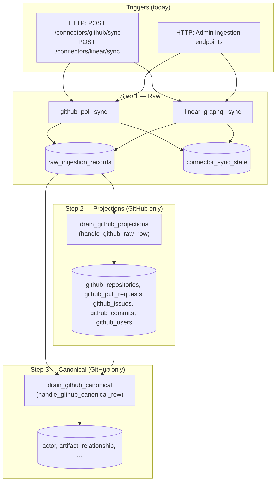

# Connectors ingestion pipeline — audit & architecture plan

**Status:** Analysis and planning only (no implementation in this document).  
**Date:** 2026-04-01  
**Related:** [`step-3-canonical-debug-and-operations.md`](./step-3-canonical-debug-and-operations.md) (Step 3 operations).

---

## 1. Connector pipeline overview

### 1.1 Three-step model (as implemented)

| Step | Purpose | Primary location in codebase |
|------|---------|------------------------------|
| **Step 1** | Append **raw** resource observations from vendor APIs | `vector.domains.ingestion.*` (`github_poll_sync`, `linear_graphql_sync`) |
| **Step 2** | **Connector projections** — normalized, queryable tables per connector | `vector.domains.projections.github.*` (handlers + `drain_github_projections`) |
| **Step 3** | **Canonical ontology** — cross-tool actors, artifacts, relationships | `vector.domains.canonical.*` (`github_mapper`, `drain_github_canonical`) |

Storage:

- Step 1: `raw_ingestion_records` (+ `ingestion_runs`, `connector_sync_state`)
- Step 2: `github_*` projection tables (see §2.2)
- Step 3: `actor`, `artifact`, `relationship`, `actor_external_identity`, mapping tables, etc. (`vector.infrastructure.db.models.canonical`)

### 1.2 High-level flow



**Important:** Today, **only GitHub** has Step 2 and Step 3 drains wired. Linear stops after Step 1 unless future work adds projection/canonical pipelines.

### 1.3 Where components live

| Kind | Examples |
|------|------------|
| **Domain services** | `run_github_poll_ingestion_for_tenant`, `run_linear_graphql_ingestion_for_tenant`, `drain_github_projections`, `drain_github_canonical` |
| **HTTP routers** | `api/http/routes/connectors/github.py` (`github_poll_sync`), `connectors/linear.py` (`linear_graphql_sync`), `admin.py` (admin-triggered syncs) |
| **Workers** | **No separate ingestion worker process** today. Step 2/3 **drains** run **in-process** on the API thread after a successful GitHub sync (same request). `app/worker.py` defines a **Celery** app with **no tasks registered** for ingestion. |
| **Repositories** | `infrastructure/db/repositories/ingestion.py` (runs, raw insert, sync state), connection repos (`github_connection`, `linear_connection`), projection upserts, canonical ORM helpers |
| **Infrastructure** | `domains/ingestion/http_fetch.py` (`FetchExecutor` — retries, 429/5xx), GitHub/Linear HTTP helpers under `domains/connectors/*/http_client.py` |

---

## 2. GitHub connector — full audit (Steps 1–3)

### 2.1 Step 1 — GitHub raw ingestion

**Entry:** `run_github_poll_ingestion_for_tenant` in [`github_poll_sync.py`](../../backend/src/vector/domains/ingestion/github_poll_sync.py).

**Flow:**

1. Resolve GitHub connection for tenant; create `IngestionRun` (`status=running`).
2. Obtain **installation access token** via [`create_github_installation_access_token`](../../backend/src/vector/domains/connectors/github/http_client.py) (JWT → `POST /app/installations/{id}/access_tokens` — real `api.github.com` per settings).
3. **`FetchExecutor`** for all REST GETs (`http_fetch.py`: httpx, retries, 429 with `Retry-After`, 5xx backoff).
4. **Installation repositories** — paginated `GET /installation/repositories` (per-page state in `connector_sync_state` scope `github:installation_repositories` until complete).
5. Per repo: **`_sync_pulls`** (watermark on `updated_at` per `github:pulls:{owner/repo}`), **`_sync_issues`** (`since` ISO per `github:issues:{owner/repo}`), **`_sync_commits`** (branch head / list strategy per file).
6. **`_sync_pull_commits`** emits `github.pull_request_commit` rows linking PRs to commits.

**Resources ingested (resource_type):**

| Resource type | Meaning |
|---------------|---------|
| `github.repository` | Repo object from installation listing |
| `github.pull_request` | PR JSON |
| `github.issue` | Non-PR issues (PRs filtered out) |
| `github.commit` | Commit objects |
| `github.pull_request_commit` | PR↔commit edge (from `GET .../pulls/{n}/commits`) |

**Raw row shape:** `payload_body` = GitHub JSON; `external_id` = e.g. `owner/repo#prnum` or `owner/repo#sha`; `query_params` + `api_endpoint` + `run_id` feed **idempotency** per run.

**Deduplication:**

- **Within a run:** `insert_raw_records_ignore_conflict` — unique on `(run_id, idempotency_key)`; `idempotency_key` from `idempotency_key(run_id, resource_type, external_id, api_endpoint, query_params)` (see `domains/ingestion/payload.py`).
- **Across runs:** New run ⇒ new rows (append-only log). **Incremental behavior** is via **`connector_sync_state`** watermarks / `since`, not by suppressing inserts for unchanged payloads.

**Resync:** Re-running sync **appends** new raw rows for **new** observations; watermarks skip **duplicate PR/issue bodies** when `updated_at` / `since` allows early exit.

**Rate limits:** `FetchExecutor` handles 429/5xx; GitHub `Retry-After` honored when numeric.

### 2.2 Step 2 — GitHub projections

**Entry:** `drain_github_projections` in [`domains/projections/github/worker.py`](../../backend/src/vector/domains/projections/github/worker.py).

**Mechanism:** Cursor + lease on `connector_projection_progress`; reads `raw_ingestion_records` in **replay order** (`replay_sequence`); calls `handle_github_raw_row` in [`handlers.py`](../../backend/src/vector/domains/projections/github/handlers.py).

**Tables:** [`github_projection.py`](../../backend/src/vector/infrastructure/db/models/github_projection.py) — `GithubRepository`, `GithubPullRequest`, `GithubIssue`, `GithubCommit`, `GithubUser`.

**Upsert:** Idempotent upserts on natural keys (tenant + connection + repo id / PR id / commit sha, etc.) via [`github_projection_upsert.py`](../../backend/src/vector/infrastructure/db/repositories/github_projection_upsert.py). Provenance: `last_raw_record_id`, `last_observed_at`, `last_replay_sequence`.

**PR→commit link:** `github.pull_request_commit` is **not** projected to a table (see handler comment); Step 3 consumes **raw** for that type.

**Interaction with Step 1:** Purely **read raw → write projection**; no callback into Step 1.

---

### 2.3 Step 3 — GitHub canonical ontology

**Entry:** `drain_github_canonical` in [`domains/canonical/worker.py`](../../backend/src/vector/domains/canonical/worker.py).

**Mechanism:** Cursor on `step3_canonical_cursor`; replays same `raw_ingestion_records` stream (filtered to GitHub resource types used in canonical); `handle_github_canonical_row` in [`github_mapper.py`](../../backend/src/vector/domains/canonical/github_mapper.py).

**Mappings (examples):**

- **Repository** → artifact kind `repository` (`Artifact` + `artifact_repository` + external mapping).
- **PR** → `changeset` / trackable unit (depends on mapper branch); **authored_by** / **contains**-style relationships to actors and repo artifact.
- **Issue** → trackable unit / associated relationships.
- **Commit** → `revision` artifact; **author** → `Actor` + `actor_external_identity` (`connector=github`).
- **`github.pull_request_commit`** → edges between PR and commit artifacts (contains / associated).

**Cross-connector identity:** `ActorExternalIdentity` stores `(connector, external_id)` for GitHub user ids; stable UUIDs via `stable_ids` helpers.

**Trigger coupling:** After **successful** GitHub sync, [`connectors/github.py`](../../backend/src/vector/api/http/routes/connectors/github.py) and **`admin`** GitHub sync call **`drain_github_projections`** then **`drain_github_canonical`** in the **same request** (synchronous).

---

## 3. Linear connector — current state

### 3.1 Step 1 — Linear GraphQL

**Entry:** `run_linear_graphql_ingestion_for_tenant` in [`linear_graphql_sync.py`](../../backend/src/vector/domains/ingestion/linear_graphql_sync.py).

**HTTP:** `FetchExecutor` POSTs to `settings.linear_graphql_url()` (mock or `https://api.linear.app/graphql`); OAuth profile uses **real** `linear_graphql_oauth_profile_url()` in [`linear/http_client.py`](../../backend/src/vector/domains/connectors/linear/http_client.py) for token exchange flows (not Step 1 bulk).

**Resources ingested (one raw row per node + viewer envelope):**

| resource_type | Incremental? |
|---------------|----------------|
| `linear.viewer` | No (single viewer) |
| `linear.team` | Full pagination each run |
| `linear.user` | Full pagination |
| `linear.workflow_state` | Full pagination |
| `linear.project` | Full pagination |
| `linear.initiative` | Full pagination |
| `linear.cycle` | Full pagination |
| `linear.issue_label` | Full pagination |
| `linear.issue` | **`orderBy: updatedAt`** + **watermark** in `connector_sync_state` (scope = resource type) |
| `linear.comment` | Same watermark pattern |
| `linear.issue_relation` | Full pagination (no watermark in code) |

**Note:** Full pagination of large types on every run can **grow Step 1 row volume** for those types; issues/comments avoid duplicate rows when watermark allows.

**Pagination:** Relay `first`/`after` via `_ingest_paginated`; `PAGE_SIZE = 50`.

**HTTP router:** [`linear.py`](../../backend/src/vector/api/http/routes/connectors/linear.py) — **`POST /sync`** returns run stats only; **does not** call projection or canonical drains.

**Admin:** [`admin.py`](../../backend/src/vector/api/http/routes/admin.py) `linear-sync` — Step 1 only (parity comment in code).

### 3.2 Step 2 projections for Linear

**None.** There are **no** `linear_*` projection tables and no `drain_linear_projections` or `handle_linear_raw_row`.

### 3.3 Step 3 canonical for Linear

**None.** `drain_github_canonical` and `handle_github_canonical_row` **require** `connector == github`; Linear raw rows are ignored.

---

## 4. Gap analysis — Linear to Step 3 parity

### 4.1 Step 2 parity

| Gap | Detail |
|-----|--------|
| **Projection schema** | Define tables (or JSONB strategy) for `linear.issue`, `linear.comment`, `linear.team`, `linear.project`, `linear.issue_relation`, etc., keyed by `(tenant_id, connection_id, linear_id)`. |
| **Projection handlers** | Map each `resource_type` to upsert; handle deletes/archival if Linear exposes them. |
| **Drain worker** | `drain_linear_projections` mirroring GitHub: cursor on `connector_projection_progress` with `connector=linear`, or separate progress row. |
| **Orchestration** | After Linear Step 1 success, call **`drain_linear_projections`** (today missing). |

### 4.2 Step 3 parity

| Gap | Detail |
|-----|--------|
| **Canonical mapper** | `handle_linear_canonical_row` (or unified mapper dispatching by connector) for issues, comments, users, projects, cycles, **blocks** / **duplicate** relations. |
| **Artifact kinds** | Likely need kinds for **work item** (issue), **discussion** (comment as sub-object or relationship), **container** (project, cycle, initiative). |
| **Relationship kinds** | e.g. `assignee`, `authored_by`, `blocks`, `duplicates`, `belongs_to_project`, `in_cycle`. |
| **Cross-tool identity** | Link `ActorExternalIdentity(connector=linear, external_id=...)` to same `Actor` as GitHub when email/login rules exist (future). |
| **Drain** | `drain_linear_canonical` with `Step3CanonicalCursor` **per connector** or composite key (today cursor is `(connection_id, connector)` — already supports another connector once implemented). |

### 4.3 Linear → canonical candidates (proposal)

| Linear entity | Canonical role (proposal) |
|---------------|----------------------------|
| User | `Actor` + `actor_external_identity` |
| Issue | `Artifact` (work item / trackable unit) |
| Comment | Relationship **or** artifact with `authored_by` to actor (product choice) |
| Project | `Artifact` (container) or `associated_with` |
| Cycle / Initiative | Container artifacts or temporal metadata on issues |
| Issue relation | `Relationship` rows (`blocks`, `duplicates`, `relates_to`) |

---

## 5. Connector architecture pattern

### 5.1 Connector-specific vs generic

**Today:** **Step 1** is **connector-specific** modules but shares **`ingestion` repository**, **`FetchExecutor`**, **`RawIngestionRecord`** shape, and **`connector_sync_state`** pattern.

**Step 2/3:** **GitHub-only** code paths (`CONNECTOR_GITHUB` guards in drains).

**Shared patterns worth extracting:**

- Pagination + watermark state machine
- Raw batch insert + run lifecycle
- Projection drain: cursor + lease + replay order
- Canonical drain: same replay order, idempotent upserts

### 5.2 Proposed abstract shape (conceptual)

```
ConnectorAdapter (connector-specific)
  fetch_incremental(session, run, connection) -> stats   # Step 1
  resource_types() -> list[str]

ProjectionHandler (per connector or per resource_type)
  project_row(session, raw) -> None

CanonicalHandler
  map_row(session, raw) -> None
```

**Generic:** envelope schema, run + sync state repos, drain loop framework, `FetchExecutor`/retry policy.  
**Connector-specific:** queries, field mapping, normalization, artifact/relation semantics.

---

## 6. Payload size and ingestion strategy (current vs desired)

### 6.1 Current trigger model

- **Sync is synchronous** in the HTTP handler: client waits for **`run_github_poll_ingestion_for_tenant`** (potentially long: many repos × pulls/issues/commits) **plus** `drain_github_projections` **plus** `drain_github_canonical` for GitHub.
- Risk: **timeouts** at load balancers / clients; **no** back-pressure for large tenants.

### 6.2 Proposed direction

- **Connect** action only enqueues **work** (or returns quickly after Step 1 kickoff).
- **Worker** consumes jobs: **Step 1 only** in job 1; **Step 2** and **Step 3** as separate jobs or chained jobs with **idempotent job ids** `(tenant_id, connection_id, connector, purpose, run_id)`.

Avoid long HTTP by: **202 Accepted** + `run_id`, or **webhook/poll** for status.

---

## 7. Async job architecture (Redis / Celery)

### 7.1 Current state

- **`REDIS_URL`** in settings; [`app/worker.py`](../../backend/src/app/worker.py) instantiates **Celery** with Redis broker/backend — **no ingestion tasks** defined in-repo (grep shows no `@task`).

### 7.2 Proposed job types

| Job | Purpose |
|-----|---------|
| `connector_initial_sync` | First full pull (or reset) — may fan out per resource |
| `connector_incremental_sync` | Scheduled / webhook-triggered delta |
| `projection_drain` | Step 2 only for `(tenant_id, connection_id, connector)` |
| `canonical_drain` | Step 3 only |

**Interaction:**  
`initial_sync` → completes Step 1 run → enqueue `projection_drain` → `canonical_drain` (or single pipeline job with internal phases).

**Idempotency:** Job `id` = hash of `(tenant_id, connection_id, connector, purpose, run_id)`; workers **re-run safe** drains (cursor-based).

**Retries:** **Retry** transient failures (fetch, DB deadlock); **do not** duplicate Step 1 rows beyond idempotency rules (per-run keys).

**Stack options:** **Celery** (already wired) vs **RQ** (simpler). Recommendation: **Celery** first to avoid duplicate broker infra.

---

## 8. Scheduling / cron strategy

### 8.1 Current state

- **No** in-repo cron scheduler for connector sync (no APScheduler/Celery beat config found for ingestion).

### 8.2 Proposed design

- **Celery Beat** or external cron **invokes** a thin **application service** method, e.g. `schedule_incremental_sync(tenant_id, connector)`, which **only enqueues** jobs.
- **Rate limiting:** Per-tenant or per-connection token bucket **in domain** or **Redis**; worker **consumes** limit before calling external APIs.
- **Tenant isolation:** Queue **per tenant** or **message headers** + DB row locks; never cross-mix tenant data in one transaction.

**Testability:** Cron/beat calls **one function** that can be unit-tested with a fake broker; **domain** `run_*_ingestion` stays pure of Celery imports.

---

## 9. Domain boundaries (target)

| Layer | Responsibility |
|-------|----------------|
| **Domain** | `run_github_poll_ingestion_for_tenant`, `run_linear_graphql_ingestion_for_tenant`, `drain_*`, mappers — **no** FastAPI, **no** Celery |
| **Application** | **Use cases** orchestrating “sync then drain” or “enqueue job” |
| **Infrastructure** | `FetchExecutor`, DB session, Celery task **wrappers** that call application services |
| **API** | HTTP routers, auth, DTOs |

**Workers:** Thin — `celery_app.task def github_sync_job(tenant_id): with session: application.sync_github(...)`.

---

## 10. Testing strategy

| Test type | Approach |
|-----------|----------|
| **Step 1** | Unit-test `run_*_ingestion` with **fake DB** + **mocked `FetchExecutor`** or recorded HTTP fixtures |
| **Step 2** | Feed synthetic `RawIngestionRecord` rows; assert projection rows |
| **Step 3** | Same + assert `actor`/`artifact`/`relationship` counts |
| **Idempotency** | Same run + same keys → no duplicate rows |
| **Watermarks** | `connector_sync_state` in/out |
| **No worker** | Call `drain_*` directly in tests (already true) |

---

## 11. Implementation roadmap (proposal)

**Phase A — Documentation & contracts**  
- Freeze resource_type list for Linear; document canonical mapping RFC.

**Phase B — Linear Step 2**  
- Migrations for projection tables; `handle_linear_raw_row`; `drain_linear_projections`; wire after Linear Step 1 (admin + user routes) + tests.

**Phase C — Linear Step 3**  
- `handle_linear_canonical_row`; extend `Step3CanonicalCursor` usage; mapping rules + tests.

**Phase D — Async**  
- Celery tasks: `connector_sync`, `projection_drain`, `canonical_drain`; HTTP returns 202 + job id; move GitHub off synchronous long requests.

**Phase E — Scheduling**  
- Beat schedule + rate limits + monitoring.

---

## 12. Constraints (unchanged for this plan)

- **Do not** break existing **mock connector** URLs or **ingestion** HTTP contract without versioning.
- **Append-only** raw log remains the source of truth for replay.
- **Cross-connector** identity resolution is **optional** and can be phased after single-connector canonical completeness.

---

## 13. File reference index

| Area | Path |
|------|------|
| GitHub Step 1 | `backend/src/vector/domains/ingestion/github_poll_sync.py` |
| Linear Step 1 | `backend/src/vector/domains/ingestion/linear_graphql_sync.py` |
| HTTP fetch / retries | `backend/src/vector/domains/ingestion/http_fetch.py` |
| Raw + sync state | `backend/src/vector/infrastructure/db/repositories/ingestion.py` |
| GitHub Step 2 drain | `backend/src/vector/domains/projections/github/worker.py`, `handlers.py` |
| GitHub Step 3 drain | `backend/src/vector/domains/canonical/worker.py`, `github_mapper.py` |
| Routers | `backend/src/vector/api/http/routes/connectors/github.py`, `linear.py`, `admin.py` |
| Celery stub | `backend/src/app/worker.py` |
