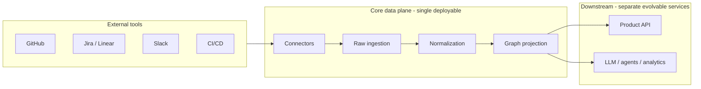

# Technical Vision: Execution Intelligence Platform (Core Data Plane)

This document describes how we envision building the **heart of the business**: ingestion, normalization, and execution graph construction. It answers service topology questions, aligns with your four pipeline stages, and anticipates **Python-first AI/LLM** layers that will consume this foundation later.

---

## 1. Goals and non-goals

### Goals

- **Faithful capture** of tool truth in a raw layer, with **replay and reprocessing** when normalization or graph rules change.
- **Deterministic, testable** transforms from raw → canonical → graph where possible; clear **traceability** from every canonical node/edge back to raw rows.
- **Incremental pipelines** (webhooks, polling, batch backfill) that scale with connector count and org size.
- **Clean contracts** so analytics, product features, and LLM agents read a **stable graph API or export**, not implementation details of GitHub or Jira.

### Non-goals (for this core plane)

- Owning all product UX or “smart” orchestration in this layer—that belongs in **downstream services** that call the graph and apply policy.
- Optimizing for premature microservice complexity before we have clear scaling or organizational boundaries.

---

## 2. Monolith vs services: recommendation

### Short answer

Start with **one deployable application** (a **modular monolith** in Python) that **strictly separates** the four stages as **domains/modules** behind stable internal interfaces. **Split into separate services only when** a concrete driver appears (independent scaling, security isolation for untrusted connector code, team ownership, or SLA divergence).

### Why not four microservices on day one?

- **Connectors → raw → normalize → graph** is a tightly coupled pipeline with shared **schemas, versioning, and replay** semantics. Many failure modes are **cross-stage** (ordering, idempotency, partial updates). Operating four networked services from day one increases latency, failure modes, and deployment friction without proving we need separate scale envelopes.
- Early velocity and **correctness** matter more than theoretical independence. A monolith with **hard module boundaries** gives most of the benefits of “separate services” (clear ownership, testing, dependency rules) with less operational overhead.

### When to extract services (explicit triggers)

| Trigger | Typical split |
|--------|----------------|
| Connectors need **sandboxing**, per-customer CPU limits, or exotic runtimes | **Connector worker pool** (still orchestrated by core) or **per-connector isolated processes** |
| Graph writes/read patterns need **different DB/cluster** and **independent scaling** | **Graph projection service** reading from an event log or canonical store |
| Heavy **ML batch jobs** (embeddings, clustering) contend with low-latency ingestion | **Async analytics / feature service** subscribed to events or snapshots |
| Regulatory **data residency** or **tenant isolation** | Separate data plane per region/tenant class |

Until those appear, keep **one codebase** with **explicit packages** (e.g. `connectors/`, `ingestion/`, `normalization/`, `graph/`, `contracts/`) and **enforce** that inner layers do not import outer ones (e.g. graph must not import GitHub SDK).

### How “other services” fit later

- **Core plane** exposes: **internal APIs** (gRPC/HTTP), **read models** (graph query API, materialized views), and/or **event streams** (Kafka/Redis streams/RabbitMQ—choice TBD).
- **Application / AI services** (recommendations, risk scoring, natural language to query, copilots) remain **consumers**. They should **not** mutate raw truth; they may write **derived annotations** (labels, summaries) in separate tables or stores keyed by canonical IDs.

---

## 3. Mapping your four stages to technical building blocks

### 3.1 Tool connectors (domain: `connectors`)

**Responsibility:** Talk to vendor APIs; normalize only to **transport concerns** (pagination, rate limits, auth refresh), not business ontology.

**Implementation sketch:**

- **Pluggable connector interface**: `fetch_backfill(scope)`, `subscribe_webhooks(...)`, `handle_webhook(payload)`, `health()`.
- **Per-tool configuration** (tokens, base URLs, workspace IDs) stored securely; **no secrets** in connector code.
- **Output:** Structured batches of **raw events** or **raw records** handed to ingestion (see below), never written “around” ingestion.

**Isolation:** Code isolation via packages; optional **process isolation** later for untrusted or resource-heavy connectors.

### 3.2 Raw data ingestion (domain: `ingestion`)

**Responsibility:** Persist **immutable** (append-only) tool-shaped data; assign **ingestion metadata** (connector version, received_at, payload hash).

**Principles:**

- **Append-first:** Updates from tools arrive as new rows or new revisions with valid time, not destructive overwrites of history (unless legally required to delete).
- **Full payload storage** (JSON column or object storage + pointer) where size allows; enables reprocessing without re-hitting APIs.
- **Idempotency keys** per external object ID + cursor/watermark for backfills.

**Outputs:** Events such as `RawGithubPullRequestUpserted v1` for downstream stages, or direct DB writes plus outbox pattern for the same.

### 3.3 Normalization (domain: `normalization`)

**Responsibility:** Map tool records → **canonical entities** and **cross-tool links**; entity resolution; stable **canonical IDs**.

**Key mechanisms:**

- **Versioned mapping rules** (code + configuration): e.g. “how we map Jira `issue_type` → canonical `Task` subtype.”
- **Provenance tables:** every canonical row references **raw table + primary key (+ optional JSON path)**.
- **Entity resolution** as its own subprocess: deterministic keys first (email, SSO id, org-scoped username), then **human-reviewed** or **ML-assisted** candidates stored as **suggested links** with confidence—not silently merged without policy.

**Outputs:** `CanonicalUserCreated`, `CanonicalTaskUpdated`, etc., or transactional writes + outbox.

### 3.4 Execution graph construction (domain: `graph`)

**Responsibility:** Project canonical facts into a **property graph model** (nodes, edges, temporal attributes).

**Two implementation options** (not mutually exclusive):

1. **Graph as primary store:** Neo4j, Memgraph, TigerGraph, etc.—best when graph traversals are dominant and modeling stays close to the product.
2. **Relational + graph projection:** Postgres as **system of record** for canonical tables; **materialized graph** in a graph DB or **recursive CTE** views for smaller scale—best when strong SQL reporting and transactions matter.

**Recommendation for early phase:** Keep **canonical tables in Postgres (or similar)** as source of truth for entities; maintain **graph projection** as an **indexed read model** (graph DB or adjacency tables), updated **incrementally** from normalization events. This preserves **easy replay**: truncate projection, rebuild from canonical + rules version.

**Edge typing:** Explicit edge kinds (`AUTHORED`, `IMPLEMENTS`, `ASSIGNED_TO`, `DEPLOYS`, …) with **metadata** (timestamps, evidence pointers to raw).

---

## 4. Data flow: events, jobs, and consistency

### 4.1 Incremental processing

- **Webhook path:** low latency; write raw → enqueue work item → normalize slice → patch graph.
- **Backfill path:** batched; checkpointed; rate-limited per connector.
- **Outbox pattern:** transactional boundary between “persist raw” and “publish work” prevents phantom events.

### 4.2 Determinism and versioning

- **Normalization version** and **graph rule version** stored with outputs or in a lineage table so replays are auditable.
- **Pure functions** for transforms: `(raw_row, rule_version) → canonical_delta` simplifies testing and reprocessing.

### 4.3 Ordering and eventual consistency

- Cross-tool consistency is **eventually consistent** by nature (Slack lags GitHub, etc.). Expose **staleness** or **last_synced_at** on reads where product needs honesty.
- **Conflicts** (e.g. two emails for same user) resolved via explicit policies, not silent last-write-wins across tools.

---

## 5. Storage layout (conceptual)

| Layer | Role | Typical technology |
|-------|------|---------------------|
| Raw | Immutable tool-shaped truth | Postgres (JSONB) + optional object store for large blobs |
| Canonical | Unified entities + mappings | Postgres (relational, strong constraints) |
| Graph | Traversal-optimized read model | Graph DB **or** dedicated tables + indices |
| Queue / stream | Work distribution | Redis, SQS, Kafka, or managed equivalent |
| Cache | Hot graph slices, permissions | Redis |
| Secrets | Tokens per tenant/connector | KMS + secret manager |

**Multi-tenancy:** `tenant_id` on every row; row-level security or schema-per-tenant depending on compliance; connectors scoped per tenant.

---

## 6. Python technical stack (suggested)

These are defaults aligned with **data + AI** later—not mandatory, but coherent:

- **Runtime:** Python 3.12+
- **Web / API:** FastAPI (or Starlette) for internal/admin APIs; **async** HTTP clients for connectors (`httpx`).
- **ORM / migrations:** SQLAlchemy 2 + Alembic.
- **Validation:** Pydantic v2 for connector payloads and public DTOs.
- **Task execution:** Celery, Dramatiq, or **Temporal** if workflows get long-lived (backfills, saga-like retries).
- **Observability:** OpenTelemetry, structured logging (`structlog`), correlation IDs from webhook → graph edge.
- **Testing:** unit tests for transforms; **contract tests** for each connector against recorded fixtures; replay tests for normalization version bumps.

**LLM / AI placement:** Use **LangGraph**, **LiteLLM**, or thin custom agents in **downstream services** that call:

- **Read APIs:** Cypher/Gremlin (if graph DB), REST/GraphQL over pre-bundled “execution context” (subgraph exporter), or **semantic layer** (metrics + entities) depending on product.

Avoid embedding LLM calls **inside** ingestion or normalization **core paths**—keep those deterministic and fast; use **async enrichment** pipelines for summaries, embeddings, and classifications.

---

## 7. Contracts for future intelligence layers

To make AI safe and useful:

1. **Stable identifiers:** canonical IDs invariant across tools; expose them in every API response.
2. **Provenance in API:** when returning a fact, include `source_tool`, `raw_pointer`, and `confidence` if inferred downstream.
3. **Subgraph export:** “give me everything related to initiative X / repo Y / user Z within depth D and time window T”—backed by indexed graph.
4. **Policy layer:** separate service or module that enforces **who can see what** before an LLM packs context (PII, embargoed repos).
5. **Feedback loop:** human corrections to entity resolution write back to **review queues**, not directly mutating raw.

---

## 8. Security and compliance (baseline)

- OAuth per tool; **minimal scopes**; token rotation.
- Encrypt at rest; isolate **connector credentials** per tenant.
- Audit log for **admin actions** and **reprocessing** jobs.
- Data deletion: propagate from **tenant request** through raw (tombstone or purge per policy) and cascade to canonical/graph with explicit jobs.

---

## 9. Observability and operations

- **Metrics:** per-connector lag, error rate, rate limit hits, normalization backlog depth, graph projection lag.
- **Tracing:** one trace across webhook receipt → raw write → normalize → graph upsert.
- **Debuggability:** “show me why this edge exists” → join graph edge → canonical fact → raw payload (your traceability principle as a product feature for operators).

---

## 10. Development workflow

1. Define **canonical schema** and **edge ontology** in code + migrations.
2. Add **raw table** mirroring first tool entity; connector writes only there.
3. Implement **normalization** with golden-file tests from sampled payloads.
4. Project **graph edges**; add integration test that rebuilds projection from scratch.
5. Expose **read API** to downstream team; iterate.

**Enforcement:** lint rules or import-linter to prevent dependency cycles between domains; optional **bounded contexts** as separate Python packages in one repo.

---

## 11. Summary: architectural stance

| Question | Stance |
|----------|--------|
| One service or many? | **One modular monolith** for the core pipeline initially; **extract workers/services** where isolation or scale demands it. |
| Where does AI live? | **Downstream**, consuming graph + APIs; **deterministic core** stays free of LLM coupling on critical paths. |
| Source of truth | **Raw** (tool-shaped), **canonical** (unified), **graph** (derivative read model with replay). |
| Language | **Python** fits connectors, batch jobs, and future ML/agents; consider **Rust/Go** later only for hot paths if profiling proves need. |

This keeps your four stages **semantically clean** while avoiding premature distributed system complexity—without blocking a future where **connectors**, **graph projection**, and **AI orchestration** run as separate fleets when the business requires it.

---

## Document history

| Date | Author | Change |
|------|--------|--------|
| 2026-03-24 | Engineering (draft) | Initial technical vision for core data plane |
