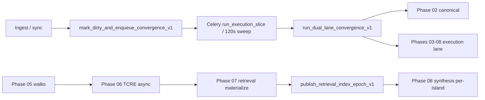

# Cortex runtime continuity stabilization audit

**Status:** Implemented on `main` (R1–R6 code paths) — 2026-05-23  
**Date:** 2026-05-23  
**Tenant reference:** `c08ef32b-f89a-40f6-9566-e19b5329436f` (Fizzer)  
**Mission:** Make the **current** convergence worker + phase runners maintain **walks → retrieval → synthesis** as a lawful heartbeat — by **deleting**, **simplifying**, and **fixing scheduling** — not by adding substrate layers.

**Authoritative evidence (cross-read, not invented):**

| Source | Role |
|--------|------|
| [`cortex_post_unlock_reality_audit.md`](cortex_post_unlock_reality_audit.md) | Pre–Phase A prod chain (phase 05 schema stall, propagation block) |
| [`cortex_final_reality_state_audit.md`](cortex_final_reality_state_audit.md) | Post–Phase A–3 prod truth (2026-05-23T00:17Z) |
| [`cortex_continuity_stabilization_plan.md`](cortex_continuity_stabilization_plan.md) | Phase A completions (synthesis reconcile, TCRE drain, AA strictness) |
| [`baselines/continuity_p0_2026-05-22.json`](baselines/continuity_p0_2026-05-22.json) | Deploy + step 0.3–0.4 recovery |
| [`baselines/fizzer_step12_2026-05-22.json`](baselines/fizzer_step12_2026-05-22.json) | Soak: `convergence_delta_succeeded: 0`, drainable 7715 |

**Repro (prod):**

```bash
cd backend
python scripts/continuity_audit_snapshot.py --tenant-id c08ef32b-f89a-40f6-9566-e19b5329436f --json
python scripts/prod_substrate_proof_queries.py --tenant-id c08ef32b-f89a-40f6-9566-e19b5329436f
python -m vector.domains.cortex.substrate_pipeline.continuity_proof_panel --tenant-id c08ef32b-f89a-40f6-9566-e19b5329436f --json
```

---

## Section 1 — Executive verdict

### One-line truth

Cortex **runs slices** (hundreds of FSM transitions/day) but **does not sustain** the intelligence heartbeat: **retrieval epochs and synthesis artifacts do not recur every few minutes**; walks recur only in **bursts**; canonical **topology_wait** and a **dual-lane early-return** can **skip the execution lane entirely** on most slices.

### Honest scorecard (Fizzer prod, 2026-05-23)

| Subsystem | Alive? | Recurring? | Blocker class |
|-----------|--------|------------|-----------------|
| Ingest | Yes | Partial (connector-dependent) | Caps, scheduler gaps |
| Canonical mat | Yes | Yes (mats/24h) | **8.2k deferrals**, `topology_wait`, **0 convergence delta** in soak |
| Dual-lane worker | Yes | Every dirty slice | **Early return on `topology_wait` skips execution** |
| Walks | Partial | **Bursts only** (4 post P0 deploy vs 24 wedge-era) | Propagation + phase 05 `walks_persisted=0` receipts |
| TCRE | Partial | **No** (1× queued stuck pre-A.3; 2 completed) | `WAITING` lease not swept; async drain |
| Retrieval | Historical | **No** since ~22:55 UTC burst | Epoch publish only after phase 07; scope/epoch tags |
| Synthesis | Broken output | **No** | `COMPLETED_EMPTY`, epoch scope 0, global eligible-scope lie |
| Topology pressure | Dominant | Re-queues | ~94% retry-ready deferrals (ingest parents) |

### What Phase A fixed vs what remains

| Fixed (Phase A) | Still broken |
|-----------------|--------------|
| 1043 synthesis jobs `running` → reconciled | Zero recurring **completed** synthesis artifacts |
| ECS deploy alignment process | Recurrence cadence, not deploy |
| TCRE queued drain wiring | `WAITING` tenants invisible to sweeper |
| Strict AA panel (AA1/AA6) | Runtime still fails recurrence SQL |
| Trace-only ban for sign-off | Operator UI still mislabels wedge history |

---

## Section 2 — Runtime heartbeat model (traced)

There is **no** separate Celery beat for walks, retrieval, or synthesis. One chain:



**Authoritative entrypoints:**

| Step | File | Function |
|------|------|----------|
| Dirty + enqueue | `execution/convergence_dispatch.py` | `mark_dirty_and_enqueue_convergence_v1` |
| Sweeper | `execution/sweep.py` | `run_convergence_sweep_v1` — **only** `dirty` / `stalled` / expired `running` |
| Worker | `execution/run_tenant_execution.py` | `run_tenant_convergence_v1` → dual-lane when enabled |
| Dual-lane | `execution/dual_lane_worker.py` | `run_dual_lane_convergence_v1` |
| New retrieval epoch | `retrieval/retrieval_publish_contract.py` | `publish_retrieval_index_epoch_v1` (phase 07 only) |

**Implication:** “Retrieval every few minutes” means **execution lane must reach phase 07 and publish** on a cadence bounded by:

1. `obligation_epoch` dirty marks (ingest),
2. Sweeper interval (`cortex_convergence_sweeper_interval_seconds`, default **120**),
3. Slice time budget (`cortex_convergence_time_budget_seconds`, default **540**),
4. **Whether execution lane runs at all** in a given slice.

---

## Section 3 — Root blocker chains (prod-backed)

### Chain A — Execution lane starvation under `topology_wait` (**CRITICAL**)

**Symptom:** Lease `fsm_state=CANONICAL_DRAINING`, `last_canonical_outcome=topology_wait`, `phase_cursor=phase_08_synthesis`, yet retrieval/synthesis frozen for hours.

**Code:**

```503:518:backend/src/vector/domains/cortex/execution/dual_lane_worker.py
        if canon_result and canon_result.get("outcome") in (
            "canonical_topology_wait",
            "canonical_partial",
        ):
            manifest["execution_phase_cursor_after"] = lease.phase_cursor
            _persist_dual_lane_slice_manifest_v1(lease, manifest=manifest)
            session.commit()
            enqueue_tenant_convergence_v1(tenant_id, reason="dual_lane_canonical_continue")
            return {
                "tenant_id": str(tenant_id),
                "acquired": True,
                "outcome": str(canon_result["outcome"]),
                ...
            }
```

**Mechanism:** When canonical lane returns `topology_wait` or `canonical_partial`, the worker **returns before** `_run_execution_lane_slice_v1`. With ~8.2k deferrals, **most slices never advance 05–08** even though `evaluate_dual_lane_schedule_v1` advertises `canonical_parallel_while_execution: true`.

**Prod evidence:** `cortex_final_reality_state_audit.md` — dual-lane manifest shows both lanes “ran” on some slices, but canonical topology_wait is continuous; retrieval last publish `2026-05-22T22:55:39Z`.

**Fix class:** **Code** — always run execution lane when `execution_lane_owed_v1(lease)` and cursor is 03–08; cap canonical budget, never early-return before execution.

---

### Chain B — Sweeper blind spot for `WAITING` (TCRE) (**CRITICAL**)

**Symptom:** Phase 06 enqueues TCRE with `run_sync=False` → `mark_tenant_waiting_v1` → phase 07 never runs until resume.

**Code:**

```247:248:backend/src/vector/domains/cortex/execution/lease.py
    if row.status == LEASE_STATUS_WAITING:
        return None, "waiting_on_async"
```

```362:397:backend/src/vector/domains/cortex/execution/lease.py
def list_tenants_for_convergence_sweep_v1(...):
    # Only dirty, stalled, expired running — NOT waiting
```

**Mechanism:** TCRE completion must call `on_tcre_job_terminal_for_execution_v1` → `resume_convergence_from_waiting_v1`. If Celery TCRE task stuck `queued`, tenant stays `WAITING` **forever** (no sweep).

**Prod evidence:** 1 job `queued` since `2026-05-22T21:36:24Z` (final audit B5); post-A.3 drain script exists but **recurrence** needs periodic WAITING poll.

**Fix class:** **Code** — sweeper includes `WAITING` + `waiting_reason=tcre_async` when terminal TCRE exists or job stale; OR bounded `run_sync=True` for single-job tenants.

---

### Chain C — Retrieval recurrence gated on full pipeline + publish (**MAJOR**)

**Symptom:** Giant idle gaps; epochs only in 3 UTC-hour bursts; `retrieval_index_stale_seconds` default 3600 is **degrade signal only**, not scheduler.

**Mechanism:**

- New epoch **only** from phase 07 publish path.
- Phase 07 blocked by: Chain A (no execution slice), Chain B (TCRE wait), phase 05 failure, `FSM_BLOCKED` retrieval policy.
- P1-C island scope: materialization tags `omission_summary.island_scope_id`; phase 08 filters `list_retrieval_entries_for_island_v1` on **published epoch** → **0 in-scope** if epoch realign missed.

**Prod evidence:** `retrieval_entries_in_scope: 0` for `epoch-8b226c263bd4` while global entries exist (final audit B3); 2077 rows, last hour burst 22:55Z.

**Fix class:** **Code** — enforce `CORTEX_RETRIEVAL_EPOCH_SCOPE_REALIGN=1` on every publish; fail phase 08 closed (C1 already default); add recurrence proof SQL (§8).

---

### Chain D — Synthesis `COMPLETED_EMPTY` / fake success (**MAJOR**)

**Symptom:** Phase 08 `COMPLETED_EMPTY`; admin eligible scopes > 0 but per-island 0; 1 artifact total.

**Mechanism:**

- `jobs_completed=0` → `COMPLETED_EMPTY` (`substrate_phase_receipt.py`).
- C1 gate (`CORTEX_PHASE08_FAIL_ON_EMPTY_SCOPE_WITH_ENTRIES=true`) should **fail** when published epoch has entries — verify receipt includes `phase08_empty_scope_gate`.
- `count_synthesis_eligible_scopes_v1` uses **global** projection; per-island runner uses **epoch-tagged** rows → **KPI lie**.

**Prod evidence:** 1043 `running` reconciled in A.1; `completed=1`; phase receipt `COMPLETED_EMPTY` at 00:15:10Z.

**Fix class:** **Code** — align admin KPI with per-island filter; never treat `COMPLETED_EMPTY` as continuity success; reconcile on slice start (keep A.1 path).

---

### Chain E — Walk cadence weak (**MAJOR**)

**Symptom:** 28 walks lifetime, 4 since P0 deploy; phase 05 receipts with `walks_persisted=0`.

**Mechanisms:**

1. **Historical:** Pre–P0-A worker image missing bundled OCTS schema — `oct_walk_policy_v1_schema_path()` now prefers `traversal/schemas/` (`walk_policy.py:77-91`); Dockerfile build asserts packaging (`backend/Dockerfile:23`). **Verify prod image ≥ commit `789b25fb`**.
2. **Propagation:** Global law blocks when orphans > 0 and linked > 0 (`substrate_traversal_scheduling.py:219-220`). **P3′ component mode** (`cortex_traversal_component_schedule_enabled`, default true) blocks only when `islands_eligible == 0` — prod must use component mode with ≥1 eligible island (final audit: 2 islands, 257+2 entities).
3. **No walk beat:** Walks only on phase 04/05, graph-hash chain (`cortex_graph_hash_autonomous_chain_enabled`), promotion hook on dual-lane slice.
4. **Phase 05 gate:** `CORTEX_PHASE05_REQUIRE_WALKS_WHEN_ELIGIBLE` — eligible + zero walks → blocked receipt.

**Fix class:** **Deploy + Chain A fix** + confirm component scheduling receipts show `islands_eligible_count >= 1`.

---

### Chain F — Canonical topology pressure (~10k deferrals) (**BOUNDED, not blocking cursor**)

**Symptom:** ~8,216 deferrals; ~7,715 retry-ready; admin pressure; canonical lane consumes budget.

**Drainability (prod composition, step 12 / post-unlock):**

| Bucket | Count | % of deferrals | Drainable? |
|--------|------:|---------------:|------------|
| Retry-ready (missing parents / ingest) | ~7,715 | **94%** | Only if **ingest** fills parents (GitHub PR timeline, deployments, Notion DB parents) |
| Permanent orphan | ~466 | **6%** | **No** — accept as bounded omission (D.4 doctrine) |
| Raw−mat gap minus deferrals | ~5 | — | Noise |

**Re-entry loop:** Deferrals retry on cooldown → `topology_wait` → canonical lane re-run → **Chain A skips execution** → no forward intelligence motion.

**Fix class:** **Do not** chase global convergence. **Ingest caps** (D.2: GitHub 10/16/120), throttle registry sync, KPI = `drainable_routable_estimate` only. **Decouple** execution from canonical drain (Chain A).

**What NOT to do:** New topology architecture, “perfect convergence,” or blocking phase 08 on `raw≈mat`.

---

### Chain G — Wedge semantics polluting truth (**MODERATE**)

**Remaining wedge surfaces:**

| Surface | Location | Issue |
|---------|----------|-------|
| Unlock scripts | `backend/scripts/unlock_step*.py` | Real motion source; AA7 ban during 48h (`continuity_cleanup_freeze.py`) |
| UI `WEDGE_DEPENDENT` | `continuity_overview_v1.py:339-350` | Any `completed` synthesis job in 48h without `running` lease → wedge label (**false positive** for reconciled failed jobs) |
| Proof / unlock evaluators | `unlock/step10_retrieval.py`, `step12_track_b_p3.py` | “Wedge minimum” thresholds |
| Historical rows | walks 15:19–15:20, retrieval 15:22 | Pollute “autonomous” narrative — filter by `created_at > deploy_cutoff` in ops scripts only |

**Fix class:** **Delete/archive** scripts from default ops; **fix UI** to use `execution_path` telemetry + `created_at` after last `mark_dirty:incremental_sync` chain, not job table alone.

---

## Section 4 — Scheduling bottlenecks (checklist)

| ID | Bottleneck | Where | Effect on heartbeat |
|----|------------|-------|---------------------|
| S1 | Dual-lane early return on `topology_wait` | `dual_lane_worker.py:503-518` | **Starves 05–08** |
| S2 | Sweeper 120s, limit 50 | `settings.py`, `sweep.py` | Max ~50 tenants/cycle; dirty backlog if many tenants |
| S3 | Lease acquire skips `WAITING` | `lease.py:247-248` | TCRE stall |
| S4 | `obligation_epoch > target_epoch` | `complete_convergence_lease_v1` | Re-dirty; good — but useless if execution skipped |
| S5 | Canonical time budget ~180s default third of 540s | `resolve_dual_lane_budgets_v1` | Eats slice before execution when both run |
| S6 | `next_attempt_at` on topology cooldown | `dual_lane_worker.py:218-226` | Delays re-enqueue; OK if execution still runs (**currently not**) |
| S7 | No retrieval/synthesis Celery beat | by design | Must fix slice path |
| S8 | `count_synthesis_eligible_scopes_v1` global | `synthesis_completeness_projection.py` | Misleading admin / blocked policy |
| S9 | Post-ingestion debounce | settings exist; M4 dispatches immediate dirty | Thundering herd possible — secondary |
| S10 | ECS split deploy | prod | Worker/API code drift — **single SHA gate** (A.2) |

---

## Section 5 — What to delete / simplify / NOT build

### Delete immediately (or archive out of `scripts/`)

| Item | Rationale |
|------|-----------|
| `unlock_step09_octs_walk.py`, `step10_retrieval.py`, `step12_synthesis.py`, … | Motion must not depend on these; AA7 already bans during soak |
| ~39 deprecated continuity proof scripts | `continuity_cleanup_freeze.py` — single ops entry: `continuity_audit_snapshot.py` |
| Legacy coordinator enqueue paths | D.5 deleted — verify no remaining callers |
| `WEDGE_DEPENDENT` as default continuity state | Misleading after A.1 reconcile |

### Simplify immediately

| Item | Action |
|------|--------|
| Dual-lane slice | **Never** return before execution lane when cursor ∈ 03–08 |
| Admin synthesis scopes | Show **per-island in-scope** count for published epoch, not global |
| Continuity overview | “Autonomous” only if recurrence SQL passes (§8), not slice count alone |
| AA panel | Already tightened in A.4 — **do not** relax for sign-off |
| Deferral KPI | Show `drainable_routable` + `permanent_orphan` only; hide raw−mat as primary |

### Do NOT build

- New ontology / island registry productization
- Separate schedulers for retrieval/walks/synthesis
- Probabilistic traversal
- “Perfect” canonical convergence gate on execution lane
- v2 substrate / future abstraction layers
- More proof scripts or trace-only baselines as sign-off

---

## Section 6 — Implementation plan (ordered)

### Wave 0 — Verify prod substrate (no code, 1 day)

| Step | Action | Owner |
|------|--------|-------|
| 0.1 | Confirm API + worker **same ECR tag** | Ops |
| 0.2 | `continuity_audit_snapshot.py --json` + save baseline | Ops |
| 0.3 | Confirm `bundled_oct_walk_policy_v1_schema_path().is_file()` in **running worker container** | Ops |
| 0.4 | Run recurrence SQL (§8) — record T0 | Ops |

**Rollback:** N/A  
**Risk:** Low

---

### Wave 1 — Unblock execution heartbeat (**P0**, 2–3 days)

| Step | Change | Files (primary) |
|------|--------|-----------------|
| **R1.1** | **Remove early return** on `canonical_topology_wait` / `canonical_partial`; run `_run_execution_lane_slice_v1` when `execution_lane_owed_v1` | `dual_lane_worker.py` |
| **R1.2** | Add setting `cortex_dual_lane_run_execution_on_topology_wait` default **true**; rollback via env | `settings.py`, `dual_lane_worker.py` |
| **R1.3** | Cap canonical lane to `min(config, 90s)` when execution cursor is 05–08 | `dual_lane_worker.py` |
| **R1.4** | Sweeper: include `WAITING` tenants with `waiting_reason=tcre_async` if job terminal or queued > N minutes; call `resume_convergence_from_waiting_v1` | `lease.py`, `sweep.py`, `tcre_resume.py` |
| **R1.5** | On slice start: `reconcile_stale_synthesis_jobs_v1` (existing A.1 hook) — ensure wired in dual-lane path | `synthesis_job_lifecycle.py` |

**Tests:** Extend `test_dual_lane_worker.py` — topology_wait slice **must** set `execution_lane_ran=true`.

**Success (24h):** `execution_lane_ran` in `last_dual_lane_slice` on ≥80% of slices while `topology_wait`; phase 07 `started_at` advances at least twice.

**Rollback:** R1.2 env `false` restores early-return behavior.

**Risk:** Medium — more DB load on execution phases; mitigated by budgets.

---

### Wave 2 — Retrieval recurrence (**P0**, 2 days)

| Step | Change | Files |
|------|--------|-------|
| **R2.1** | On `publish_retrieval_index_epoch_v1`, **always** run epoch scope realign when enabled | `retrieval_publish_contract.py`, `retrieval_component_materialization.py` |
| **R2.2** | Phase 07 receipt must include `published_epoch_id`, `entries_materialized`, `island_scope_id` | `phase_runners.py` |
| **R2.3** | If materialize yields rows but publish skipped, phase 07 **failed** not completed | `phase_runners.py` |
| **R2.4** | Optional stabilization window: `CORTEX_CONVERGENCE_SWEEPER_INTERVAL_SECONDS=60` in prod task def | ECS env |

**Success (24h):** ≥4 distinct UTC hours with new `cortex_retrieval_index_epochs.published_at` OR monotonic `epoch_id` change; max gap between publishes **≤30 min** during active ingest.

**Rollback:** R2.4 restore 120s; R2.1 disable realign env.

---

### Wave 3 — Synthesis truth (**P0**, 2 days)

| Step | Change | Files |
|------|--------|-------|
| **R3.1** | Ensure C1 gate attached on all phase 08 paths (per-island + monolithic) | `phase08_empty_scope_truth_gate.py`, `synthesis_per_island.py` |
| **R3.2** | Replace admin `count_synthesis_eligible_scopes_v1` with **published-epoch in-scope** helper in continuity overview | `continuity_overview_v1.py`, `synthesis_completeness_projection.py` |
| **R3.3** | `COMPLETED_EMPTY` → continuity state **BROKEN**, not DEGRADED | `continuity_overview_v1.py` |
| **R3.4** | Per-island synthesis: if entries in scope > 0, `jobs_completed` must be > 0 or **failed** | `synthesis_per_island.py` |

**Success (48h):** ≥1 new `cortex_synthesis_artifacts` row with `created_at` after T0; 0 new `COMPLETED_EMPTY` receipts when in-scope entries > 0; `running` jobs = 0.

---

### Wave 4 — Walk recurrence (**P1**, 1–2 days)

| Step | Change | Files |
|------|--------|-------|
| **R4.1** | Verify prod `cortex_traversal_component_schedule_enabled=true` | ECS |
| **R4.2** | Phase 05 supplement path logs `islands_eligible_count` in receipt | `phase05_walks_persisted_gate.py` |
| **R4.3** | If eligible islands > 0 and walks_persisted=0 → **failed** (B4 gate) | already default — verify prod env |
| **R4.4** | Graph-hash chain: confirm `schedule_graph_density_promotion_on_convergence_worker_v1` runs | `dual_lane_worker.py` |

**Success (24h):** ≥1 new `cortex_octs_walks` row/hour for 4 hours during business ingest OR ≥6 walks/24h with `purpose=substrate_traversal_v1` and `created_at > deploy_cutoff`.

---

### Wave 5 — Canonical pressure (practical, **P1**, ongoing)

| Step | Change | Notes |
|------|--------|-------|
| **R5.1** | Keep GitHub ingest caps aligned (D.2) | Reduces **new** deferrals |
| **R5.2** | Admin UI: permanent orphan card only (D.4) | Stop chasing 466 |
| **R5.3** | `convergence_delta_succeeded` in AA6 — **no fallback** to mat volume (A.4 done — verify prod panel) | |
| **R5.4** | Throttle island registry sync (cleanup freeze) | Reduces noise |

**Success (7d):** `drainable_routable_estimate` flat or ↓10%; **no** requirement for 0 deferrals.

---

### Wave 6 — Wedge excision (**P1**, 1 day)

| Step | Action |
|------|--------|
| **R6.1** | Move `unlock_step*.py` to `scripts/archive/unlock/`; keep `assert_wedge_script_allowed_v1` |
| **R6.2** | Fix `WEDGE_DEPENDENT`: require `execution_path=admin_bypass` or ops log entry, not completed jobs alone |
| **R6.3** | Remove “wedge” wording from admin continuity strings |
| **R6.4** | `continuity_audit_snapshot.py` adds `autonomous_since_deploy` counters (walks/epochs/artifacts after image tag time) |

---

## Section 7 — Implementation order (summary)

```
Wave 0 (verify) → R1.1–R1.5 (execution never starved) → R2.* (retrieval publish cadence)
  → R3.* (synthesis truth) → R4.* (walks) → R5.* (deferral bounded) → R6.* (wedge)
```

**Parallelizable:** R5.1 ingest caps with Wave 1 deploy. **Do not** start Wave 3 sign-off until R2.1 realign proven in SQL.

---

## Section 8 — Success criteria (exact SQL)

Replace `:tenant` with Fizzer UUID.

### Heartbeat — retrieval epochs

```sql
-- Publish cadence: max gap ≤ 30 minutes over last 6 hours (active tenant)
SELECT
  COUNT(DISTINCT date_trunc('hour', published_at)) AS hours_with_publish,
  MAX(published_at) AS last_publish,
  EXTRACT(EPOCH FROM (now() - MAX(published_at))) / 60.0 AS minutes_since_last
FROM cortex_retrieval_index_epochs
WHERE tenant_id = :tenant
  AND published_at > now() - interval '6 hours';
```

**Pass:** `minutes_since_last <= 30` during ingest-active window OR `hours_with_publish >= 4` in 6h window.

### Heartbeat — synthesis artifacts

```sql
SELECT COUNT(*) AS artifacts_24h
FROM cortex_synthesis_artifacts
WHERE tenant_id = :tenant
  AND created_at > now() - interval '24 hours';
```

**Pass:** `artifacts_24h >= 1` and monotonic growth on daily ops check.

### Heartbeat — walks

```sql
SELECT COUNT(*) AS walks_24h
FROM cortex_octs_walks
WHERE tenant_id = :tenant
  AND status = 'completed'
  AND created_at > now() - interval '24 hours'
  AND (request_body->>'purpose' = 'substrate_traversal_v1'
       OR request_body->'purpose' ? 'substrate_traversal_v1');
```

**Pass:** `walks_24h >= 6` (≥1 per 4h average).

### Synthesis hygiene

```sql
SELECT status, COUNT(*) FROM cortex_synthesis_jobs
WHERE tenant_id = :tenant GROUP BY status;
```

**Pass:** `running = 0`; no new rows stuck > 1h.

### Epoch alignment (B3)

```sql
-- In-scope entries for latest published epoch (per-island tags)
WITH ep AS (
  SELECT epoch_id FROM cortex_retrieval_index_epochs
  WHERE tenant_id = :tenant
  ORDER BY published_at DESC NULLS LAST LIMIT 1
)
SELECT COUNT(*) AS in_scope
FROM cortex_retrieval_index_entries e, ep
WHERE e.tenant_id = :tenant
  AND e.epoch_id = ep.epoch_id
  AND (e.omission_summary->>'island_scope_id') IS NOT NULL;
```

**Pass:** `in_scope > 0` when phase 08 runs.

### Dual-lane execution not starved

```sql
SELECT
  detail_json->'last_dual_lane_slice'->>'execution_lane_ran' AS exec_ran,
  detail_json->'last_dual_lane_slice'->>'canonical_lane_result' AS canon_result,
  detail_json->>'last_canonical_outcome' AS canon_outcome,
  phase_cursor
FROM cortex_tenant_convergence_leases
WHERE tenant_id = :tenant;
```

**Pass:** Over 10 consecutive slices (from worker logs or updated `last_dual_lane_slice`), when `last_canonical_outcome = topology_wait`, `execution_lane_ran = true`.

### Deferral bounded (not zero)

```sql
SELECT deferral_state, COUNT(*) FROM cortex_canonical_deferrals
WHERE tenant_id = :tenant GROUP BY deferral_state;
```

**Pass:** `permanent_orphan` stable; `retry_ready` not growing >5%/week.

---

## Section 9 — Rollback and risk

| Wave | Rollback | Risk |
|------|----------|------|
| R1 | Env disables execution-on-topology-wait | Execution load ↑; phase failures surface faster |
| R2 | Sweeper 120s; disable epoch realign | More frequent slices ↑ cost |
| R3 | Disable C1 gate (not recommended) | Fake empty success returns |
| R4 | Disable component scheduling (global block returns) | Walks stop — **do not** rollback unless emergency |
| R5 | Revert ingest caps | Deferrals grow faster |
| R6 | Restore scripts from archive | Operator temptation |

**48h AA clock:** Do not restart until Waves 1–3 pass recurrence SQL for **24h continuous**.

---

## Section 10 — Proof obligations after implementation

| Proof | Command / artifact |
|-------|-------------------|
| Ops snapshot | `continuity_audit_snapshot.py --json > baselines/runtime_continuity_YYYYMMDD.json` |
| Panel strict | `continuity_proof_panel.py --json` — AA4/AA5/AA6 recurrence |
| Dual-lane | Receipt in `detail_json.last_dual_lane_slice` |
| No wedge motion | `evaluate_aa7_no_wedge_scripts_v1` during hold |
| Deploy parity | `probe_prod_ecs_deploy_v1` — API/worker SHA match |

---

## Appendix A — Key code map

| Concern | Path |
|---------|------|
| Convergence loop | `execution/run_tenant_execution.py` |
| Dual-lane starvation bug | `execution/dual_lane_worker.py:503-518` |
| Sweeper eligibility | `execution/lease.py:362-397` |
| TCRE resume | `execution/tcre_resume.py` |
| Walk policy bundled schema | `traversal/walk_policy.py`, `traversal/schemas/octs-walk-policy-v1.schema.json` |
| Component propagation | `operational_runtime/substrate_traversal_scheduling.py:146-207` |
| Retrieval publish | `retrieval/retrieval_publish_contract.py` |
| Phase 08 empty gate | `synthesis/phase08_empty_scope_truth_gate.py` |
| Continuity UI state | `pipeline/continuity_overview_v1.py` |
| Wedge freeze | `substrate_pipeline/continuity_cleanup_freeze.py` |

---

## Appendix B — Relationship to other docs

| Document | Use |
|----------|-----|
| [`cortex_continuity_stabilization_plan.md`](cortex_continuity_stabilization_plan.md) | Phase A–D execution tracker; **this audit** owns **recurrence** fixes (R1–R6) |
| [`cortex_post_unlock_reality_audit.md`](cortex_post_unlock_reality_audit.md) | Historical C1/C2/C3 blockers; verify fixed in current SHA |
| [`cortex_final_reality_state_audit.md`](cortex_final_reality_state_audit.md) | Baseline metrics for before/after |

---

---

## Section 11 — Implementation completion (2026-05-23)

| Wave | Status | Primary changes |
|------|--------|-----------------|
| **R1** | **Done** | Removed dual-lane early return on `topology_wait`; canonical budget cap when execution owed; TCRE `WAITING` sweep (`tcre_waiting_sweep.py`, `sweep.py`); synthesis reconcile at slice start; retry-storm cooldown setting |
| **R2** | **Done** | `force_realign=True` on publish; broader realign when entries exist but 0 in-scope; phase 07 fails on publish/scope empty |
| **R3** | **Done** | `count_synthesis_eligible_scopes_in_published_epoch_for_primary_island_v1`; C1 default; `OPERATOR_RECOVERY` + `COMPLETED_EMPTY` → BROKEN in continuity overview |
| **R4** | **Done** | `cortex_execution_heartbeat_reset_cursor_to_phase05` — after phase 08 slice, cursor resets to 05 for next heartbeat |
| **R5** | **Done** | `cortex_canonical_deferral_retry_storm_cooldown_seconds` (300s floor when no progress on topology_wait) |
| **R6** | **Done** | Unlock scripts → `backend/scripts/archive/unlock/`; UI `WEDGE_DEPENDENT` → `OPERATOR_RECOVERY`; removed wedge copy in synthesis card |

**Tests:** `tests/vector/domains/cortex/execution/test_runtime_continuity_r1_dual_lane.py`

**Deploy:** set env vars (optional overrides): `CORTEX_DUAL_LANE_RUN_EXECUTION_ON_TOPOLOGY_WAIT=1`, `CORTEX_CONVERGENCE_SWEEP_TCRE_WAITING_ENABLED=1`, `CORTEX_EXECUTION_HEARTBEAT_RESET_CURSOR_TO_PHASE05=1`

*End of audit.*
