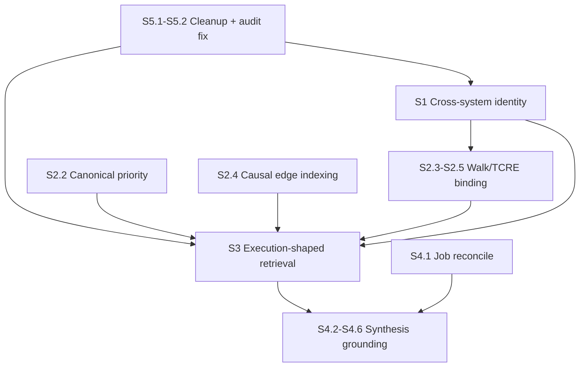

# Cortex semantic execution intelligence roadmap

**Status:** Implementation roadmap (semantic / intelligence track)  
**Date:** 2026-05-24  
**Tenant reference:** `c08ef32b-f89a-40f6-9566-e19b5329436f` (Fizzer)  
**Supersedes:** [`cortex_semantic_execution_intelligence_phase_plan.md`](cortex_semantic_execution_intelligence_phase_plan.md) completion claims — code for Waves S0–S5 **exists**, but **prod outcomes are not achieved**.

**Evidence base:**

| Source | Use |
|--------|-----|
| [`cortex_full_system_reality_audit_2026-05-24.md`](cortex_full_system_reality_audit_2026-05-24.md) | Current prod truth (lease, phases, AA panel, dead zones) |
| [`cortex_graph_truth_and_intelligence_quality_audit.md`](cortex_graph_truth_and_intelligence_quality_audit.md) | Semantic failure patterns |
| [`cortex_semantic_ops_runbook.md`](cortex_semantic_ops_runbook.md) | Operator commands (two-track model) |
| Live Postgres @ 2026-05-24T13:23Z | Numbers in this doc |

**This is NOT:** runtime continuity, dual-lane FSM, recurrence stabilization, orchestration sophistication, ontology expansion, embeddings, or a new graph engine.

**This IS:** the shortest path from **moving substrate** to **truthful execution intelligence** by improving, simplifying, and deleting what already exists.

---

## Executive framing

### What already works (do not rebuild)

| Layer | State |
|-------|-------|
| Ingest + raw store | Operational |
| Dual-lane convergence worker | Operational |
| Phase 05–06–07 chain | Runs; 07 **fail-loud** on bad mix |
| S3 semantic mix gate | **Working** — blocks org_link mirror publish |
| Graph dedupe (Wave S1 code) | **Working in prod** — dup_factor 1.0 |
| TCRE resume + walks | Partial — 4 TCRE, 106 walks |
| Fail-loud synthesis gates | Working — nothing useful to synthesize yet |

### What is broken (this roadmap fixes)

| Layer | Prod symptom |
|-------|--------------|
| Identity | 96% entities isolated; Slack/GitHub rules produce **zero** promotions |
| Graph | 100% `org.persona_belongs_to_handle`; Notion-handle star, not execution topology |
| Retrieval | 94% org_link; phase 07 **FAILED** `retrieval_semantic_mix_violation` |
| Synthesis | Phase 08 queued; 1043 failed jobs; 0 published claims |
| Ops | 30+ proof scripts; audit tooling schema drift; misleading KPIs |

### North star — Execution Reality Reconstruction V0

**Nothing before this counts as execution intelligence.** Not graph density, not retrieval row count, not phase receipts, not AA panel PASS.

**V0 is achieved only when Cortex can truthfully explain ONE real PR chain end-to-end with evidence** — a specific merged PR in Fizzer prod history, inspectable without wedge scripts, covering all six dimensions below.

We will want more (more PRs, more islands, recurrence). **Start here:** one PR, full chain, full evidence.

| Dimension | What “truthful” means for V0 |
|-----------|------------------------------|
| **Ownership** | Who opened, reviewed, merged, deployed — same person across Slack/GitHub where applicable; identity inspector + mats show **who**, with anchor/candidate evidence |
| **Discussion** | Slack/GitHub/Notion thread context tied to that PR — message or thread mats + TCRE coordination artifacts (not org_link mirrors) |
| **Delivery** | PR → review → merge — canonical mats + TCRE causal chain for the work thread |
| **Deployment** | Merge → deploy (and rollback if applicable) — deployment mats + TCRE temporal/causal edges |
| **Retrieval lineage** | Published epoch rows (`materialization`, `causal_*`, `walk`) each traceable to canonical/TCRE source IDs; mix gate passed |
| **Synthesis claim** | ≥ 1 published claim on that PR chain citing retrieval refs — not `claims: []`, not scope-empty |

**Until V0:** Cortex has substrate motion, not execution reality reconstruction.

**Scope for V0:** One island (`d7e41b3c763d38e9`) is enough; org-wide coverage is explicitly out of scope for V0.

---

## Core design rule — artifacts first, not graph semantics

**Execution continuity must emerge from real artifacts already in the substrate — not from adding more graph semantics.**

| Execution continuity comes from | It does **not** come from |
|--------------------------------|---------------------------|
| Ingested connector events (PRs, deploys, messages, reviews) | New org `link_type` rows |
| Canonical **materializations** (`pull_request`, `deployment`, …) | `ContinuityEdgeKind` schema without artifact backing |
| **TCRE** artifacts (`causal_edge`, `causal_chain`, chronology) | Graph density / promotion inflation |
| **Walks** over artifact-backed scope | Phase 04 `edge_count` or auth-link row growth |
| **Retrieval index** rows (`materialization`, `walk`, `causal_*`) | Org-link mirrors repackaged as “execution topology” |

The org graph (S1) exists to resolve **who** — identity adjacency only. **What happened** and **what caused what** are reconstructed by binding **real artifacts** into retrieval and TCRE — then optionally referenced by synthesis claims.

**If a PR cannot be pointed to as a canonical mat + retrieval row + TCRE receipt, we do not have execution continuity for that PR** — regardless of how many auth edges exist.

---

## Non-negotiable constraints (all phases)

1. **Retrieval is the product substrate** — graph and identity exist to scope execution-state retrieval, not as the product.
2. **Execution continuity = artifact continuity** — PRs, deploys, messages, TCRE chains, and mats; **not** new graph edge types or ontology layers.
3. **No new `link_type`** without prod evidence, expected count, retrieval use-case, and synthesis use-case in the PR. New link types are for **identity** (S1) only; execution chains stay in retrieval/TCRE.
4. **Delete before add** — fewer scripts, panels, counters, and orchestration concepts after S5.
5. **Graph progress = `unique_auth_pairs` + `dup_factor`**, never raw link row count. Graph growth is **not** execution progress.
6. **Do not weaken `retrieval_semantic_mix_violation`** — fix materialization mix instead.
7. **Synthesis stays fail-loud** — empty claims are worse than FAILED.
8. **No ML, embeddings, probabilistic identity, or agent orchestration** in this roadmap.

---

# Phase S1 — Cross-system identity continuity

## Objective

Fix semantic fragmentation so the graph can connect **the same person across Slack, GitHub, Notion, and email** in **promoted authoritative edges** — deterministically, with evidence.

## Why it matters

Without cross-system identity, there is no **ownership continuity**. Walks, TCRE, and retrieval cannot attach work artifacts to people. Today 96% of entities never enter the auth graph; the 4% that do form a Notion-handle star (17 personas → 293 handles).

## Current prod truth (Fizzer, 2026-05-24)

| Metric | Value |
|--------|-------|
| Active org entities | 7,393 |
| Entities in auth graph | 297 (**4.0%**) |
| Graph-isolated entities | 7,096 (**96.0%**) |
| Auth links (active) | 2,080 |
| Unique auth pairs | 2,080 (dup_factor **1.0**) |
| Distinct personas (auth source) | 17 |
| Distinct handles (auth target) | 293 |
| Candidates | 51,260 rows / 2,080 distinct pairs |
| Candidate rules in prod data | **2** |

### Auth edge distribution (100% persona→handle)

| rule_id | count |
|---------|-------|
| `p04.candidate.exact_notion_user_id_v1` | 2,000 |
| `p04.candidate.email_norm_continuity_evidence_v1` | 80 |
| Slack / GitHub / Linear rules | **0** |

### Failed / nonexistent cross-system promotions (concrete)

**Slack:** 3,786 `message` anchors, 174 `person` anchors — **zero** `exact_slack_user_id_v1` auth edges.

**GitHub:** 4,722 `canonical_reference` anchors, 815 `pull_request` anchors — **zero** `exact_github_login_v1` auth edges.

**Notion (works):** 1,239 `page` anchors → 2,000 Notion-ID promotions. Same `notion_user_id` on many pages → many org handles → cross-entity candidate buckets form.

**Email (partial):** 80 edges from `email_norm_continuity_evidence_v1` — only cross-system bridge today besides Notion clustering.

### Candidate churn

Phase 03 runs repeatedly with `COMPLETED_EMPTY` (mislabeled — candidates grow, entities don't). Each slice adds ~2,000 candidate rows while promotion only fires for Notion + email. 49,180 candidate rows have no matching auth link.

## Root causes (code-proven)

| # | Cause | Code |
|---|-------|------|
| R1 | **Slack/GitHub fingerprints are global** — one org entity per `slack_user_id` / `github_login` → cross-entity buckets never form | `identity/identity_primitive_projection.py` |
| R2 | Candidate generation requires **≥2 different org entities** in same join bucket | `identity/anchor_continuity_candidates.py` → `_emit_cross_entity_pairs_from_bucket()` |
| R3 | Promotion stack is **connector-fair** — not the bottleneck | `identity/identity_continuity_promotion_v1.py`, `operational_runtime/graph_density_promotion.py` |
| R4 | Phase 03 `COMPLETED_EMPTY` mislabels real work | `substrate_pipeline/phase_runner_receipt.py` → `infer_processed_count_v1()` |
| R5 | Operator rebuild path **skips promotion** | `identity/continuity_rebuild.py` → `run_identity_continuity_rebuild()` |
| R6 | Backfill scans only 5,000 anchors; 12k+ deferrals block anchor creation | `identity/backfill.py`, canonical deferrals |

**Key insight:** Notion "wins" because its fingerprint includes `evidence_canonical_entity_id` (many handles per user key). Slack/GitHub use global registry keys (one handle per user key) — exact-key rules can **never** emit candidates under current logic.

## Implementation steps (PR-sized)

### S1.1 — Prod diagnosis harness (ship first, read-only) ✅

**Status:** Shipped — `identity_continuity_diagnosis_v1.py`, `GET .../identity-continuity-diagnosis`, audit snapshot includes diagnosis block.

**Files:** `identity/continuity_evidence_inspector.py`, `scripts/identity_continuity_audit_snapshot.py`, admin identity continuity inspector API.

**Work:**
- Expose per-rule bucket stats: `buckets_with_ge2`, `eligible_cross_entity_pairs`, `singleton_buckets` for Slack vs GitHub vs Notion.
- Sample 10 anchors per connector with `continuity_identity_signals_for_anchor()`.
- Receipt links to latest `candidate_set_sha256` batch.

**Rollout:** Admin-only; no prod writes.

### S1.2 — Fix Slack/GitHub primitive fingerprint model (core unlock) ✅

**Status:** Shipped — evidence-scoped fingerprints (default on); revert via `CORTEX_IDENTITY_EVIDENCE_SCOPED_SLACK_GITHUB_FINGERPRINT=0`. Boundary repair runs in anchor backfill path.

**Files:** `identity/identity_primitive_projection.py`, `identity/backfill.py`, tests in `test_identity_primitive_projection.py`.

**Work:**
- Add evidence-scoped fingerprint material for `slack_user` and `github_user` (mirror Notion: include `evidence_canonical_entity_id` in fingerprint).
- Run bounded `repair_anchor_org_entity_boundary_v1()` for affected tenants after deploy.
- Regenerate candidates; verify Slack/GitHub buckets with ≥2 entities appear in diagnosis harness.

**Alternative (smaller, defer if risky):** cross-tool join rule via shared email only — does not fix exact-key rules but adds incremental bridges.

**Anti-overengineering:** Do **not** add ML scoring or new entity kinds. One fingerprint change + repair script.

### S1.3 — Email bridge coverage audit + fix gaps ✅

**Status:** Shipped — `aggregate_connector_email_bridge_coverage_v1` in diagnosis harness; Slack member/profile and GitHub PR author email paths widened.

**Files:** `identity/identity_primitive_projection.py` (email extraction), GitHub/Slack connector payload paths.

**Work:**
- Measure `% anchors with extractable email` per connector on Fizzer.
- Fix missing email primitive extraction on GitHub PR author / Slack profile where deterministic.
- Target: email rule promotions > 80 and growing.

### S1.4 — Operator rebuild promotion parity ✅

**Status:** Shipped — `run_identity_continuity_rebuild()` schedules graph density promotion after substrate refresh (pipeline parity).

### S1.5 — Honest phase 03 receipts ✅

**Status:** Shipped — `infer_processed_count_v1()` for phase 03 uses `entities_upserted + candidates_generated_count`.

### S1.6 — Skip identity/graph spam when delta zero ✅

**Status:** Shipped — phase 04 skipped when phase 03 is `COMPLETED_EMPTY` and `distinct_candidate_pairs_delta == 0`.

### S1.7 — Promotion diversity observability ✅

**Status:** Shipped — `promotable_by_rule_id` primary KPI with 48h Slack/GitHub zero alert in graph truth / semantic readiness / control plane.

## Delete / simplify (S1)

| Target | Action |
|--------|--------|
| Treating candidate row count as progress | **DELETE** from admin KPIs |
| Phase 03 `COMPLETED` without delta | **SIMPLIFY** to honest outcome labels |
| Duplicate identity rebuild without promotion | **FIX** operator path (S1.4) |

## Rollout order (S1)

1. S1.1 diagnosis → confirm fingerprint hypothesis in prod  
2. S1.2 fingerprint fix + boundary repair  
3. S1.3 email gaps (parallel with S1.2 if separate owners)  
4. S1.4 + S1.5 + S1.6 (same release train)  
5. S1.7 observability  

## Validation SQL

```sql
-- Isolation rate (target: < 85% after S1)
WITH incident AS (
  SELECT source_entity_id eid FROM cortex_org_links
  WHERE tenant_id = :tenant AND link_authority = 'authoritative' AND revoked_at IS NULL
  UNION SELECT target_entity_id FROM cortex_org_links
  WHERE tenant_id = :tenant AND link_authority = 'authoritative' AND revoked_at IS NULL
)
SELECT
  (SELECT COUNT(*) FROM cortex_org_entities
   WHERE tenant_id = :tenant AND tombstoned_at IS NULL AND lifecycle_state = 'active') AS total,
  (SELECT COUNT(*) FROM incident) AS in_graph;

-- Promotion rule diversity (target: >= 3 rules with auth edges)
SELECT rule_id, COUNT(*) AS n
FROM cortex_org_links
WHERE tenant_id = :tenant AND link_authority = 'authoritative' AND revoked_at IS NULL
GROUP BY 1 ORDER BY n DESC;

-- Slack/GitHub candidate existence (target: > 0 before promotion can fire)
SELECT rule_id, COUNT(*) AS candidates
FROM cortex_org_link_candidates
WHERE tenant_id = :tenant AND rule_id IN (
  'p04.candidate.exact_slack_user_id_v1',
  'p04.candidate.exact_github_login_v1'
)
GROUP BY 1;

-- Cross-system: same persona linked to handles from different connector metadata
-- (inspect via identity continuity inspector API after S1.2)
```

## Success criteria

| Criterion | Target |
|-----------|--------|
| Entities in auth graph | **≥ 15%** of active entities (up from 4%) |
| Promotion rules with auth edges | **≥ 3** (Slack, GitHub, Notion and/or email) |
| Slack/GitHub candidate rows | **> 0** distinct cross-entity pairs |
| `promotable_by_rule_id` | Non-zero for Slack and GitHub |
| Phase 03 receipts | No false `COMPLETED_EMPTY` when candidates generated |
| Identity inspector | Shows cross-system evidence for sampled merged personas |

## Rollback plan

- S1.2 fingerprint change: feature flag `CORTEX_IDENTITY_EVIDENCE_SCOPED_SLACK_GITHUB_FINGERPRINT=0` reverts to global keys; run boundary repair rollback script if entity splits occur.
- S1.6 skip logic: env `CORTEX_PHASE03_SKIP_WHEN_EMPTY=0` restores current behavior.
- Promotion passes are append-only with ledger dedupe — no destructive rollback needed.

## Anti-overengineering constraints (S1)

- Do **not** add embeddings, probabilistic merge scores, or new org entity kinds.
- Do **not** add new `link_type` values for execution — S2 adds continuity via **artifacts**, not org-link semantics.
- Do **not** build a separate identity ML pipeline — fix fingerprints and existing rules only.

---

# Phase S2 — Execution continuity from artifacts

> **Naming note:** This phase is **not** “make the org graph look like execution topology.” It is **materialize and chain real work artifacts** (PRs, deploys, messages) through canonical → walks → TCRE → retrieval. The graph (S1) supplies **ownership context only**.

## Objective

Make **ingested execution artifacts** (canonical mats, TCRE outputs, walks) sufficient to reconstruct work threads, ownership, and delivery chains — **without** adding execution semantics to the org-link graph.

## Why it matters

Identity continuity (S1) answers "who is the same person across systems." Execution continuity answers "what work happened, who owned it, what caused what" — and that answer must be **grounded in connector artifacts**, not in new graph edge types.

Today retrieval indexes org_link mirrors because **execution-shaped artifacts never dominate the index** — not because we lack graph ontology. Adding more `org.persona_belongs_to_handle` edges or wiring `ContinuityEdgeKind` into org links would **not** fix PR→deploy reconstruction; indexing canonical mats and TCRE causal edges will.

## Current prod truth

### Edge-type distribution

| Surface | Edge types | Prod count |
|---------|------------|------------|
| Auth org links | `org.persona_belongs_to_handle` only | 2,080 |
| Continuity schema (3.5) | `pr_links_issue`, `commit_deployed_by`, `deployment_for_workflow`, … (14 kinds) | **Contract only — not in prod graph** |
| TCRE causal | 10 `tcre_*` kinds | Artifacts exist; **1** causal_chain retrieval row |
| Canonical structural | `contained_in`, `authored_by`, `references`, … | In canonical projection, **under-indexed in retrieval** |

### Why persona→handle dominates

Promotion + candidate rules only emit `org.persona_belongs_to_handle`. Graph density promotion has no execution edge types to promote. Phase 04 projection counts candidate + auth edges — **vanity metric**.

### Missing artifact continuity (examples)

| Chain | Ingested? | In auth graph? | In retrieval index? |
|-------|-----------|----------------|---------------------|
| Linear issue → GitHub PR | Partial (deferrals) | No | No |
| PR → review → merge | Yes (GitHub) | No | Rare mat rows (307 total) |
| Merge → deployment | Yes (GitHub deploy events) | No | No |
| Deploy → rollback | Yes | No | No |
| Slack thread → incident | Yes (Slack) | No | No |
| Owner → PR (via identity) | Anchors exist | **No cross-system link** | No |

### Traversal semantics

106 walks exist; they traverse the **org-entity reference graph**, not PR/deploy/message topology. Walks produced 26 retrieval entries vs 5,299 org_link entries.

## Root causes

| # | Cause |
|---|-------|
| E1 | Execution edges live in **TCRE/canonical/coordination contracts**, not org_link ledger — never bound into retrieval at volume |
| E2 | `ContinuityEdgeKind` (14 types) is **schema-only** — no materialization path to retrieval |
| E3 | Canonical deferrals (12,344) prevent PR/deploy/message mats → no chronology for TCRE |
| E4 | TCRE jobs complete but **`causal_edge` not indexed** — only chain + chronology mats |
| E5 | Walks don't target execution artifact nodes — they target org entities from identity graph |

## Implementation steps (PR-sized)

### S2.1 — Define minimal execution continuity set (artifact-backed, doc only) ✅

**Status:** Shipped — [`DOCS/cortex/execution_continuity_minimal_set_v1.md`](../cortex/execution_continuity_minimal_set_v1.md) defines 5 artifact-backed classes and maps them to retrieval index kinds (`materialization`, `walk`, `causal_chain`, `causal_edge`).

### S2.2 — Canonical materialization priority for execution-bearing kinds ✅

**Status:** Shipped — `execution_kind_priority_v1.py` boosts PR/deploy/timeline/message drain order; low-value GitHub refs fast-track to `permanent_orphan`. Revert via `CORTEX_CANONICAL_EXECUTION_KIND_PRIORITY=0`.

### S2.3 — TCRE scope binding to execution artifacts ✅

**Status:** Shipped — `execution_artifact_tcre_scope_v1.py` filters TCRE mats to execution kinds + walk start intersection; phase 06 enables strict binding when walk present.

### S2.4 — Index TCRE causal edges in retrieval (prerequisite for S3)

**Files:** `retrieval/retrieval_tcre_binding.py`.

**Work:**
- Materialize `index_kind=causal_edge` rows from TCRE `causal_edge` artifacts (today: lookup map only).
- Cap per epoch via existing TCRE materialization limits.

### S2.5 — Walk start-node selection for execution continuity

**Files:** `substrate_pipeline/substrate_traversal_execution.py`, `traversal/runtime_execution_model.py`.

**Work:**
- Prefer walk start nodes = org entities incident to **canonical PR/deploy mats** on the island, not random high-degree handles.
- Receipt: `walks_persisted` + `execution_anchor_count`.

### S2.6 — Dead topology cleanup

**Files:** `pipeline/pipeline_admin_graph_truth_inspector.py`, phase 04 receipts.

**Work:**
- Remove `edge_count` from primary admin KPI; show `unique_auth_pairs`, `index_kind mix`, `tcre_artifact_count`.
- Mark `ContinuityEdgeKind` schema-only types as **non-KPI** until retrieval indexes them.

## Delete / simplify (S2)

| Target | Action |
|--------|--------|
| Phase 04 monotonic `edge_count` KPI | **DELETE** as success signal |
| `ContinuityEdgeKind` as fake progress | **SIMPLIFY** — document as future or wire to retrieval, not both |
| Graph density for Notion star growth | **CAP** promotion when `unique_pairs_delta = 0` (already partially done) |

## Rollout order (S2)

1. S2.1 doc (same PR as S1.7 if needed)  
2. S2.2 canonical priority (can start during S1)  
3. S2.4 causal_edge indexing (feeds S3 — can ship early)  
4. S2.3 + S2.5 walk/TCRE binding  
5. S2.6 admin cleanup  

**Dependency:** S2.3/S2.5 benefit from S1 (owners linked); S2.4 can ship before S1 completes.

## Validation SQL

```sql
-- Canonical mats for execution kinds (target: monotonic increase)
SELECT canonical_object_kind, COUNT(*) AS n
FROM cortex_canonical_transform_materializations
WHERE tenant_id = :tenant
  AND canonical_object_kind IN ('pull_request', 'deployment', 'timeline_mutation')
GROUP BY 1 ORDER BY n DESC;

-- TCRE artifact volume (target: causal_edge artifacts > 0 per completed job)
SELECT artifact_kind, COUNT(*) AS n
FROM cortex_tcre_reconstruction_artifacts a
JOIN cortex_tcre_reconstruction_jobs j ON j.id = a.job_id
WHERE j.tenant_id = :tenant AND j.status = 'completed'
GROUP BY 1;

-- Walk → execution anchor binding (receipt JSON in phase 05 runs)
SELECT output_json->>'execution_anchor_count' AS anchors, completed_at
FROM cortex_substrate_phase_runs
WHERE tenant_id = :tenant AND phase_id = 'phase_05_traversal'
ORDER BY completed_at DESC LIMIT 5;
```

## Success criteria

| Criterion | Target |
|-----------|--------|
| Canonical PR + deploy mats | **Monotonic increase** over 7d window |
| TCRE jobs per walk epoch | **≥ 1** completed job with **≥ 3** causal_edge artifacts |
| Retrieval `causal_edge` rows | **> 0** (after S2.4 + S3 publish) |
| Bounded reconstruction query | Inspector can show **PR → deploy** chain for **≥ 1** real Fizzer PR with evidence refs |
| Owner attribution | **≥ 1** chain where actor identity spans **2+ connectors** (depends on S1) |

## Rollback plan

- S2.2 drain priority: revert candidate_selection ordering via env flag.
- S2.4 causal_edge indexing: disable via `CORTEX_RETRIEVAL_INDEX_TCRE_CAUSAL_EDGES=0`.
- No org_link schema changes to roll back.

## Anti-overengineering constraints (S2)

- Do **not** add org link types or graph semantics to “represent” PR→deploy — **materialize the PR and deploy mats** instead.
- Do **not** wire `ContinuityEdgeKind` into org links unless each kind maps to a **concrete artifact materialization path** (default: use TCRE + retrieval, not org links).
- Do **not** treat phase 04 edge_count or auth-link growth as execution progress.
- Do **not** build a separate execution graph DB — artifact continuity lives in retrieval index + TCRE receipts.
- Do **not** require global deferral zero — scope to island + permanent orphan omission.

---

# Phase S3 — Execution-shaped retrieval

## Objective

Turn retrieval from **topology mirror** into **execution-state index** — published epochs that are primarily materializations, walks, and causal chains, passing the S3 mix gate without weakening it.

## Why it matters

Phase 07 **correctly fails** today (`retrieval_semantic_mix_violation`). Until retrieval publishes lawful epochs, phase 08 never runs. This is the **hard blocker** for all downstream intelligence.

## Current prod truth

| Metric | Value |
|--------|-------|
| Total retrieval entries | 5,633 |
| org_link | 5,299 (**94.1%**) |
| materialization | 307 (**5.5%**) |
| walk | 26 (**0.5%**) |
| causal_chain | 1 (**0.0%**) |
| causal_edge | **0** |
| Published epoch `epoch-57147c1555c6` | **100% org_link** (1,599 entries) |
| Last retrieval entry | 2026-05-23T13:51Z |
| Phase 07 last run | **FAILED** @ 2026-05-24T10:06Z |

### Useless retrieval example (typical row)

```json
{
  "index_kind": "org_link",
  "index_epoch": "epoch-57147c1555c6",
  "artifact_ref_json": { "org_link_id": "..." },
  "omission_summary": { "outside_island_scope_entity_count": 7029 }
}
```

Returns a **graph edge hash**, not "PR merged → deployed."

### Good retrieval (target shape)

```json
{
  "index_kind": "materialization",
  "index_key": "mat:<canonical_entity_id>",
  "artifact_ref_json": { "canonical_entity_id": "...", "kind": "pull_request" }
}
```

Plus companion `causal_chain` / `causal_edge` rows from TCRE.

## Root causes

| # | Cause | Code |
|---|-------|------|
| M1 | Materialization order runs walks/TCRE/mats **then** org_link — but upstream volumes too low | `retrieval_semantic_orchestration_v1.py` |
| M2 | org_link cap 500/epoch still large vs ~26 walks | `retrieval_materialization_caps_v1.py` |
| M3 | `causal_edge` never materialized to index | `retrieval_tcre_binding.py` |
| M4 | Canonical mats missing `canonical_entity_id` on island entities → mat binder skips | `retrieval_canonical_materialization_v1.py` |
| M5 | Mix gate correctly rejects publish | `retrieval_semantic_mix_v1.py` |

## Implementation steps (PR-sized)

### S3.1 — Index TCRE causal_edge rows

**Files:** `retrieval/retrieval_tcre_binding.py` → `materialize_retrieval_index_from_tcre_job_v1`.

**Work:** Loop `by_tcre_causal_edge_id`; write `index_kind=causal_edge` entries with stable `index_key`.

*(If not done in S2.4, this is the highest-leverage single PR.)*

### S3.2 — Lower org_link cap + conditional skip

**Files:** `retrieval/retrieval_materialization_caps_v1.py`, `retrieval/retrieval_semantic_orchestration_v1.py`.

**Work:**
- Default `CORTEX_RETRIEVAL_MAX_ORG_LINK_ENTRIES_PER_EPOCH`: 500 → **100** (Fizzer prod).
- If `execution_index_count / total >= 0.60` before org_link pass, **skip org_link materialization** entirely for that epoch.

### S3.3 — Boost canonical mat materialization on island

**Files:** `retrieval/retrieval_canonical_materialization_v1.py`.

**Work:**
- Ensure island entity set maps to `metadata_json.canonical_entity_id` for mat binding.
- Raise `CORTEX_RETRIEVAL_MAX_CANONICAL_MATS_PER_EPOCH` only if mix still fails after S3.1 (default 800 may suffice once deferrals drain from S2.2).

### S3.4 — Retrieval composition law (operator doc + receipt)

**Files:** `retrieval/retrieval_publish_contract.py`, phase 07 receipt JSON.

**Work:** Every published epoch receipt includes:

```json
{
  "semantic_mix": {
    "org_link_pct": 25.0,
    "execution_index_pct": 65.0,
    "gate_pass": true
  }
}
```

Admin retrieval page shows mix breakdown per epoch — not just entry count.

### S3.5 — Fix audit tooling schema drift

**Files:** `substrate_pipeline/semantic_readiness_v1.py` line 384 — `published_at` → use `created_at` + `published IS TRUE`.

**Work:** Unblock `graph_truth_audit_snapshot.py` and `identity_continuity_audit_snapshot.py` on prod.

### S3.6 — Retrieval inspector: good vs useless rows

**Files:** `api/http/routes/admin_cortex_retrieval.py`.

**Work:**
- Filter samples by `index_kind`; flag rows where `index_kind=org_link` and no execution neighbor within same `traversal_epoch`.
- "Useless row" = org_link mirror with empty execution context.

## Delete / simplify (S3)

| Target | Action |
|--------|--------|
| Global retrieval bootstrap mirroring all org links | **DELETE** from default pipeline path |
| Publishing without mix check | Already deleted (gate works) — **KEEP** |
| Retrieval row count as KPI | **REPLACE** with mix percentages |

## Rollout order (S3)

1. S3.5 audit tooling fix (parallel, day 1)  
2. S3.1 causal_edge indexing  
3. S3.3 canonical mat boost (depends on S2.2 deferral drain)  
4. S3.2 org_link cap + skip  
5. S3.4 + S3.6 inspection surfaces  
6. Run `retrieval_island_semantic_backfill.py --apply` on Fizzer island once mix laws land  

## Validation SQL

```sql
-- Mix for latest BUILDING/PUBLISHED epoch (target: org_link <= 30%, execution >= 60%)
SELECT index_kind, COUNT(*) AS n,
  ROUND(100.0 * COUNT(*) / SUM(COUNT(*)) OVER (), 1) AS pct
FROM cortex_retrieval_index_entries
WHERE tenant_id = :tenant AND index_epoch = :epoch
GROUP BY 1 ORDER BY n DESC;

-- Phase 07 outcome (target: completed, not retrieval_semantic_mix_violation)
SELECT status, output_json->>'error_code' AS err, completed_at
FROM cortex_substrate_phase_runs
WHERE tenant_id = :tenant AND phase_id = 'phase_07_retrieval'
ORDER BY completed_at DESC LIMIT 3;

-- Published epoch freshness (target: newest within 24h of walks)
SELECT index_epoch, build_state, entry_count, published_at, created_at
FROM cortex_retrieval_index_epochs
WHERE tenant_id = :tenant
ORDER BY created_at DESC LIMIT 3;
```

## Success criteria

| Criterion | Target |
|-----------|--------|
| Phase 07 | **COMPLETED** with publish (no mix violation) |
| Published epoch mix | org_link **≤ 30%**, execution index **≥ 60%** |
| `causal_edge` rows | **> 0** in published epoch |
| Retrieval freshness | New epoch within **24h** of walk/TCRE activity |
| Useless row rate | org_link-only scopes **< 30%** of entries |
| S3 gate | **Unchanged thresholds** — pass by composition, not config weaken |

## Rollback plan

- S3.2 cap/skip: env restores 500 org_link cap and disables skip.
- S3.1 causal_edge: env flag disables indexing.
- Failed publish leaves epoch in BUILDING — no partial publish (existing contract).

## Anti-overengineering constraints (S3)

- Do **not** disable or loosen `retrieval_semantic_mix_violation`.
- Do **not** add embedding-based retrieval or new index stores.
- Do **not** mirror entire org graph "just in case" — org_link is supporting evidence only.

---

# Phase S4 — Synthesis stabilization

## Objective

Turn synthesis from **broken substrate output** into **grounded execution intelligence** — recurring, inspectable artifacts with verifiable claims tied to retrieval evidence.

## Why it matters

Even perfect retrieval is useless if synthesis cannot consume it. Today phase 08 is **queued** because phase 07 fails. Historical 1043 failed jobs poison trust in the synthesis layer.

## Current prod truth

| Metric | Value |
|--------|-------|
| Synthesis jobs | 1 completed, **1043 failed** |
| Artifacts | 1 (`degradation_brief`, **claims: []**, unpublished) |
| Phase 08 status | **queued** (blocked on phase 07) |
| Last artifact | 2026-05-22T15:33Z |
| Typical failure | `SD-SCOPE-EMPTY`, `retrieval_not_semantic`, `phase08_empty_scope_with_retrieval_entries` |

### Weak grounding chain

```
Retrieval epoch (100% org_link) → synthesis scope selection → empty execution context → claims: []
```

Fail-loud gates **work** — they prevent fake-green. There is nothing truthful to synthesize yet.

## Root causes

| # | Cause |
|---|-------|
| Y1 | Phase 07 not publishing lawful epoch — phase 08 never starts |
| Y2 | 1043 failed jobs — unreconciled incident |
| Y3 | Three synthesis shapes (inline, Celery, per-island) — operator confusion |
| Y4 | Scopes derived from org_link rows → empty execution narrative |
| Y5 | Empty claims correctly blocked from publish — no "minimal useful" baseline defined in prod |

## Implementation steps (PR-sized)

### S4.1 — Synthesis job table reconciliation (incident, ship immediately)

**Files:** `scripts/synthesis_failed_jobs_reconcile.py`, `synthesis/synthesis_job_lifecycle.py`.

**Work:**
- Run reconcile on Fizzer: terminalize stale `failed`/`running` rows with receipt.
- Add admin "synthesis hygiene" count to semantic panel.
- Prevent recurrence: job terminal transition invariant test.

**Can start on day 1** — no dependency on S1–S3.

### S4.2 — Collapse to single pipeline synthesis path

**Files:** `synthesis/synthesis_pipeline.py`, `synthesis/synthesis_per_island.py`, `app/tasks/cortex_synthesis_jobs.py`.

**Work:**
- Pipeline hot path: **inline per-island only** (`synthesis_per_island.py`).
- Celery `run_synthesis_job_task` → admin/ad-hoc only; document as non-pipeline.
- Delete duplicate activation in `operational_runtime` if still referenced.

### S4.3 — Minimal useful synthesis definition (v1)

**Files:** `synthesis/synthesis_useful_artifact_v1.py`, `synthesis/synthesis_fail_loud_contract_v1.py`.

**Work:** Define **one** workload for Fizzer v1:

- **Workload:** `execution_continuity_brief` (or extend `degradation_brief` with required claim schema)
- **Minimum:** ≥ 1 claim with `evidence_refs` pointing to retrieval `materialization` or `causal_chain` rows
- **Lawful empty:** only when island has zero execution index entries (explicit SD code)

### S4.4 — Grounding laws (strict, no prompt engineering sprawl)

**Files:** `synthesis/synthesis_orchestrator.py`, `synthesis/synthesis_retrieval_semantic_gate_v1.py`.

**Work:**
- Ingress gate: reject scopes where **100%** of bound retrieval rows are `org_link`.
- Require ≥ 1 `materialization` / `causal_chain` / `walk` ref in scope before LLM call.
- Keep existing Q1 retrieval semantic gate — do not bypass.

### S4.5 — Synthesis inspector

**Files:** `api/http/routes/admin_cortex_synthesis.py`.

**Work:**
- Job detail shows: retrieval epoch mix, scope entry kinds, claim→evidence_ref linkage.
- Flag "ungrounded" = claims without resolvable retrieval refs.

### S4.6 — Phase 08 recurrence proof

**Files:** `continuity_proof_panel.py` AA5, semantic readiness panel.

**Work:**
- AA5 PASS requires `jobs_completed > 0` **and** useful artifact per S4.3 definition.
- Track `published_claims_7d` on semantic panel (fix SQL — see S3.5).

## Delete / simplify (S4)

| Target | Action |
|--------|--------|
| 1043 failed job mass | **RECONCILE** immediately |
| Celery synthesis on hot path | **REMOVE** from pipeline |
| Empty degradation brief as success | **KEEP blocked** — fix inputs instead |
| Advanced prompt variants | **DEFER** — one template until claims work |

## Rollout order (S4)

1. **S4.1** reconcile (day 1, parallel with S1)  
2. **S4.2** path collapse  
3. Wait for **S3 phase 07 COMPLETED**  
4. **S4.3 + S4.4** grounding laws  
5. **S4.5 + S4.6** inspection + metrics  

## Validation SQL

```sql
-- Synthesis hygiene (target: failed running stale = 0)
SELECT status, COUNT(*) FROM cortex_synthesis_jobs
WHERE tenant_id = :tenant GROUP BY 1;

-- Useful artifacts (target: >= 1 in 7d with claims)
SELECT id, artifact_kind,
  COALESCE(jsonb_array_length(body_json->'claims'), 0) AS claim_count,
  published, created_at
FROM cortex_synthesis_artifacts
WHERE tenant_id = :tenant
  AND created_at >= NOW() - INTERVAL '7 days';

-- Phase 08 completion (target: completed with jobs_completed > 0)
SELECT status, output_json->>'outcome' AS outcome,
  output_json->'jobs_completed' AS jobs, completed_at
FROM cortex_substrate_phase_runs
WHERE tenant_id = :tenant AND phase_id = 'phase_08_synthesis'
ORDER BY completed_at DESC LIMIT 3;
```

## Success criteria

| Criterion | Target |
|-----------|--------|
| Failed job backlog | **0** stale failed/running (reconciled) |
| Phase 08 | **COMPLETED** after S3 publish |
| Useful artifacts | **≥ 1 published / 7d** with **≥ 1 claim** + evidence refs |
| AA5 | **PASS** on strict definition |
| Ungrounded claims | **0** in published artifacts |

## Rollback plan

- S4.4 ingress gate: disable via `CORTEX_SYNTHESIS_REQUIRE_EXECUTION_REFS=0` (temporary only).
- S4.2: revert to prior inline global synthesis if per-island breaks — unlikely if S3 scopes are island-scoped already.

## Anti-overengineering constraints (S4)

- Do **not** add agent orchestration, multi-step reasoning, or prompt A/B frameworks.
- Do **not** synthesize from org_link-only scopes "to get something."
- Do **not** weaken empty-claims gate to show activity.

---

# Phase S5 — Runtime / admin simplification

## Objective

Make Cortex **understandable, operable, and debuggable** — one operational truth model, minimal scripts, honest admin surfaces.

## Why it matters

Complexity tax consumes the team that should be building S1–S4. Fake-green surfaces actively misdirect debugging (edge_count, candidate count, retrieval row count).

## Current prod truth

| Complexity | Count / state |
|------------|---------------|
| Deprecated proof scripts listed in continuity audit | **30+** |
| Operator canonical entrypoint | `continuity_audit_snapshot.py` (works) |
| Semantic entrypoint | `graph_truth_audit_snapshot.py` (**broken** — `published_at` SQL) |
| Duplicate Celery tasks | `run_slice` + `run_tenant` |
| Frozen but read | `pipeline_continuation` table |
| Misleading KPIs | auth link row count, phase 04 edge_count, phase 03 COMPLETED |
| ECS vs repo | Prod `4f029cc`, repo `ce8cf05` |

## Implementation steps (PR-sized)

### S5.1 — DELETE list (immediate)

| Item | Path / action |
|------|----------------|
| Celery alias | `app/tasks/cortex_convergence.py` → `run_tenant` task body; keep sweep only or redirect |
| Serial dual-lane fallback | `execution/run_tenant_execution.py` serial loop (~240 lines) |
| Wedge scripts from runbooks | `backend/scripts/archive/unlock/unlock_step*.py` — ban imports in CI |
| `prod_substrate_proof_queries.py` | Already deprecated — remove from docs |
| Admin auth link COUNT(*) hero | `pipeline/pipeline_admin_operator_kpi.py` |

### S5.2 — SIMPLIFY list

| Item | Action |
|------|--------|
| 30+ `continuity_p*_proof.py` | Archive; CI matrix references `continuity_audit_snapshot.py` only |
| Pipeline run `completed` vs lease `dirty` | Admin shows lease truth first; pipeline is receipt mirror |
| Phase naming (7 admin tabs vs 8 phases) | Rename graph tab → "Graph + Traversal" or split |
| 50+ cortex env vars | Document **10 operator vars** in runbook |
| Island registry sync on every inspect | Sync on retrieval publish only |

### S5.3 — KEEP list

| Item | Why |
|------|-----|
| Dual-lane worker + lease FSM | Sole orchestration owner |
| `continuity_audit_snapshot.py` | Runtime truth |
| `graph_truth_audit_snapshot.py` | Semantic truth (after S3.5 fix) |
| S3 semantic mix gate | Honest blocker |
| Fail-loud synthesis gates | Honest blocker |
| Identity + graph truth inspectors | Debug surfaces (enhance in S1/S3) |

### S5.4 — Unified operational truth model

**Two scripts, two panels:**

| Track | Script | Admin panel | Primary metrics |
|-------|--------|-------------|-----------------|
| Runtime continuity | `continuity_audit_snapshot.py` | Continuity overview | Lease FSM, AA panel, phase receipts |
| Semantic readiness | `graph_truth_audit_snapshot.py` | Semantic readiness | unique_pairs, dup_factor, retrieval mix, claims_7d |

**Rule:** M3/AA PASS ≠ semantic green. Both must be checked.

### S5.5 — Execution reality inspection surfaces

Consolidate under **Pipeline → Semantic readiness** (not new pages):

1. **Identity continuity** — cross-system promotions per rule (S1)
2. **Execution thread** — sample TCRE chain for selected PR/deploy (S2)
3. **Retrieval mix** — epoch composition chart (S3)
4. **Graph truth** — unique pairs, isolation % (existing)

### S5.6 — Deploy alignment

**Files:** deploy pipeline, `probe_prod_ecs_deploy_v1`.

**Work:** Prod must run same SHA as semantic roadmap releases — gate deploy on ECS align check.

## Rollout order (S5)

**Start S5.1 + S5.5 audit fix on day 1** (parallel with S1/S4.1):

1. S3.5 / S5 fix audit SQL  
2. S5.1 deletes (Celery alias, serial fallback)  
3. S5.2 proof script archive + admin KPI cleanup  
4. S5.4 + S5.5 inspection consolidation  
5. S5.6 deploy gate  

## Validation

```bash
# Only these two for operator sign-off
DATABASE_URL="" python backend/scripts/continuity_audit_snapshot.py --tenant <uuid> --json
DATABASE_URL="" python backend/scripts/graph_truth_audit_snapshot.py --tenant <uuid> --json

# ECS align
DATABASE_URL="" PYTHONPATH=backend/src python -c "
from vector.domains.cortex.substrate_pipeline.continuity_p0_baseline import probe_prod_ecs_deploy_v1
import subprocess, json
print(json.dumps(probe_prod_ecs_deploy_v1(expected_sha=subprocess.check_output(['git','rev-parse','--short','HEAD'], text=True).strip()), indent=2))
"
```

## Success criteria

| Criterion | Target |
|-----------|--------|
| Operator scripts | **2** canonical scripts |
| Deprecated proof scripts in runbooks | **0** |
| Duplicate Celery enqueue paths | **0** |
| Admin primary KPI | unique_pairs + retrieval mix + claims_7d |
| Time to debug island E2E | **< 30 min** with docs + SQL |
| ECS deploy match | **100%** on semantic releases |

## Rollback plan

Deletes are git-revertable. Admin KPI changes are display-only.

## Anti-overengineering constraints (S5)

- Do **not** add new admin pages for every metric — extend semantic readiness card.
- Do **not** build a third proof/audit system — fix the two that exist.

---

# Roadmap closure

**Definition of done for this entire roadmap (phase 1):** [Execution Reality Reconstruction V0](#6-goal--execution-reality-reconstruction-v0) — one real PR, six dimensions, full evidence. All phases S1–S5 are in service of that single bar until V0 passes.

## 1. Dependency graph



**Critical path to V0:** S1.2 (ownership) → S2.2 + S2.4 (discussion/delivery/deployment artifacts) → S3 publish (retrieval lineage) → S4 (synthesis claim on that PR).

**Parallel tracks:**
- S5 cleanup + S4.1 reconcile: **start immediately**
- S2.4 causal_edge indexing: **can ship before S1 completes**
- S3.5 audit fix: **day 1**

## 2. Recommended implementation order

| Order | Work | Est. effort | Unblocks |
|-------|------|-------------|----------|
| **0** | S4.1 reconcile 1043 jobs + S3.5/S5 audit SQL fix | 1–2 days | Trust, tooling |
| **1** | S1.1 diagnosis + S1.2 Slack/GitHub fingerprint | 1 week | Cross-system candidates |
| **2** | S2.4 causal_edge indexing + S3.2 org_link cap | 3–5 days | Mix gate pass path |
| **3** | S2.2 canonical priority + S3.3 mat boost | 1 week | Execution index volume |
| **4** | S1.4–S1.6 + S2.3/S2.5 walk/TCRE binding | 1 week | End-to-end chain |
| **5** | S3 publish proof on Fizzer island | 2–3 days | Retrieval lineage (V0 §5) |
| **6** | S4.2–S4.6 synthesis grounding | 1 week | **V0 sign-off** (§6 synthesis claim) |
| **7** | S5 admin simplification sweep | ongoing | Operability |

## 3. What NOT to build

| Do not build | Why |
|--------------|-----|
| Execution continuity as org-graph semantics | Continuity comes from **artifacts** (mats, TCRE, walks), not new link types |
| New graph engine / graph DB | Retrieval index + TCRE artifacts suffice |
| `ContinuityEdgeKind` → org_link promotion | Schema theater without artifact backing |
| Graph density / edge_count as execution KPI | Vanity; does not reconstruct PR→deploy |
| Embeddings-first retrieval | Deterministic evidence first |
| ML identity resolution | Fix fingerprints + rules |
| Probabilistic merge scores | Breaks explainability |
| Agent orchestration for synthesis | Ground retrieval first |
| New runtime FSM / orchestration layer | Dual-lane works |
| Global convergence / deferral zero | Permanent orphan omission instead |
| Ontology redesign | Use existing canonical + TCRE vocab |
| Third audit/proof system | Fix two scripts |
| Weakening S3 mix gate | Fake-green retrieval |

## 4. Delete immediately (first PR batch)

1. **`cortex_convergence.run_tenant`** Celery alias (keep `run_slice` + sweep)
2. **Serial dual-lane fallback** in `run_tenant_execution.py`
3. **1043 failed synthesis jobs** — reconcile to terminal state
4. **`published_at` SQL bug** in `semantic_readiness_v1.py`
5. **Auth link COUNT(*)** as primary admin KPI
6. **Unlock scripts** from operator runbooks (keep archive, ban CI)

## 5. What Cortex looks like after S5

### Architecture (unchanged shape, simpler interior)

```
Ingest → Canonical → Identity → Graph export
                              ↓
                    Walk → TCRE → Retrieval (execution-shaped) → Synthesis (grounded)
         ↑
    Dual-lane worker (unchanged)
```

### Prod targets (Fizzer island `d7e41b3c763d38e9`)

| Dimension | Target state |
|-----------|----------------|
| Identity | ≥ 15% entities in auth graph; Slack+GitHub+Notion promotions |
| Graph | unique_pairs grows; dup_factor ≤ 1.05; isolation falling |
| Retrieval | Published epochs pass mix gate; org_link ≤ 30% |
| TCRE | Causal edges indexed; chains inspectable |
| Synthesis | ≥ 1 useful artifact/week with evidence-backed claims |
| Ops | 2 scripts, 1 semantic panel, 1 continuity panel; ECS aligned |

### Operator experience

- Morning check: two JSON snapshots, both green on **their** metrics.
- Debug one PR thread: identity inspector → TCRE chain → retrieval refs → synthesis claim — **< 30 min**.
- No wedge scripts, no 30 proof scripts, no "why does panel say PASS but synthesis empty."

## 6. Goal — Execution Reality Reconstruction V0

**Milestone name:** **Execution Reality Reconstruction V0** (replaces informal “island E2E” bar)

**Definition:** Cortex can truthfully explain **one** real PR chain end-to-end with evidence. **Not before.** After V0 we expand (more PRs, islands, recurrence) — but V0 is the first time the system reconstructs execution reality, not substrate theater.

**When V0 is allowed to be declared:** All of S1.2, S2.2, S3 (publish), and S4 (grounded synthesis) have landed for the chosen PR. S5 is operability, not a V0 gate.

**Where:** Fizzer prod, island `d7e41b3c763d38e9` — one **named PR** (record `pr_number`, `repo`, `canonical_entity_id` in sign-off receipt).

---

### V0 acceptance test (all required — no wedge scripts)

Pick **one** merged PR in Fizzer history. Document it in `DOCS/audits/baselines/execution_reality_v0_<pr-id>.json`. Every row below must be inspectable in admin or via SQL.

#### 1. Ownership

- [ ] PR author resolved to **one org persona** with **≥ 2 connector evidence refs** (e.g. GitHub login + Slack user or email) — identity continuity inspector
- [ ] Reviewer(s) and merger attributable to personas where data exists
- [ ] Deploy actor attributable if deployment mat exists
- [ ] No ownership claim without `artifact_ref` or anchor evidence

#### 2. Discussion

- [ ] ≥ 1 **discussion artifact** linked to that PR: Slack thread mat and/or GitHub review comment / issue comment mat
- [ ] TCRE or retrieval row connects discussion → PR (coordination / temporal edge or mat reference), not org_link-only mirror
- [ ] Operator can open discussion source from retrieval `artifact_ref_json`

#### 3. Delivery

- [ ] Canonical `pull_request` mat exists for that PR
- [ ] Review / merge timeline visible: `timeline_mutation` or review mats + TCRE causal chain covering open → merge
- [ ] TCRE job **completed** with ≥ 2 `causal_edge` artifacts scoped to this PR

#### 4. Deployment

- [ ] ≥ 1 `deployment` (or equivalent) canonical mat tied to post-merge delivery for that PR or its merge commit
- [ ] TCRE or retrieval shows merge → deploy continuity (temporal or causal edge)
- [ ] If rollback occurred in window, mat or TCRE `negative_signal` / failure artifact present (lawful omission documented if absent in source data)

#### 5. Retrieval lineage

- [ ] Published retrieval epoch passes S3 mix gate (`execution_index_pct ≥ 60%`, `org_link_pct ≤ 30%`)
- [ ] For this PR: ≥ 1 `materialization` row + ≥ 1 `causal_chain` or `causal_edge` row in that epoch, each with `artifact_ref_json` → canonical or TCRE ID
- [ ] Retrieval inspector shows full lineage: raw/canonical → TCRE → index row (no orphan claims)

#### 6. Synthesis claim

- [ ] ≥ 1 **published** synthesis artifact with ≥ 1 **claim** about this PR chain
- [ ] Each claim cites **retrieval refs** that resolve to rows from §5 (not org_link-only scope)
- [ ] Receipt shows no `SD-SCOPE-EMPTY`; fail-loud gates respected

---

### V0 sign-off command (after deploy)

```bash
# Runtime + semantic baselines for the chosen PR (script TBD: execution_reality_v0_signoff.py)
DATABASE_URL="" python backend/scripts/continuity_audit_snapshot.py --tenant <fizzer-uuid> --json
DATABASE_URL="" python backend/scripts/graph_truth_audit_snapshot.py --tenant <fizzer-uuid> --json
# Manual: identity inspector + retrieval inspector + synthesis job detail for named PR
```

**V0 = PASS** only when a human engineer and the sign-off receipt agree all six sections are checked with linked IDs.

**What V0 is not:** second PR, org-wide graph, 48h autonomous recurrence, or “retrieval epochs exist.” Those are **post-V0** goals.

---

## Philosophy (repeat until done)

We are **not** building a giant org graph, an AI ontology platform, or a theoretical execution engine.

We are **not** solving execution continuity by **adding graph semantics** — more link types, edge counts, or topology labels.

We **are** building a **truthful execution continuity substrate** that:

- Reconstructs **real execution reality** from **ingested artifacts** (events → mats → TCRE → retrieval)
- Uses the org graph **only for identity** (who); uses **artifact chains** for execution (what happened, why)
- Uses **evidence** at every layer (anchors → mats → TCRE → retrieval → claims) — each step points at a stored artifact ID
- Stays **explainable and replayable** (deterministic rules, fail-loud gates)
- Gets **simpler** after each phase (delete > add)
- Makes **retrieval and synthesis useful** — not merely present

**Stop condition for this roadmap (phase 1):** **Execution Reality Reconstruction V0** passes for one named PR with all six dimensions evidenced.

**Stop condition (phase 2, post-V0):** Same bar on a **second** PR or island + **7 days** recurrence without wedge scripts — then expand scope, not new architecture.

---

## Related documents

| Doc | Relationship |
|-----|--------------|
| [`cortex_full_system_reality_audit_2026-05-24.md`](cortex_full_system_reality_audit_2026-05-24.md) | Evidence base for this roadmap |
| [`cortex_semantic_ops_runbook.md`](cortex_semantic_ops_runbook.md) | Update after S5.4 |
| [`cortex_semantic_execution_intelligence_phase_plan.md`](cortex_semantic_execution_intelligence_phase_plan.md) | Historical; code landed, outcomes did not |
