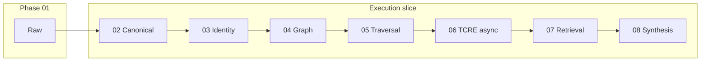

# Cortex Per-Phase Simplification Audit — Deterministic Substrate Reduction Pass

**Status:** Authoritative phase-reduction plan (post orchestration collapse M0–M9)  
**Context:** [`CORTEX_SIMPLIFICATION_AND_DETERMINISM_REFACTOR.md`](./CORTEX_SIMPLIFICATION_AND_DETERMINISM_REFACTOR.md), [`operational-runtime/RUNTIME_SIMPLIFICATION_AUDIT.md`](./operational-runtime/RUNTIME_SIMPLIFICATION_AUDIT.md)  
**Date:** 2026-05-21  

---

## Executive summary

Orchestration is now **single-owner**: `run_tenant_execution_v1` under a Postgres lease + FSM. The **next risk** is that each **phase body** still embeds years of anticipatory substrate sophistication—replay job universes, pass-fairness schedulers inside canonical, org-link replay as graph export, operational-runtime traversal passes, continuation rows parallel to FSM, and 5k-line ingestion executors.

**Doctrine for this pass:** Same lesson as M0–M9 — *simplicity > sophistication*. Every phase must become:

```text
input → deterministic transform → explicit output → gate
```

**Not:** a future-proof autonomous subsystem.

**Deletion test (repeat everywhere):** *If we deleted 50% of this phase, would execution reality reconstruction still fundamentally work?* If yes → bias toward deletion.

---

## Implementation progress (P0)

| Step | Status | Summary |
|------|--------|---------|
| **1** | **Done** | Phase 07 = retrieval index only; synthesis activation evaluation moved to phase 08 entry |
| **2** | **Done** | TCRE Celery worker no longer materializes retrieval; resume still delegates to phase 07 via convergence |
| **3** | **Done** | Single TCRE resume path — execution lease only (`on_tcre_job_terminal_for_execution_v1`); no continuation enqueue |
| **4** | **Done** | Execution hot path no longer writes `pipeline_continuation` (phase 06/08); PIPE-085-01 asserts execution lease |
| **5** | **Done** | Phase 02 single `drain_forward_progress_backlog` call; removed slack preface dual drain |
| **6** | **Done** | No `canonical_pass_index` / pass cooldowns on execution lease; slice-local drain only |
| **7** | **Done** | Determinism repair removed from phase 02 runner; admin `run_canonical_determinism_repair_v1` + execution `/rerun?run_determinism_repair=` |

## Implementation progress (P1)

| Step | Status | Summary |
|------|--------|---------|
| **8** | **Done** | Phase 03 single `run_identity_substrate_projection_for_pipeline_v1`; no audit replay job on execution hot path |
| **9** | **Done** | Phase 04 direct `run_graph_projection_export_for_pipeline_v1`; no replay job or verification slice on execution hot path |
| **10** | **Done** | Phase 05 single `run_traversal_slice_for_pipeline_v1`; no schedule pass or explainability on execution hot path |

## Implementation progress (P2)

| Step | Status | Summary |
|------|--------|---------|
| **11** | **Done** | Split `sync_executor` into per-connector modules + `sync_router`; `IngestionSyncContext` collapsed to **live** \| **replay** |

## Implementation progress (P3)

| Step | Status | Summary |
|------|--------|---------|
| **12** | **Done** | CESP `verify_gp085_*` / certification packs remain CI-only; execution hot path uses `execution`/`synthesis` contracts, not `operational_runtime` |

### P3 step 12 — done (2026-05-21)

| Change | Detail |
|--------|--------|
| `execution/phase06_contract.py` | Phase 06 output law + post-enqueue PIPE-085 lease assert (execution slice, not CESP) |
| `synthesis/phase08_activation_gate.py` | Phase 08 activation evaluation (eligible scopes, forbidden backoff, triggers) |
| `phase_runners.run_phase_06_tcre_v1` | Imports `execution.phase06_contract` only (no `operational_runtime`) |
| `run_tenant_execution_v1` | Post–phase 06 assert via `execution.phase06_contract` |
| `synthesis_pipeline.run_substrate_phase_08_synthesis_v1` | Imports `phase08_activation_gate` only (no `operational_runtime`) |
| `substrate_autonomous_progression` | Re-exports phase 06 helpers from execution; `verify_gp085_prog01` calls P3 boundary verifier |
| `substrate_synthesis_activation_scheduling` | Admin/CI wrapper adds `gate_id`; core evaluate delegates to `phase08_activation_gate` |
| CI guard | `verify_execution_hot_path_no_cesp_imports_boundary_v1` + `test_execution_hot_path_no_cesp_imports_boundary.py` |
| Static gates | `verify_gp085_prog01` / `verify_gp085_syn01` enforce hot-path import boundaries |

### P0 step 1 — done (2026-05-21)

| Change | Detail |
|--------|--------|
| `run_phase_07_retrieval_v1` | Returns retrieval materialization output only (no `run_synthesis_activation_after_phase07_v1`) |
| `run_substrate_phase_08_synthesis_v1` | Calls `evaluate_synthesis_activation_schedule_v1` before synthesis work; skips phase 08 when activation not allowed (e.g. forbidden backoff) |
| `run_tenant_convergence_v1` | No longer reads `synthesis_activation` / `next_phase_chain` from phase 07 output |
| CI guard | `verify_phase07_retrieval_only_boundary_v1` + `test_phase07_retrieval_only_boundary.py` |
| Static gates | `verify_gp085_prog01`, `verify_gp085_syn01` updated for new boundaries |

### P0 step 2 — done (2026-05-21)

| Change | Detail |
|--------|--------|
| `run_tcre_reconstruction_job_task` | On `completed`, only `on_tcre_job_completed_for_pipeline_v1` (no retrieval materialization) |
| `materialize_retrieval_index_incremental_after_tcre_v1` | Removed — TCRE index binding runs only in phase 07 via `materialize_retrieval_index_for_pipeline_v1` |
| CI guard | `verify_tcre_worker_no_retrieval_materialization_boundary_v1` + `test_tcre_worker_no_retrieval_materialization_boundary.py` |
| Static gates | `verify_gp085_prog01` calls P0 step 2 boundary verifier |

### P0 step 3 — done (2026-05-21)

| Change | Detail |
|--------|--------|
| `on_tcre_job_terminal_for_execution_v1` | Canonical TCRE terminal handler: `resume_convergence_from_waiting_v1` + `enqueue_tenant_convergence_v1` only |
| `on_tcre_completed_for_convergence_v1` | Alias to terminal handler (no `resume_pipeline_after_tcre_completion_v1`) |
| `on_tcre_job_completed_for_pipeline_v1` | Celery callback routes to execution terminal handler |
| `recover_stalled_pipeline_v1` | Completed TCRE recovery uses same execution terminal path |
| `resume_convergence_from_waiting_v1` | Accepts `pipeline_run_id` so lease cursor stays bound to the pipeline run |
| CI guard | `verify_single_tcre_execution_resume_boundary_v1` + `test_single_tcre_execution_resume_boundary.py` |
| Static gates | `verify_gp085_prog01` + **PROG-TCRE-RESUME** updated for execution-only resume |

### P0 step 4 — done (2026-05-21)

| Change | Detail |
|--------|--------|
| `run_phase_06_tcre_v1` | Removed `mark_pipeline_waiting_on_tcre_v1`; async wait is execution-lease only |
| `run_substrate_phase_08_synthesis_v1` | Removed `mark_continuation_completed_v1` on skip/complete paths |
| `run_tenant_convergence_v1` | After phase 06, `mark_tenant_waiting_v1` + `assert_pipe085_chain_after_phase06_legal_v1` (lease-based) |
| `assert_pipe085_chain_after_phase06_legal_v1` | Checks `AWAITING_TCRE` lease instead of continuation row |
| `enforce_phase06_progression_law_v1` | Output contract only (async + `job_id`); no continuation assertion |
| CI guard | `verify_execution_hot_path_no_continuation_boundary_v1` + `test_execution_hot_path_no_continuation_boundary.py` |

### P0 step 5 — done (2026-05-21)

| Change | Detail |
|--------|--------|
| `run_phase_02_canonical_v1` | One `drain_forward_progress_backlog` call (full backlog); removed slack-scoped preface + merge |
| Imports | Phase runner imports `drain_forward_progress_backlog` directly, not `drain_stub_materialize_backlog` |
| `drain_stub_materialize_backlog` | Retained as thin delegate for admin/ingestion/identity paths only |
| CI guard | `verify_canonical_single_drain_boundary_v1` + `test_canonical_single_drain_boundary.py` |

### P0 step 6 — done (2026-05-21)

| Change | Detail |
|--------|--------|
| `run_tenant_convergence_v1` | Dropped lease `canonical_pass_index`, `pass_cooldown_until`, `pass_topology_stall_counts`; stores `last_canonical_outcome` + `convergence_health` only |
| `run_phase_02_canonical_v1` | No pass-fairness parameters; each slice uses fresh in-drain pass rotation |
| `operator_snapshot` | Pass cooldown hints read from phase 02 output, not lease |
| CI guard | `verify_execution_lease_no_pass_fairness_boundary_v1` + `test_execution_lease_no_pass_fairness_boundary.py` |

### P0 step 7 — done (2026-05-21)

| Change | Detail |
|--------|--------|
| `run_phase_02_canonical_v1` | No post-drain `repair_tenant_materialization_oracle_determinism_drift`; phase output is drain summary only |
| `run_canonical_determinism_repair_v1` | New execution admin helper (also available via canonical verification admin route) |
| `execution_rerun_v1` | Optional `run_determinism_repair` runs repair before clear+restart when requested |
| `POST .../execution/rerun` | Query param `run_determinism_repair` (default false) |
| CI guard | `verify_canonical_no_inline_determinism_repair_boundary_v1` + `test_canonical_no_inline_determinism_repair_boundary.py` |

### P1 step 8 — done (2026-05-21)

| Change | Detail |
|--------|--------|
| `run_identity_substrate_projection_for_pipeline_v1` | Single phase-03 entry: refresh handles/candidates + inline audit receipt |
| `build_identity_substrate_projection_receipt_v1` | Receipt JSON without `CortexOrgLinkReplayJob` row |
| `run_phase_03_identity_v1` | Calls projection helper only; dropped `identity_substrate_audit_replay_job_id` |
| `finalize_identity_substrate_operator_audit` | Retained for admin/ingest paths that still persist audit replay job rows |

### P1 step 9 — done (2026-05-21)

| Change | Detail |
|--------|--------|
| `run_graph_projection_export_for_pipeline_v1` | Single phase-04 entry: `build_org_graph_projection_export_document` + slim receipt |
| `run_phase_04_graph_v1` | Calls export helper only; dropped replay job + `org_graph_traversal_verification_slice` from output |
| `pipeline_receipts` | Graph phase receipt: `stable_hash`, `node_count`, `edge_count` (no `graph_projection_export_job_id`) |
| Admin / ingest | `post_ingestion_substrate_refresh` still uses `execute_org_link_replay_job` + verification slice (non-execution) |
| CI guard | `verify_phase04_graph_projection_export_boundary_v1` + `test_phase04_graph_projection_export_boundary.py` |
| CI guard | `verify_phase03_identity_projection_boundary_v1` + `test_phase03_identity_projection_boundary.py` |

### P1 step 10 — done (2026-05-21)

| Change | Detail |
|--------|--------|
| `run_traversal_slice_for_pipeline_v1` | Single phase-05 entry: sorted start selection + walk materialization |
| `_pick_start_node_ids_v1` | Deterministic ascending sort before cap |
| `run_phase_05_traversal_v1` | Calls traversal slice only; dropped `octs_walk_schedule` nested pass |
| `run_octs_walk_schedule_pass_v1` | Retained for admin scheduling (density frontiers + explainability panel) |
| CI guard | `verify_phase05_traversal_slice_boundary_v1` + `test_phase05_traversal_slice_boundary.py` |

### P2 step 11 — done (2026-05-21)

| Change | Detail |
|--------|--------|
| `connectors/{github,linear,slack,notion,calls}/sync.py` | Per-connector sync bodies extracted from monolithic executor |
| `sync_shared.py` | Shared raw persistence, checkpoint helpers, `generic_scope_ping` |
| `sync_router.py` | Thin `execute_connector_sync` dispatch router |
| `sync_executor.py` | Compatibility shim re-exporting router + test hooks |
| `IngestionSyncContext` | Top-level modes **live** \| **replay**; `backfill_lane` + `checkpoint_sync_mode` for checkpoint lanes |
| Celery ingest tasks | No substrate phase imports; post-ingest refresh on live incremental completion |
| CI guard | `verify_ingestion_sync_split_boundary_v1` + `test_ingestion_sync_split_boundary.py` |
| Tests | Connector exhaust tests patch `connectors.*.sync.httpx` instead of monolithic module |

---

## Global questions (every phase)

| Question | Answer pattern |
|----------|----------------|
| TRUE minimum responsibility? | One sentence: what rows/state must exist after this phase for downstream truth |
| Complexity beyond responsibility? | Replay frameworks, fairness passes, repair scans, admin-only maturity, CESP gates |
| Anticipatory / future-looking? | Certification packs, equivalence proofs, saturation, density promotion, Phase 09 hooks |
| Hard to debug? | Multi-path outcomes, JSON blobs without stable receipt, async without single job_id contract |
| Hidden state transitions? | `waiting`/`completed` phase rows vs FSM; continuation table; deferral release side effects |
| Replay complexity? | Separate job FSMs vs `clear + rerun slice` |
| Not required today? | Anything not on critical path to: raw → canonical → identity → graph → walks → TCRE → retrieval index → synthesis |
| Move OUT of phase? | Scheduling, recovery, observability-only classifiers → execution engine or admin inspect |
| Delete entirely? | Parallel orchestration, Celery sidecars (mostly done M9), duplicate replay writers |
| Deterministic core loop? | Bounded batch loop with explicit counters + terminal outcome enum |

---

# PHASE 01 — INGESTION

## A. PHASE PURPOSE

**Minimal responsibility:** Pull connector snapshots into **append-only raw memory** with monotonic checkpoints and idempotent row keys. Emit **dirty** execution obligation when live incremental completes.

| | Contract |
|---|----------|
| **Inputs** | Active `tenant_connection`, connector credentials, checkpoint state |
| **Outputs** | `cortex_raw_*` rows, updated `connector_sync_state`, optional `ingestion_run` audit row |
| **Deterministic contract** | Same checkpoint + same provider pages → same raw row keys and payload hashes (replay uses isolated checkpoint scope) |

**One-line truth:** *Ingest is a dumb, idempotent copy from provider to raw store.*

## B. CURRENT COMPLEXITY INVENTORY

| Item | Location / notes |
|------|------------------|
| Monolithic sync executor (~5.2k LOC) | `ingestion/sync_executor.py` — GitHub/Linear/Slack/Notion/Calls in one module |
| Sync context modes | `incremental`, `backfill`, `replay`, `recovery`, `targeted` |
| Replay lane + checkpoint scope split | `sync_context.checkpoint_scope_key()` → `replay:<job_id>` |
| Live vs replay Celery queues | `cortex_live` vs `cortex_replay` |
| Envelope contract validation | `raw_envelope_contract.py` |
| Live idempotency derivation | logical key, source revision, payload hash |
| Temporal ordering / deletion observed | `temporal_ordering.py` |
| Per-provider pagination sub-syncs | Hundreds of helper paths inside sync_executor |
| Ingestion scheduler beat | `cortex_ingestion_scheduler` — tenant routing policy |
| Post-ingest substrate dispatch | `post_ingestion_refresh_dispatch` → dirty lease (good) |
| Raw memory replay subsystem | `raw_memory_replay.py`, control plane, trust state |
| Failure recovery metadata | `raw_memory_failure_recovery.py` |
| Verification / certification hooks | `ingestion/verification.py`, runtime_correctness |
| Admin overview / recent raw | operator surfaces |

## C. COMPLEXITY CLASSIFICATION

| Item | Verdict | Why |
|------|---------|-----|
| Idempotent raw upsert + checkpoint merge | **KEEP** | Core substrate |
| `IngestionSyncContext` modes | **SIMPLIFY** | Collapse to `live` + `replay` only; defer `recovery`/`targeted` until needed |
| Monolithic sync_executor | **SIMPLIFY** | Split per connector package; shared envelope + checkpoint only |
| Replay isolated checkpoints | **KEEP** | Required for safe replay lane |
| Separate replay queue | **KEEP** | Prevents replay from advancing live cursors |
| Scheduler routing policy | **SIMPLIFY** | Single rule: active connection + min gap + not paused |
| Raw memory control plane / trust | **DEFER** | Admin-only; freeze runtime imports from execution path |
| Certification / verification engines | **DEFER** | CI-only |
| Autonomous ingestion recovery | **DELETE** | Recovery = re-run sync with same checkpoint contract |

## D. DETERMINISM AUDIT

| Issue | Root cause |
|-------|------------|
| Provider pagination order drift | Unstable sort keys on some list endpoints |
| Clock skew in event timestamps | `derive_provider_event_timestamp` heuristics |
| Checkpoint merge non-monotonic bugs | Fixed by `merge_monotonic_connector_state` but hard to reason about |
| Replay advancing live cursor | Mitigated by scope_key — must never regress |
| Partial run status | `ingestion_run` failed mid-page leaves ambiguous “how much landed” |

**Target:** Run record + checkpoint patch atomically per sync invocation; outcome enum `succeeded|failed|skipped` only.

## E. DEBUGGABILITY AUDIT

| Pain | Cause |
|------|-------|
| “Where did this raw row come from?” | envelope fields exist but scattered across providers |
| Huge stack traces | sync_executor size |
| Replay vs live confusion | mode flags on run row |

**Minimal debugging model:**

1. `ingestion_run_id` → connector, mode, records_written, checkpoint_before/after hash  
2. Structured log: `cortex_ingest_run` with tenant, connection, outcome  
3. No substrate phases in ingest task

## F. REPLAY AUDIT

| Today | Verdict |
|-------|---------|
| Dedicated replay sync + checkpoint scope | **KEEP** for ingest-only replay |
| Raw memory replay job orchestration | **SIMPLIFY** → admin triggers `run_sync_replay` with job id, not separate FSM universe |
| Substrate replay via ingestion | **DELETE** as orchestration — use execution `rerun from=CANONICAL` after ingest replay lands raw |

**Contract:** Ingest replay = re-execute sync transform on bounded raw scope. Substrate replay = execution engine only.

## G. STATE MODEL AUDIT

| State | Owner |
|-------|-------|
| `connector_sync_state.state` | Per connection + scope_key |
| `ingestion_run.status` | Per run |
| Raw row identity | Idempotency keys |

**Problems:** `running` runs on crash; no single “ingest obligation epoch” tied to execution FSM.

**Redesign:** On live incremental success → `mark_tenant_dirty_v1` only (already). Ingest does **not** set phase cursors.

## H. PHASE SIMPLIFICATION PLAN

1. **Split** `sync_executor.py` into `connectors/{github,linear,slack,notion,calls}/sync.py` + thin `execute_connector_sync` router.  
2. **Collapse** sync modes to `live` | `replay`.  
3. **Delete** ingestion-path autonomous recovery; document operator re-trigger.  
4. **Freeze** raw memory certification imports from worker hot path.  
5. **Standardize** run outcome + checkpoint diff in run summary JSON (stable schema v1).

## I. TARGET MINIMAL PHASE DESIGN

```text
resolve_connection
→ fetch_pages (connector adapter)
→ validate_envelope
→ upsert_raw_idempotent
→ merge_checkpoint_monotonic
→ finalize_run(succeeded|failed)
→ if live: mark_tenant_dirty
```

---

# PHASE 02 — CANONICAL

## A. PHASE PURPOSE

**Minimal responsibility:** Transform **routable raw** rows into **canonical materializations** for an approved bundle, respecting topology (parent-before-child), bounded per slice.

| | Contract |
|---|----------|
| **Inputs** | `tenant_id`, `bundle_id`, batch limit, optional pass cursor |
| **Outputs** | Materialized rows, `canonical_outcome` enum, progress counters |
| **Deterministic contract** | Same raw + bundle mapping + pass selection → same materialization keys (modulo intentional topology deferral) |

**One-line truth:** *Canonical is a bounded batch transform from raw to typed materialized facts.*

## B. CURRENT COMPLEXITY INVENTORY

| Item | Location |
|------|----------|
| `transform_runtime.py` (~2.3k LOC) | Legacy drain + materialize paths |
| `forward_progress/drain_runtime.py` | Authoritative drain for convergence |
| `forward_progress/deferral_store.py` | Topology deferrals table |
| `forward_progress/pass_registry.py` | Per-connector/resource pass keys |
| `forward_progress/pass_fairness.py` | Cooldowns, stall counts on lease |
| `forward_progress/candidate_selection.py` | Fair pass rotation |
| Slack preface + general drain | Double call in `phase_runners` |
| Determinism repair scan | `repair_tenant_materialization_oracle_determinism_drift` post-drain |
| Topology wait / failed zero-progress | `wait_phase_v1` / `fail_phase_v1` |
| Canonical replay runtime | `canonical/replay_runtime.py` + job tables |
| Replay determinism / topology | `replay_determinism.py`, `replay_topology.py` |
| Verification engine, certification | `canonical_verification_engine.py`, cert packs |
| Failure remediation runtime | `failure_remediation_runtime.py` |
| Control plane, query runtime | operator/admin sophistication |
| Trust-state / ambiguity doctrine | spread across DOCS + metadata |
| Orphan → deferral mapping | `map_orphan_class_to_deferral_reason` |
| Convergence health labels | `_convergence_health_label` in drain |

**Runner surface:** `run_phase_02_canonical_v1` — single `drain_forward_progress_backlog` only (determinism repair: admin only).

## C. COMPLEXITY CLASSIFICATION

| Item | Verdict | Why |
|------|---------|-----|
| Bounded forward-progress drain | **KEEP** | Core loop |
| Topology deferral store | **SIMPLIFY** | Keep row-level deferral; delete pass-fairness rotation |
| Pass registry / fair cursor | **DELETE** | Anticipatory multi-pass scheduler inside phase |
| Pass cooldown on lease | **MOVE OUT** | Belongs in execution engine backoff only |
| Slack preface special case | **INLINE** | Or delete if not measurably needed |
| Determinism repair scan | **SIMPLIFY** | Admin/break-glass or nightly; not every slice |
| `drain_stub_materialize_backlog` dual path | **DELETE** | Single `drain_forward_progress_backlog` |
| Canonical replay job FSM | **DELETE** (orchestration) | Use execution rerun |
| Verification/cert packs | **DEFER** | CI-only |
| Failure remediation auto-exec | **DELETE** from hot path | Operator rerun |
| Control plane / query runtime | **DEFER** | Admin |

## D. DETERMINISM AUDIT

| Issue | Root cause |
|-------|------------|
| Pass fairness changes candidate order | Non-replayable across tenants at same raw state |
| Topology deferral release timing | Parent materialization async to child pass |
| Partial batch success | `canonical_outcome=partial` vs phase `completed` |
| Repair scan mutates after drain | Second pass changes oracle without explicit receipt |
| Multiple drain entrypoints | stub vs forward_progress divergence |

**Target outcome enum (only):** `progressed | topology_wait | blocked | failed` with `processed_count` and `receipt_hash`.

## E. DEBUGGABILITY AUDIT

| Pain | Cause |
|------|-------|
| “Why wasn’t this raw materialized?” | Deferrals + pass cooldown + topology |
| Slack vs non-slack paths | Special casing |
| Lease detail_json fairness | Hidden in convergence lease |

**Minimal debugging model:**

1. Per slice: `{pass_key, selected, succeeded, deferred, topology_skipped, outcome}`  
2. Admin: `GET execution/state` + forward-progress snapshot (read-only)  
3. Deferral rows queryable by `raw_id`

## F. REPLAY AUDIT

| Today | Verdict |
|-------|---------|
| `canonical/replay_runtime.py` jobs | **DELETE** orchestration — keep transform fns |
| Admin materialize-backlog | **Done (M8)** — 410 → execution restart |
| Replay = drain with frozen bundle mapping | **KEEP** as transform |

**Contract:** `clear_derived from=CANONICAL` + rerun slice — not replay job queue.

## G. STATE MODEL AUDIT

| State | Problem |
|-------|---------|
| Phase `waiting` topology | Good mirror; FSM must be source of truth (partially done M5) |
| `completed` with zero succeeded | Must be `waiting` or `blocked` (M1 gate — done for chain; enforce in FSM) |
| Deferral rows | Implicit queue — OK if visible |
| `canonical_pass_index` on lease | Extra scheduler state — **delete** |

## H. PHASE SIMPLIFICATION PLAN

1. **Single drain:** `run_phase_02` calls only `drain_forward_progress_backlog`.  
2. **Remove** pass fairness from lease; engine uses fixed pass order or single FIFO by `created_at`.  
3. **Remove** slack preface unless metric proves necessity.  
4. **Move** determinism repair to admin `execution/clear` hook or weekly job.  
5. **Collapse** outcomes to 4-value enum; FSM `BLOCKED` on `topology_wait` zero progress.  
6. **Delete** canonical replay Celery/ job enqueue from runtime (keep row-level re-materialize fn).

## I. TARGET MINIMAL PHASE DESIGN

```text
select_batch(limit, order=fifo_by_raw_created)
for row in batch:
    if topology_blocked(row): defer(row); continue
    materialize(row, bundle) → receipt
emit summary {processed, deferred, outcome, receipt_hash}
gate: untreated_routable_count == 0 → pass
```

**Simplest deterministic canonicalization engine:** FIFO raw selection + topology deferral table + idempotent upsert — **no pass rotation, no repair in hot loop**.

---

# PHASE 03 — IDENTITY

## A. PHASE PURPOSE

**Minimal responsibility:** Project canonical materializations into **identity handles, anchors, and link candidates** for the tenant (deterministic given canonical snapshot).

| | Contract |
|---|----------|
| **Inputs** | Canonical rows (implicit), `bundle_id`, trigger label |
| **Outputs** | Updated identity substrate tables, audit summary |
| **Deterministic contract** | Same canonical inputs → same handle/candidate keys |

**One-line truth:** *Identity is a deterministic projection from canonical, not a rebuild orchestrator.*

## B. CURRENT COMPLEXITY INVENTORY

| Item | Location |
|------|----------|
| `continuity_rebuild.py` | handles + candidates refresh |
| `finalize_identity_substrate_operator_audit` | audit + replay job id |
| Org link replay runtime | separate job universe |
| Org link replay lane registry | lawful edge promotion, etc. |
| Failure remediation | identity failure_remediation |
| Control plane, readiness economics | certification |
| Worker dispatch | Celery org link jobs |
| `anchor_limit=5000` | hidden cap |
| Phase runner creates replay job for audit | **Removed P1 step 8** — `run_identity_substrate_projection_for_pipeline_v1` |

## C. COMPLEXITY CLASSIFICATION

| Item | Verdict | Why |
|------|---------|-----|
| Handles + candidates refresh | **KEEP** | Core |
| Substrate counts before/after | **SIMPLIFY** | Single receipt block |
| Operator audit finalize + replay job | **DELETE** | Audit log row only, no job |
| Org link replay job FSM | **DELETE** (orchestration) | Graph phase uses replay **function** inline |
| Failure remediation auto | **DEFER** | Admin |
| Readiness economics | **DEFER** | CI |
| Worker dispatch side paths | **MOVE OUT** | Only via explicit admin |

## D. DETERMINISM AUDIT

| Issue | Root cause |
|-------|------------|
| Audit replay job async | Non-deterministic completion time |
| Anchor limit truncation | Silent partial projection |
| Multiple org_link job kinds | Order-dependent promotion |

## E. DEBUGGABILITY AUDIT

**Minimal model:** `{handles_upserted, candidates_created, truncated: bool, receipt_hash}`

## F. REPLAY AUDIT

Replace org-link replay **jobs** with synchronous `execute_org_link_replay_job` only when admin requests; default path = identity projection only.

## G. STATE MODEL AUDIT

Phase always `completed` today even if truncated — should surface `partial` in output and gate if critical.

## H. PHASE SIMPLIFICATION PLAN

1. Remove audit replay job creation from hot path.  
2. Merge continuity refresh into one function with explicit caps in output.  
3. Ban org_link Celery from execution slice.  
4. Gate: canonical gate passed (engine already ensures).

## I. TARGET MINIMAL PHASE DESIGN

```text
counts_before = snapshot()
refresh_handles_and_candidates(limit=EXPLICIT)
counts_after = snapshot()
emit receipt
gate: identity_substrate_consistent (optional count thresholds)
```

---

# PHASE 04 — GRAPH

## A. PHASE PURPOSE

**Minimal responsibility:** Export **org graph projection** suitable for traversal (stable hash + entity/edge set).

| | Contract |
|---|----------|
| **Inputs** | Identity/org link substrate |
| **Outputs** | `graph_projection_stable_hash_sha256`, `node_count`, `edge_count` |
| **Deterministic contract** | Same links → same stable hash |

**One-line truth:** *Graph phase is projection export, not graph intelligence.*

## B. CURRENT COMPLEXITY INVENTORY

| Item | Location |
|------|----------|
| `execute_org_link_replay_job(graph_projection_export)` | **Removed P1 step 9** from execution runner — admin/ingest only |
| `build_org_graph_traversal_verification_slice_v1` | **Removed P1 step 9** from execution runner — admin/OCTS verify |
| `compute_octs_slice_hash_v1` | hash of slice |
| Graph density promotion (removed from runner M9) | admin inline only |
| Graph orphan continuity | admin / propagation |
| Completeness propagation | observability |
| Phase 085 graph gates | CI |

## C. COMPLEXITY CLASSIFICATION

| Item | Verdict | Why |
|------|---------|-----|
| Projection export | **KEEP** | Core |
| Verification slice in runner | **MOVE OUT** | Async admin verify or sample |
| Org link replay job wrapper | **SIMPLIFY** | Direct `projection_export_v1()` call |
| Orphan / density / promotion | **DELETE** from pipeline | Already sidecar-removed |
| Propagation gating | **DELETE** | Read-only metrics |

## D. DETERMINISM AUDIT

Replay job indirection adds async variance; slice build may depend on walk state if not careful.

## E. DEBUGGABILITY AUDIT

Output should be: `{stable_hash, node_count, edge_count, export_job_id?}` — drop nested slice from default output (store on demand).

## F. REPLAY AUDIT

Graph export is deterministic transform — no replay job queue.

## G. STATE MODEL AUDIT

`completed` without hash should `fail` phase.

## H. PHASE SIMPLIFICATION PLAN

1. Replace replay job with `run_graph_projection_export_v1(session)`.  
2. Move verification slice to admin endpoint.  
3. Delete graph maturity sidecars from pipeline permanently.

## I. TARGET MINIMAL PHASE DESIGN

```text
projection = export_org_graph(tenant)
hash = stable_hash(projection)
gate: hash present && node_count > 0 (or explicit empty-ok policy)
```

---

# PHASE 05 — TRAVERSAL

## A. PHASE PURPOSE

**Minimal responsibility:** Materialize **OCTS walks** from graph frontier for this pipeline run (bounded starts).

| | Contract |
|---|----------|
| **Inputs** | `graph_projection_stable_hash`, pipeline_run_id |
| **Outputs** | Walk materialization summary, optional `primary_octs_walk_id` |
| **Deterministic contract** | Same graph hash + same start selection policy → same walk ids |

**One-line truth:** *Traversal creates walks; it does not heal, retry, or recover them.*

## B. CURRENT COMPLEXITY INVENTORY

| Item | Location |
|------|----------|
| `substrate_traversal_execution.run_substrate_traversal_materialization_v1` | core |
| `run_octs_walk_schedule_pass_v1` inlined in runner | scheduling pass still large |
| `substrate_traversal_scheduling.py` | frontier ranking, explainability panel |
| Traversal retry/heal (M9 removed from pass) | admin only |
| Stalled traversal recovery | admin only |
| Traversal explainability | observability payload |
| Pipeline continuation `waiting_on_traversal` | legacy (optional) |
| RET_SKIP registry coupling | propagation |

## C. COMPLEXITY CLASSIFICATION

| Item | Verdict | Why |
|------|---------|-----|
| Walk materialization | **KEEP** |
| Inline schedule pass in runner | **Removed P1 step 10** — `run_traversal_slice_for_pipeline_v1` |
| Explainability panel in hot path | **Removed P1 step 10** — admin `run_octs_walk_schedule_pass_v1` / HTTP panel |
| Frontier density ranking sophistication | **SIMPLIFY** | Fixed policy: connected components, deterministic sort |
| Retry/heal/stall recovery | **DELETE** (pipeline) | Done M9 |
| Continuation wait for traversal | **DELETE** | Prefer sync completion in slice |

## D. DETERMINISM AUDIT

Frontier ranking tie-breaks; walk enqueue order; async walk execution still external.

## E. DEBUGGABILITY AUDIT

Emit `{starts_selected, walks_created, walk_ids[], materialization_receipt}`.

## F. REPLAY AUDIT

Rerun traversal = clear walks for pipeline scope + rerun phase 05.

## G. STATE MODEL AUDIT

Phase should not `complete` if zero walks when policy requires ≥1; TCRE depends on `primary_octs_walk_id`.

## H. PHASE SIMPLIFICATION PLAN

1. Collapse materialization + schedule into one function.  
2. Remove explainability from slice output.  
3. Deterministic start selection: sort node ids ascending, take first K.  
4. Delete continuation traversal wait paths.

## I. TARGET MINIMAL PHASE DESIGN

```text
starts = select_starts_deterministic(graph_hash, max=N)
walks = materialize_walks(starts, pipeline_run_id)
gate: walks terminal or enqueued with ids recorded
```

---

# PHASE 06 — TCRE / REASONING

## A. PHASE PURPOSE

**Minimal responsibility:** Enqueue **one** TCRE reconstruction job scoped to pipeline (and optional walk), then yield until terminal.

| | Contract |
|---|----------|
| **Inputs** | `pipeline_run_id`, optional `octs_walk_id` |
| **Outputs** | `job_id`, async=true |
| **Deterministic contract** | Job inputs hash stable; job execution may be async but terminal handler is idempotent |

**One-line truth:** *TCRE is one async transform step; the engine waits, not the phase runner.*

## B. CURRENT COMPLEXITY INVENTORY

| Item | Location |
|------|----------|
| `enqueue_reconstruction_job_v1` | reasoning runtime |
| `mark_pipeline_waiting_on_tcre_v1` | **continuation table** (duplicate of FSM) |
| `enforce_phase06_progression_law_v1` | CESP law in runner |
| TCRE Celery worker | `cortex_tcre_reconstruction_jobs` |
| TCRE saturation (removed M9) | admin |
| Replay twin/diff/proof frameworks | reasoning/replay_* |
| Incremental retrieval in TCRE task | determinism gap §8.5 |
| `on_tcre_job_completed_*` dual resume | convergence + continuation |

## C. COMPLEXITY CLASSIFICATION

| Item | Verdict | Why |
|------|---------|-----|
| Single job enqueue per slice | **KEEP** |
| FSM `AWAITING_TCRE` | **KEEP** |
| Pipeline continuation row | **DELETE** | Merge to FSM only |
| Progression law enforce in runner | **SIMPLIFY** | Engine asserts async output |
| Saturation scheduling | **DELETE** | Done M9 |
| Replay equivalence proofs | **DEFER** | CI |
| Retrieval materialization inside TCRE task | **DELETE** | Retrieval only phase 07 |

## D. DETERMINISM AUDIT

| Issue | Root cause |
|-------|------------|
| Double resume paths | continuation + convergence |
| TCRE mutates retrieval early | Skips RETRIEVAL gate |
| Job scope drift | `octs_strict_binding` false default |

## E. DEBUGGABILITY AUDIT

Single `{job_id, scope_hash, enqueue_receipt}`; FSM transition on terminal.

## F. REPLAY AUDIT

Admin replay = new job after `clear` from TCRE — not twin/diff framework in hot path.

## G. STATE MODEL AUDIT

Engine marks `waiting_on_tcre` (good). Phase `completed` while job pending — OK if FSM drives.

## H. PHASE SIMPLIFICATION PLAN

1. Remove `mark_pipeline_waiting_on_tcre_v1`; use FSM only.  
2. Remove progression law call from runner.  
3. Forbid retrieval side effects in TCRE worker.  
4. Single `on_tcre_job_terminal` → resume slice at phase 07.

## I. TARGET MINIMAL PHASE DESIGN

```text
job = enqueue_tcre(scope=pipeline+walk)
return {job_id, async: true}
--- engine AWAITING_TCRE ---
on_terminal(job): gate pass → RETRIEVAL
```

---

# PHASE 07 — RETRIEVAL

## A. PHASE PURPOSE

**Minimal responsibility:** Build/publish **retrieval index** for tenant for this pipeline epoch.

| | Contract |
|---|----------|
| **Inputs** | TCRE outputs (materialized graph), pipeline_run_id |
| **Outputs** | `published_index_epoch`, materialization counts |
| **Deterministic contract** | Same inputs → same index epoch + doc keys |

**One-line truth:** *Retrieval indexes evidence; it does not bootstrap synthesis.*

## B. CURRENT COMPLEXITY INVENTORY

| Item | Location |
|------|----------|
| `retrieval_index_materialization.py` (~870 LOC) | main materialization |
| `get_published_index_epoch_v1` | epoch tracking |
| `run_synthesis_activation_after_phase07_v1` in runner | **synthesis scheduling inside retrieval** |
| `apply_post_phase07_retrieval_policy_v1` | starvation / blocked policy (M7) |
| Skip registries, starvation classifiers | operational_runtime |
| Completeness propagation | gating reads |
| Bootstrap / incremental paths | multiple code paths |
| RET_SKIP codes | many skip reasons |

## C. COMPLEXITY CLASSIFICATION

| Item | Verdict | Why |
|------|---------|-----|
| Index materialization | **KEEP** |
| Published epoch | **KEEP** |
| Synthesis activation in phase 07 | **MOVE OUT** | Phase 08 only |
| Starvation classifier as BLOCKED | **SIMPLIFY** | Single policy fn |
| Skip registry proliferation | **SIMPLIFY** | Top 5 skip codes only |
| Propagation gating | **DELETE** |
| Incremental bootstrap in TCRE | **DELETE** (in TCRE) |

## D. DETERMINISM AUDIT

Materialization order; partial publish; synthesis activation side effects change phase 08 entry.

## E. DEBUGGABILITY AUDIT

`{epoch, docs_indexed, skipped_counts_by_code, receipt_hash}`

## F. REPLAY AUDIT

`clear retrieval derived` + rerun phase 07 — no replay job framework.

## G. STATE MODEL AUDIT

M7 retrieval policy can BLOCK — good. Remove `completed` when starvation unaddressed.

## H. PHASE SIMPLIFICATION PLAN

1. Remove synthesis activation hook from `run_phase_07_retrieval_v1`.  
2. Narrow skip codes; collapse classifiers to execution `BLOCKED` reasons.  
3. Single materialization path (no bootstrap shortcut).  
4. Explicit gate: `published_index_epoch` set.

## I. TARGET MINIMAL PHASE DESIGN

```text
index = materialize_retrieval_index(pipeline)
epoch = publish(index)
gate: epoch present && policy_allows_synthesis
```

---

# PHASE 08 — SYNTHESIS

## A. PHASE PURPOSE

**Minimal responsibility:** Run **synthesis jobs** for eligible scopes until terminal or bounded limit.

| | Contract |
|---|----------|
| **Inputs** | `published_index_epoch`, pipeline_run_id |
| **Outputs** | Synthesis job summaries, activation audit |
| **Deterministic contract** | Same epoch + scopes → same job ids (idempotent enqueue) |

**One-line truth:** *Synthesis is bounded job execution on published retrieval epoch.*

## B. CURRENT COMPLEXITY INVENTORY

| Item | Location |
|------|----------|
| `synthesis_pipeline.py` | phase 08 runner delegate |
| Synthesis activation scheduling | eligibility, forbidden backoff |
| `cortex_synthesis_jobs` Celery | async jobs |
| Activation audit table | `cortex_synthesis_activation_audits` |
| Continuation mark completed | synthesis chain remnant |
| Phase 08 certification / e2e harness | test sophistication |
| Eligibility explainability | syn idle/starved |

## C. COMPLEXITY CLASSIFICATION

| Item | Verdict | Why |
|------|---------|-----|
| Bounded synthesis job run | **KEEP** |
| Activation scheduling pass | **SIMPLIFY** | Inline eligibility check, no separate schedule fn |
| Forbidden backoff | **SIMPLIFY** | Binary blocked flag |
| Celery synthesis jobs | **KEEP** | True async compute |
| Continuation completed marks | **DELETE** |
| Certification harness | **DEFER** | CI |
| e2e operational certification | **DEFER** |

## D. DETERMINISM AUDIT

Job enqueue order; partial job completion; activation audit vs actual jobs mismatch.

## E. DEBUGGABILITY AUDIT

`{jobs_enqueued, jobs_succeeded, jobs_failed, epoch}`

## F. REPLAY AUDIT

Clear synthesis artifacts + rerun phase 08.

## G. STATE MODEL AUDIT

Mark pipeline complete only when synthesis terminal; align FSM `IDLE`.

## H. PHASE SIMPLIFICATION PLAN

1. Remove continuation coupling.  
2. Phase 08 = `evaluate_eligibility` + `enqueue_jobs` + wait async or sync subset.  
3. Drop separate activation Celery (M9 done).  
4. Finalize pipeline in engine when phase 08 returns terminal.

## I. TARGET MINIMAL PHASE DESIGN

```text
if not eligible(epoch): BLOCKED
jobs = enqueue_synthesis_jobs(limit=N)
wait_or_complete
gate: all_required_jobs_terminal
```

---

# CROSS-PHASE AUDIT

## 1. CROSS-PHASE COMPLEXITY MAP

| Duplicated pattern | Phases | Consolidation |
|--------------------|--------|---------------|
| Replay job FSM | Canonical, identity, org_link, ingestion raw | **One contract:** execution `clear` + `rerun` |
| `execute_org_link_replay_job` | Identity audit, graph export | Direct transform functions |
| Scheduling passes | Traversal (05), retrieval→syn (07) | Engine schedules; phases transform only |
| Continuation table | TCRE, traversal, synthesis | **Delete**; FSM `AWAITING_*` only |
| Phase `waiting/completed/failed` + FSM | All | Phase rows = audit mirror; FSM drives |
| Observability panels in hot path | Traversal, TCRE saturation, canonical health | Admin inspect endpoints |
| CESP `verify_gp085_*` gates | All operational_runtime | CI freeze; zero runtime imports in engine |
| Retry/backoff | Canonical fairness, synthesis forbidden, ingest | **Engine-only** exponential backoff |
| Certification / proof packs | Canonical, identity, reasoning | CI-only packages |
| Admin 410 + execution routes | All bypass | Done M8 — finish deleting dead code paths |



## 2. COMMON ANTI-PATTERNS

| Anti-pattern | Evidence | Remedy |
|--------------|----------|--------|
| Anticipatory architecture | Pass fairness, saturation, density, Phase 09 readiness | Delete from hot path |
| Abstraction before need | Replay job layers per domain | One replay contract |
| Over-generalization | sync_executor monolith | Per-connector modules |
| Dynamic routing | Fair pass rotation | FIFO / fixed order |
| Partial-state semantics | `completed` + zero work | `blocked` / `waiting` only |
| Autonomous recovery | Removed orchestration; phase repair scans remain | Admin rerun only |
| Replay overengineering | `replay_equivalence_proofs`, twin/diff | CI-only |
| Doctrine leakage | Phase runners call CESP law enforce | Engine gates only — **done P3 step 12** (hot path → execution/synthesis contracts) |
| Side effects in wrong phase | Synthesis activation in 07; retrieval in TCRE | Strict phase boundaries |
| Hidden schedulers | `run_octs_walk_schedule_pass` inside 05 | Collapse to materialization |

## 3. SUBSTRATE MINIMALISM PLAN

| Tier | What |
|------|------|
| **Core (always)** | Raw ingest, canonical FIFO drain, identity projection, graph export, walk materialization, TCRE job, retrieval publish, synthesis jobs |
| **Optional (admin)** | Determinism repair, verification slices, explainability panels, promotion, orphan stitch |
| **Future work** | Phase 09 products, replay equivalence proofs, graph density maturity |
| **Deleted forever** | Progression coordinator, sidecar Celery, canonical backlog task, pass-fairness scheduler, continuation-as-orchestrator |

**Per-tenant execution stores (target):**

| Store | Role |
|-------|------|
| `CortexTenantConvergenceLease` / execution | FSM + cursor + block |
| `cortex_execution_transition_log` | Audit |
| `cortex_substrate_pipeline_runs` + phase_runs | Optional mirror (collapse later) |
| Domain tables | Raw, canonical, identity, graph, walks, TCRE, retrieval, synthesis |

## 4. DELETION-FIRST ROADMAP

### High-confidence deletions (P0)

| Item | Phase |
|------|-------|
| `canonical_pass_index` + pass fairness on lease | 02 |
| `pipeline_continuation` write paths | 06, 05, 08 |
| Synthesis activation inside phase 07 runner | 07 |
| Determinism repair in every canonical slice | 02 |
| Identity audit replay job enqueue | 03 — **done P1 step 8** (execution path) |
| Verification slice in graph runner | 04 — **done P1 step 9** (execution path) |
| Explainability panel in traversal pass | 05 — **done P1 step 10** (execution path) |
| `enforce_phase06_progression_law` in runner | 06 |
| `drain_stub_materialize_backlog` duplicate | 02 |
| Canonical replay job orchestration (runtime) | 02 |

### Medium-confidence simplifications (P1)

| Item | Phase |
|------|-------|
| Split sync_executor | 01 — **done P2 step 11** |
| Collapse traversal materialization + schedule | 05 — **done P1 step 10** |
| Direct graph export (no replay job wrapper) | 04 — **done P1 step 9** |
| Retrieval skip code taxonomy | 07 |
| Single canonical drain entry | 02 |

### Risky but valuable (P2)

| Item | Risk |
|------|------|
| Remove `CortexSubstratePipelineRun` — execution-only audit | Migration + admin UX |
| Sync TCRE completion (no Celery) | Runtime cost |
| Drop deferral table for inline topology retry | Complexity in canonical loop |

### Freeze / defer (P3)

- CESP gates in CI — **done step 12** (`verify_gp085_*` + certification packs; zero hot-path imports)  
- Certification packs — **frozen** (tests/CI only)  
- Phase 09 readiness  
- Graph orphan/density admin tools  

## 5. FINAL TARGET SUBSTRATE

After all reductions, Cortex substrate should feel:

| Property | Description |
|----------|-------------|
| **Boring** | Phases are 50–200 line runners calling one domain function |
| **Predictable** | Outcome enums + receipt hashes |
| **Deterministic** | FIFO selection, stable hashes, idempotent upserts |
| **Easy to replay** | `POST execution/rerun?from_phase=X` |
| **Easy to debug** | `GET execution/state` + transition log |
| **Easy to reason about** | One async gap (TCRE), one job queue family (synthesis) |

**Not:** autonomous distributed intelligence runtime.

### Target phase runner shape (uniform)

```python
def run_phase_XX_v1(session, *, tenant_id, pipeline_run_id, ...) -> PhaseResult:
    begin_phase(...)
    receipt = deterministic_transform_v1(session, ...)  # single call
    gate = evaluate_phase_gate_v1(receipt)
    if not gate.passed:
        block_or_wait(session, gate)
        return receipt
    complete_phase(..., output=receipt.to_json())
    return receipt
```

### Implementation waves (recommended)

| Wave | Focus | Est. impact |
|------|-------|-------------|
| **P0** | Canonical simplification + continuation deletion + phase 07/06 boundaries | Largest determinism win |
| **P1** | Graph/identity/traversal runner collapse | Debuggability |
| **P2** | Ingestion module split | Maintainability |
| **P3** | CI freeze doctrine leakage | Guardrails |

---

## Appendix — Code anchors (post M9)

| Phase | Runner | Primary domain |
|-------|--------|----------------|
| 01 | *(ingest)* | `ingestion/sync_router.py`, `ingestion/connectors/*/sync.py`, `post_ingestion_refresh_dispatch.py` |
| 02 | `run_phase_02_canonical_v1` | `canonical/forward_progress/drain_runtime.py`, `canonical/transform_runtime.py` |
| 03 | `run_phase_03_identity_v1` | `identity/continuity_rebuild.py` |
| 04 | `run_phase_04_graph_v1` | `identity/projection_export.py` (`run_graph_projection_export_for_pipeline_v1`) |
| 05 | `run_phase_05_traversal_v1` | `substrate_traversal_execution.py` (`run_traversal_slice_for_pipeline_v1`) |
| 06 | `run_phase_06_tcre_v1` | `reasoning/runtime` enqueue, `execution/phase06_contract.py` |
| 07 | `run_phase_07_retrieval_v1` | `retrieval/retrieval_index_materialization.py`, `execution/blocked.py` |
| 08 | `run_phase_08_synthesis_v1` | `synthesis/synthesis_pipeline.py`, `synthesis/phase08_activation_gate.py` |
| Engine | `run_tenant_execution_v1` | `execution/run_tenant_execution.py` |

---

## Sign-off criteria (phase reduction complete)

- [x] Execution / phase 08 hot path does not import `operational_runtime` or CESP verifiers (**P3 step 12**)  
- [ ] No phase runner imports `schedule_*` or Celery task modules  
- [ ] No phase runner creates replay **jobs** (only synchronous transforms)  
- [x] Canonical slice has **one** drain entry, no pass fairness on lease (**P0 steps 5–6**)  
- [x] `pipeline_continuation` unused by execution hot path (**P0 step 4**)  
- [x] TCRE worker does not materialize retrieval (**P0 step 2**)  
- [x] Phase 07 does not enqueue synthesis (**P0 step 1**)  
- [ ] Every phase output includes `receipt_hash` + terminal `outcome` enum  
- [ ] FSM `BLOCKED` is the only “stuck” state; no fake-green `completed`  

---

*Document owner: Cortex substrate team. Implements the same philosophy as M0–M9 orchestration collapse, applied inside each phase.*
