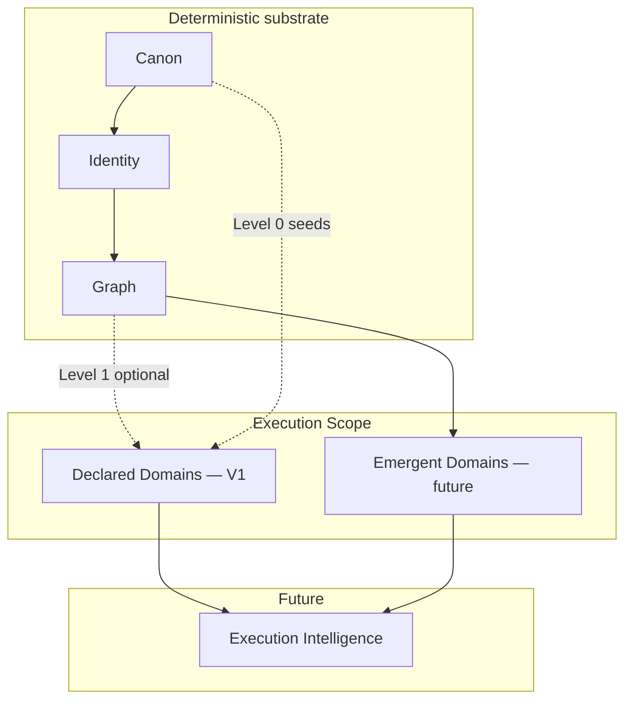

# Cortex Execution Scope — Architecture & Terminology

**Status:** Normative vocabulary and layer boundaries  
**Date:** 2026-05-29  
**Purpose:** Prevent conflation of **Declared Domains**, **Emergent Domains**, and **Execution Intelligence**

**V1 implementation plan:** [`declared-domains-v1-plan.md`](declared-domains-v1-plan.md)

---

## Execution scope family



| Term | Definition | V1 |
|------|------------|-----|
| **Execution Scope** | Umbrella: materialized groupings of execution activity at concern granularity | Concept only |
| **Declared Domain** | Cross-tool rollup **projected from** a qualified **declared container** seed (initiative, project, pinned work database, …) | **Yes** |
| **Emergent Domain** | Materialized concern **not** declared anywhere (Authentication, Hiring, …) | No |
| **Execution Intelligence** | Risk, drift, delivery interpretation **on** scope layers | No |

**Always qualify** execution scope: *declared* vs *emergent*.

---

## Declared Domains (V1)

**Definition:** Deterministic, replayable projection from a canon **declared container** seed. Level 0 (direct) + optional Level 1 (graph). See §0 in plan.

**Answers:**

- What artifacts belong to this initiative/project across tools?
- Who is involved?
- Is activity increasing or decreasing?

**Does not answer:**

- What undeclared concerns exist?
- What is the company working on overall?
- Is this work at risk?

**Properties:** Same as graph — boring, incremental, explainable. See [`declared-domains-v1-plan.md`](declared-domains-v1-plan.md).

**Honest pitch:** *"Cortex makes declared initiatives real across Slack, GitHub, and docs — and shows which are heating up."*

Linear already lists initiatives. Cortex adds cross-tool aggregation, participant rollup, and momentum.

---

### Container vs Domain

**Do not conflate these terms.**

| Term | Meaning |
|------|---------|
| **Declared container** (seed) | A canon entity with `declared_container_kind` — a provider artifact explicitly qualified as a work boundary (Linear initiative, Linear project, pinned Notion database, …) |
| **Declared domain** (projection) | A `declared_domains` row — the cross-tool rollup materialized **from** that seed |

In V1, the relationship is **1 qualified container seed → 1 declared domain projection**. The Declared Domains pass is agnostic to provider; it reads seed kind and registry membership paths only.

**Container ≠ domain in human terms.** A declared domain V1 is a **projection from a qualified declared container seed**, not a guarantee that the seed matches how people think about “domains of work.”

| Provider / seed kind | Container often aligns with human execution scope? |
|----------------------|-----------------------------------------------------|
| Linear initiative | **Often yes** — strategic bet / theme |
| Linear project | **Often yes** — bounded delivery scope |
| Notion `work_database` (pinned database) | **Often no** — may be a **portfolio**, **backlog**, or **registry of work**, not a single execution scope |

Example (Notion-primary roadmap):

```text
Global Roadmap (pinned work_database seed)
├── JWT Authentication          ← row = member, not a declared domain in V1
├── Android Hiring
└── Stripe Migration
```

An EM asking *“What are the active domains?”* may mean the **rows**, not the database name. V1 still materializes the **container boundary** the operator qualified.

**V1 intentionally prioritizes:**

- **Determinism** — same canon + graph + extractor version → same memberships
- **Explainability** — every membership has `extractor_rule` + evidence
- **Provider-agnostic operation** — seed kinds extend via canon registry, not pass logic

over **semantic fidelity** across all PM tools at all granularities.

**Contributor rule:** Never assume `Notion Database ≈ Linear Project ≈ execution domain`. Equivalence is **per seed kind and tenant schema**, not global. See [`declared-domains-v1-plan.md`](declared-domains-v1-plan.md) §Semantic caveat and [`notion-declared-domains-v1-plan.md`](notion-declared-domains-v1-plan.md) §Notion compatibility bridge.

---

### Lifecycle (future execution-scope dimension)

**Status and lifecycle are future execution-scope dimensions**, not part of Declared Domains V1 identity.

Examples from PM tools (Linear, Notion, Jira, …):

| Lifecycle phase | Example status values |
|-----------------|-------------------------|
| Planned / future | Planned, Backlog, Idea, Shaped |
| Active / current | In Progress, Active |
| Completed / past | Done, Completed |
| Dormant / cancelled | Archived, Canceled, Dropped |

V1 **does not partition** declared domains by lifecycle state. Domain existence follows **qualified container seeds**, not status fields.

Future deterministic projections may answer:

- Current active domains
- Emerging domains (planned with rising activity)
- Completed or dormant domains

**Preserve for later:** canon entities and raw payloads should retain provider status fields where available, so lifecycle-scoped execution views can be added **without redesigning** the Declared Domains pass or seed model.

---

## Emergent Domains (future)

**Definition:** Hybrid materialization of concerns that may span initiatives, projects, repos, and quarters without a declared container.

**Examples:** Authentication, Hiring, Pricing, Incident Response, Developer Experience.

**Sibling to Declared Domains** — not a downstream pipeline stage. May read declared domains as signals; separate tables, separate trust model, separate pass (future).

**Gate:** Declared Domains in prod + measured coverage gap + design review.

---

## Execution Intelligence (future)

Interpretation layer: risk, focus, delivery, coordination — scoped to Declared or Emergent Domains.

**Does not** define domains. **Consumes** scope projections.

See [`capabilities/execution-intelligence.md`](capabilities/execution-intelligence.md).

---

## Forbidden naming (contributor rules)

| Do not use | Use instead |
|------------|-------------|
| Topic / Topic Materialization | Declared Domain or Emergent Domain |
| Declared Work Rollup | **Declared Domain** |
| Execution Domain (for V1) | **Declared Domain** |
| Execution Domain (umbrella) | **Execution Scope** |

1. Never implement emergent discovery in the declared-domain pass.
2. Never add `belongs_to_domain` graph edges — use projection tables.
3. Initiative/project remain **canon seeds** — not the rollup itself.
4. If it interprets meaning beyond explicit seed + graph rule, it is not Declared Domains V1.

---

## Stack

```
Ingestion → Canon → Identity → Graph → Declared Domains (V1)
                                      → Emergent Domains (future)
                                                ↓
                                      Execution Intelligence (future)
```

---

## Related documents

| Document | Role |
|----------|------|
| [`declared-domains-v1-plan.md`](declared-domains-v1-plan.md) | Authoritative V1 plan |
| [`graph-projection-v1-plan.md`](graph-projection-v1-plan.md) | Upstream graph |
| [`00-overview/terminology-consistency.md`](00-overview/terminology-consistency.md) | Canonical vocabulary |
| [`topic-materialization-v1-plan.md`](topic-materialization-v1-plan.md) | Superseded redirect |
| [`declared-work-rollup-v1-plan.md`](declared-work-rollup-v1-plan.md) | Superseded redirect |
