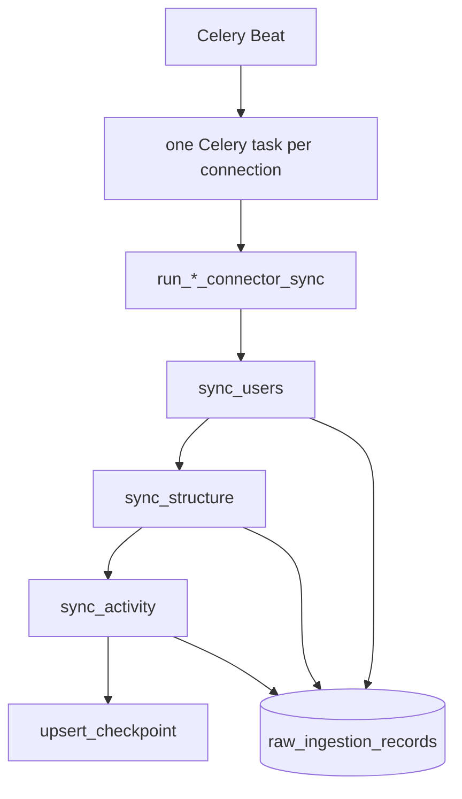

# Cortex ingestion — organizational exhaust implementation plan

**Status:** normative implementation plan (consolidate & harden, do not replace architecture)  
**Guardrail:** [minimal_ingestion_doctrine.md](./minimal_ingestion_doctrine.md) **wins on any conflict** — no coverage platform, no orchestration layer, no ingestion-time identity/graph logic.  
**Related:** [phase-01-organizational-exhaust-spec.md](../01-ingestion/phase-01-organizational-exhaust-spec.md), [ingestion_production_evolution_plan.md](./ingestion_production_evolution_plan.md), [connector-exhaust-matrix.md](../connectors/connector-exhaust-matrix.md), [organizational-exhaust-execution-track.md](./organizational-exhaust-execution-track.md), `backend/src/vector/domains/cortex/ingestion/exhaust_coverage_registry.py`

**Strategic goal:** Ingest enough **provider truth** in `raw_ingestion_records` that downstream domains (`cortex/identity`, `cortex/graph`, `cortex/execution`) can reconstruct the organization. Ingestion does **not** do that reconstruction itself.

**Non-goals:** workflow engine, cross-connector DAG, coverage database, debt planner, ingestion-time canonicalization, “platform engineering theater.”

---

## Executive summary

**Runtime spine (unchanged):**

```text
Celery Beat (~2m) → run_cortex_connector_sync_task → execute_connector_sync → run_*_connector_sync
  → load_checkpoint → fetch_page → append_raw → update_checkpoint → repeat_until_budget
```


| Layer           | What we add                                                          |
| --------------- | -------------------------------------------------------------------- |
| **Connectors**  | More streams in `connectors/*/sync.py` (people, structure, activity) |
| **Checkpoints** | Per-stream cursors + `backfill_complete` + `introduced_at`           |
| **Admin**       | Read checkpoint JSON + SQL aggregates (counts, time span)            |
| **Matrix**      | `exhaust_coverage_registry.py` + docs (static, not runtime)          |


| Today                     | Target                                                    |
| ------------------------- | --------------------------------------------------------- |
| Bounded operational sync  | Same loop, more streams, honest `introduced_at`           |
| People mostly embedded    | Provider `*.user` / `*.team` / `*.membership` rows        |
| Run completed ≠ complete  | Ops judge `backfill_complete` + SQL counts, not a planner |
| Activity-first sync order | Call order: people → structure → activity in one task     |


**Code already shipped (related):** ingestion Beat ~2m, scheduler tick audit, admin beat history — see git history on `cleannn`.

---

## 1. Architectural analysis (current state)

### What is already right


| Primitive                                        | Role                                                             |
| ------------------------------------------------ | ---------------------------------------------------------------- |
| Scheduled sync (~2 min Beat + min gap)           | Steady pressure; no blocking full sync                           |
| One Celery task per connection×connector         | Isolated failure, replay, ops                                    |
| `IngestionSyncContext`                           | Live vs `replay:{job_id}` — replay does not clobber live cursors |
| Checkpoint deep merge (`checkpoint_contract` v2) | Resumable pagination                                             |
| `append_raw` + Step 15 keys                      | Dedupe by logical object + revision                              |
| Ring indices (Slack channels, GitHub repos)      | Fairness under caps                                              |
| `backfill_complete` on some streams              | Stream-local bool in checkpoint JSON                             |


### Domain boundary (freeze growth)


| Ingestion **does**                        | Ingestion **does not**              |
| ----------------------------------------- | ----------------------------------- |
| Fetch, paginate, `append_raw`, checkpoint | Cross-provider identity matching    |
| Provider `resource_type` rows             | Organizational graph edges          |
| Dedupe keys (`source_identity_key`)       | Canonical Person table              |
| Admin read models                         | Execution / intelligence derivation |


**Freeze** new modules under `cortex/ingestion/` outside `connectors/*/sync.py` and small shared helpers (`sync_shared`, `checkpoint_contract`, `sync_context`, `live_idempotency`, `sync_router`, `scheduler`). Existing `raw_memory_`* governance stays; no new surface there.

### Gaps (work remaining)

1. People streams missing on GitHub, Linear, Notion (Slack partial).
2. Sync call order not yet people → structure → activity everywhere.
3. `introduced_at` not set when new streams ship.
4. `backfill_complete` inconsistent across streams.
5. Slack `users:read.email` not default/recommended.
6. Admin overview does not yet surface checkpoint slice + SQL rollups in one place.

---

## 2. Per-connector exhaust (what to build)

Registry maturity today: Slack L2; others L3. Target: deepen streams until matrix + checkpoints say so — not a separate “L6 platform.”


| Connector  | People (add)                                            | Structure                | Activity (extend)                                                     |
| ---------- | ------------------------------------------------------- | ------------------------ | --------------------------------------------------------------------- |
| **Slack**  | `slack.user` ✓; add `slack.channel_member`; email scope | `slack.conversation`     | messages, threads, replies, reactions, files; later pins/edits        |
| **GitHub** | `github.user`, `github.team`, `github.team_membership`  | `github.repository`      | PRs, reviews, issues, CI, deploys, etc. (exists; deepen caps via env) |
| **Linear** | `linear.user`, `linear.team`, memberships               | projects, cycles, labels | issues (+ assignee/creator in query), comments, activity              |
| **Notion** | `notion.user`                                           | databases, pages         | search, query, blocks                                                 |
| **Calls**  | `calls.participant` ✓                                   | meetings                 | transcripts, segments                                                 |


Detail and API mapping: [connector-exhaust-matrix.md](../connectors/connector-exhaust-matrix.md).

---

## 3. Three planes = call order only

**Not** separate systems, queues, or runtimes.

```python
def run_slack_connector_sync(...):
    n = sync_users(...)            # people: users.list, channel members
    n += sync_channels(...)        # structure: conversations.list
    n += sync_channel_history(...)  # activity: history, replies, …
    upsert_checkpoint(...)         # merge stream blobs + optional meta.exhaust_depth
    return n
```

Same pattern for GitHub, Linear, Notion, Calls.

---

## 4. Checkpoint & ops honesty (no coverage platform)

### Per-stream fields (inside existing `streams.{connector}` blobs)

Most streams already have `next_cursor`, `pages_fetched_last_run`, `rows_seen_last_run`. **Add when a stream ships:**


| Field               | Purpose                                                       |
| ------------------- | ------------------------------------------------------------- |
| `introduced_at`     | ISO date — “we only started this stream then” (trust honesty) |
| `backfill_complete` | `true` when pagination done or documented policy cap          |
| `last_ok_at`        | Last successful page (optional)                               |


**Optional checkpoint `meta` (connector-wide):**

```json
{
  "exhaust_depth": "shallow",
  "ingest_policy": {
    "slack_conversation_types": "public_channel,private_channel",
    "slack_ingest_dms": false
  }
}
```

Values: `shallow` | `deepening` | `mature` (operator may override). **Not** T0–T5 frameworks.

### Compute on admin read (SQL) — do not persist

- `COUNT(*)` / `MIN(fetched_at)` / `MAX(fetched_at)` by `resource_type`
- Email presence rate for `slack.user` (query JSON)
- GitHub repos with `pull_requests.backfill_complete != true` (read checkpoint + SQL)

### Do not build

- `coverage_ledger.py` or coverage tables  
- `known_unknowns` arrays in JSON  
- Five-universe ontology  
- Debt planner / dynamic prioritization engine

Log discovery anomalies; fix forward on next sync.

---

## 5. People exhaust (tier-0, ingestion-only)

**Goal:** Provider-local actor rows for downstream `cortex/identity` — not matching or canonicalization in ingestion.


| Connector | New `resource_type`                                    | API                              |
| --------- | ------------------------------------------------------ | -------------------------------- |
| Slack     | `slack.channel_member`                                 | `conversations.members` (capped) |
| GitHub    | `github.user`, `github.team`, `github.team_membership` | org members, teams APIs          |
| Linear    | `linear.user`, `linear.team`, `linear.team_membership` | GraphQL                          |
| Notion    | `notion.user`                                          | `GET /v1/users`                  |


**Payload:** store provider blob under envelope; optional `person` sub-object is **documentation only** for humans reading raw rows — not a canonical schema.

**Slack:** promote `users:read.email` to recommended scopes in `connection_permissions.py` / default `SLACK_BOT_SCOPES`.

**Activity enrichments (same file, same task):**

- Linear issues query: `assignee`, `creator`, `subscriber`, `team`; fix `activity_history` in query when API supports it.
- Notion: optional `GET /pages/{id}` for metadata refresh (structure/activity boundary).

---

## 6. Connector implementation notes

### 6.1 Slack

- Persist `users.list` cursor in checkpoint (not only page counters).
- Add `slack.channel_member` with per-channel pagination caps.
- Keep ring + `CORTEX_SLACK_HISTORY_CHANNELS_PER_SYNC`; optional: sort ring by channels missing `history.backfill_complete` first (sort only — no planner).
- Defer DMs/canvases until `ingest_policy` explicitly enables.

### 6.2 GitHub

- People streams first in sync file.
- Keep **round-robin** deep fetch (`CORTEX_GITHUB_PR_FETCH_MAX_REPOS`); do **not** build coverage-priority engine — optional sort incomplete repos first is enough.
- Raise per-stream page caps via env gradually.

### 6.3 Linear

- People streams + enriched issue query.
- Align `backfill_complete` on issues/comments streams with GitHub pattern.

### 6.4 Notion

- `notion.user` early in sync.
- Keep block BFS queue in existing checkpoint maps; set `introduced_at` on `notion.block` when shipped.

### 6.5 Calls

- Keep participant rows; set `introduced_at` on `calls.meeting` / participant stream at ship date.
- Document calendar scope in `meta.ingest_policy` (single user vs domain-wide).

---

## 7. Replay / backfill / production evolution

Normative detail: [ingestion_production_evolution_plan.md](./ingestion_production_evolution_plan.md).


| Mode        | Trigger                    | Checkpoint                           |
| ----------- | -------------------------- | ------------------------------------ |
| Incremental | Beat (default)             | `modes.incremental`, scope `default` |
| Backfill    | Admin `sync_mode=backfill` | `modes.backfill`, same scope         |
| Replay      | Admin `trigger-replay`     | scope `replay:{job_id}` — audit only |


**New stream (production):** ship code → set `introduced_at` → one backfill pass per tenant/connector → Beat incremental. **No** raw DELETE.

**Richer fields on existing type:** stream cursor reset + backfill, or bump `ingestion_version.extraction` in payload + small change in `live_idempotency` hash fallback — see evolution plan.

**Stream reset (to implement):** ~30-line helper + admin action clearing one path in checkpoint JSON (live scope only).

---

## 8. Testing (strong, small)


| Layer         | What                                                                                       |
| ------------- | ------------------------------------------------------------------------------------------ |
| Unit          | `checkpoint_contract` merge, `live_idempotency` keys, stream reset helper                  |
| Per connector | Pagination resume; `append_raw` dedupe; replay isolation (existing tests)                  |
| Evolution     | New stream does not duplicate old types; extraction bump produces new revision when needed |
| One drill     | Mock tenant: after people streams, SQL shows `*.user` rows and stable counts on re-sync    |


**Do not build:** large simulation framework, N×M matrix integration suite, ingestion-time `actor_resolvable_pct` gates (that belongs in `cortex/identity` later).

**CI:** touching `connectors/*/sync.py` runs ingestion tests; matrix/registry updated in same PR.

---

## 9. Operational hardening


| Area     | Action                                                                                               |
| -------- | ---------------------------------------------------------------------------------------------------- |
| Beat     | 120s; `celery-beat` restart after env change                                                         |
| Queues   | `cortex_live` for sync; Beat task on `vector`                                                        |
| Admin    | Overview: checkpoint excerpt + per-`resource_type` SQL stats + `introduced_at` / `backfill_complete` |
| Runbooks | `trigger-sync` backfill, `reset-stream`, `trigger-replay` (audit)                                    |
| Docs     | This plan + minimal doctrine + evolution plan                                                        |


**Operator mental model:**

```text
Healthy exhaust?
  → raw row counts and time span per resource_type
  → checkpoint: backfill_complete + introduced_at per stream
  → meta.exhaust_depth
NOT: ingestion_runs.status == completed alone
```

---

## 10. Phased roadmap

### Phase 0 — Docs & admin read path (1 week)

- Minimal doctrine + this plan aligned (done in docs).
- Admin: expose checkpoint `streams` slice + SQL aggregates on ingestion overview.
- Optional: `reset_stream_checkpoint()` helper (no new package).

**Exit:** Operator can see cursors and counts without new streams.

### Phase 1 — People streams (2–3 weeks) **priority**

Slack (user cursor, members, email scope) → Linear → Notion → GitHub; Calls `introduced_at` only.

Each PR: one connector file + matrix + registry + tests. **No** new shared framework module.

**Exit:** `*.user` rows exist for connected tenants; `introduced_at` set.

### Phase 2 — Call order + structure closure (2 weeks)

- Refactor each `run_*_connector_sync` to people → structure → activity.
- Finish `backfill_complete` on list enumerators (Slack channels, GitHub install repos, etc.).

### Phase 3 — Activity depth (ongoing)

- Slack pins / message_changed where history provides it.
- GitHub/env cap tuning.
- Notion block continuation via existing queues.

### Phase 4 — Freeze ingestion surface (ongoing rule)

- New exhaust code only in `connectors/`* + allowed helpers per doctrine.
- Downstream domains consume raw SQL/API; ingestion does not grow intelligence.

---

## 11. Architecture diagram




---

## 12. First PRs (suggested)

1. Admin: checkpoint + SQL on ingestion overview.
2. `reset_stream_checkpoint` + admin action (small).
3. Linear `linear.user` + issue query fields + tests.
4. Notion `notion.user` + tests.
5. Slack members + user list cursor + email scope.
6. GitHub org members + tests.

---

## 13. Code reference

Default caps (`settings.py`): Slack 12 channels/sync; GitHub 16 repos deep/sync; Linear/Notion/Calls 25s budget; Notion 8 search pages, 100 block parents, 3 block pages/parent.

**Ingested types today:** [connector-exhaust-matrix.md](../connectors/connector-exhaust-matrix.md) + `exhaust_coverage_registry.py` — update in same PR as code.

---

## Document control


| Change               | Update together                                                                    |
| -------------------- | ---------------------------------------------------------------------------------- |
| New stream           | matrix, registry, connector `sync.py`, tests, set `introduced_at` on ship          |
| Checkpoint field     | doctrine + this doc §4                                                             |
| Production evolution | [ingestion_production_evolution_plan.md](./ingestion_production_evolution_plan.md) |
| Identity/graph       | downstream domains only — not ingestion PRs                                        |


