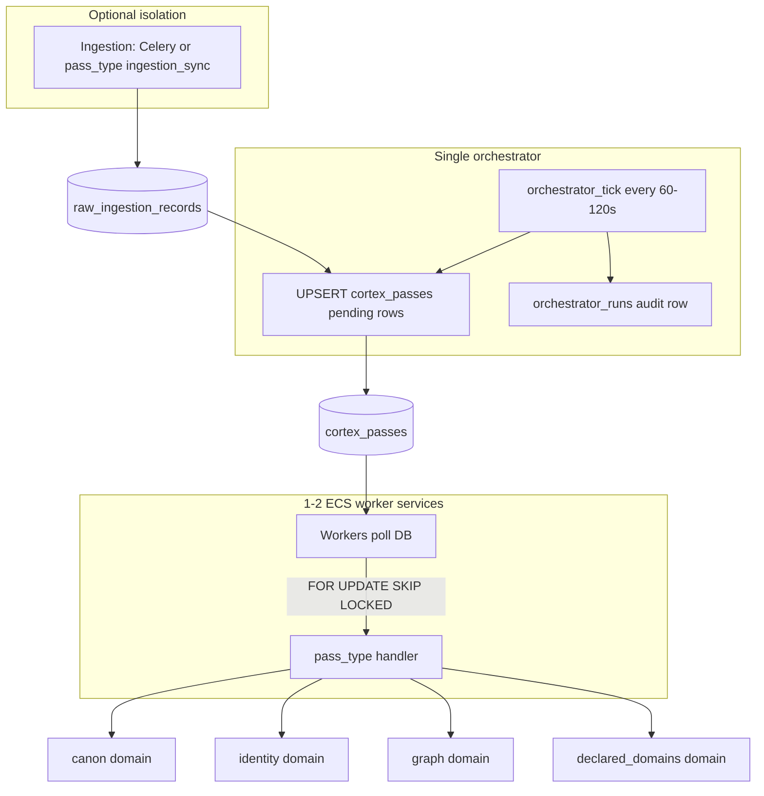

# Cortex operational runtime — phased plan (v1)

**Status:** Approved direction — implementation roadmap  
**Date:** 2026-05-28  
**Scope:** Scheduling, workers, queues, orchestration, operational visibility — **not** logical domain separation  

**Related docs:**

- [`scheduler-beat-tick-v1.md`](../scheduler-beat-tick-v1.md) — current Beat/tick/lane model  
- [`declared-domains-v1-plan.md`](../declared-domains-v1-plan.md) — declared domains pass integration  
- [`RUNTIME_SIMPLIFICATION_AUDIT.md`](RUNTIME_SIMPLIFICATION_AUDIT.md) — historical convergence substrate audit (partially superseded by canon/identity lanes)  
- [`identity-resolution-v1-plan.md`](../identity-resolution-v1-plan.md) — identity domain design  

---

## Philosophy

Cortex should operate like a **deterministic reconstruction engine**, not a distributed orchestration platform.

| Keep | Change |
|------|--------|
| Isolated domains (ingestion, canon, identity, future graph/projection) | One ECS service per domain |
| Replayability, deterministic passes, dirty queues | One Beat entry per domain |
| Independently rebuildable layers | Celery as hidden orchestrator for passes |
| Low coupling between domain code | Queue sprawl and worker fleet explosion |

**Target end state:**

- **Postgres** is authoritative for “what must run” (`cortex_passes` + pass run audit tables).
- **Workers** pull work (`FOR UPDATE SKIP LOCKED`), not unbounded Beat → `.delay()` storms.
- **One orchestrator** plans pending work on a fixed interval.
- **Admin** is the operational debugger (pending, stale, locks, retries, recovery).

---

## Current state (baseline)

### Production topology today

| ECS service | Celery queues | Role |
|-------------|---------------|------|
| `vector-worker-service` | `cortex_live`, `cortex_replay` | Connector sync |
| `vector-substrate-worker-service` | `vector` | Beat scheduler ticks, email, misc |
| `vector-canon-worker-service` | `cortex_canon` | Canon materialization passes |
| `vector-identity-worker-service` | `cortex_identity` | Identity reconciliation passes |

### Beat schedule (3 entries)

Defined in `backend/src/app/celery_app.py`:

| Beat key | Tick task | Interval (default) | Work enqueued |
|----------|-----------|-------------------|---------------|
| `cortex-ingestion-beat-tick` | `vector.cortex.ingestion.scheduler_tick` | 120s | `run_sync` → `cortex_live` |
| `cortex-canon-beat-tick` | `vector.cortex.canon.scheduler_tick` | 300s | `run_pass` → `cortex_canon` |
| `cortex-identity-beat-tick` | `vector.cortex.identity.scheduler_tick` | 300s | `run_pass` → `cortex_identity` |

### Known pain points

1. **Hidden state** — Redis queues + Celery process state; partial Postgres audit (`ingestion_scheduler_ticks` only for Beat).
2. **Fleet sprawl** — Four always-on Fargate services for low-throughput tenants.
3. **Asymmetric reliability** — Identity has stale-`RUNNING` abandonment and enqueue dedup; canon does not.
4. **No ingest → downstream trigger** — `schedule_post_ingestion_substrate_refresh` is a no-op (`substrate_pipeline_removed`); canon/identity wait on Beat interval only.
5. **Weak cross-lane observability** — Worker telemetry in admin inspects `cortex_live` / `cortex_replay` only.
6. **Duplicate Beat risk** — Multiple Beat containers → duplicate ticks (identity mitigates in DB; canon does not).

### Code anchors

| Concern | Location |
|---------|----------|
| Celery app, routes, beat | `backend/src/app/celery_app.py` |
| ECS queue roles | `backend/src/vector/domains/cortex/ingestion/worker_queue_roles_v1.py` |
| Deploy split | `backend/scripts/ecs_align_worker_queue_roles.py`, `.github/workflows/deploy.yml` |
| Ingestion tick + audit | `backend/src/app/tasks/cortex_ingestion_scheduler.py`, `ingestion_scheduler_ticks` |
| Canon tick | `backend/src/app/tasks/cortex_canon_scheduler.py` |
| Identity tick + dedup | `backend/src/app/tasks/cortex_identity_scheduler.py`, `identity/pass_run_ops.py` |

---

## Target architecture



### `cortex_passes` (authoritative work queue)

Conceptual columns:

| Column | Purpose |
|--------|---------|
| `id` | Primary key |
| `tenant_id` | Tenant scope |
| `pass_type` | `ingestion_sync`, `canon_pass`, `identity_pass`, `graph_projection_pass`, `declared_domain_pass`, … |
| `status` | `pending`, `running`, `completed`, `failed`, `cancelled` |
| `priority` | Planner fairness |
| `scheduled_at` | When eligible to run |
| `started_at`, `finished_at` | Execution window |
| `locked_by`, `locked_until` | Worker lease |
| `attempt_count`, `max_attempts` | Retry policy |
| `source_trigger` | `scheduled`, `ingestion_complete`, `admin`, … |
| `payload_json` | e.g. `connection_id`, `drain: true`, `replay_job_id` |
| `error_summary`, `stats_json` | Outcome |

**Dedup:** partial unique index on `(tenant_id, pass_type)` where `status IN ('pending', 'running')`.

**Audit:** keep `canon_pass_runs` / `identity_pass_runs` (and `ingestion_runs`) as per-execution traces; `cortex_passes` is the **work queue**, not a replacement for domain run history.

### Pass semantics (all phases once on DB rail)

| Concern | Behavior |
|---------|----------|
| Scheduling | Orchestrator inserts/upserts pending rows from dirty signals + intervals |
| Retries | Increment `attempt_count`, set `scheduled_at = now() + backoff`, `status = pending` |
| Stale runs | Lease expiry on `locked_until`; sweeper marks `failed` or requeues with `stale_lease_recovered` |
| Dead workers | Same lease recovery; another worker claims via `SKIP LOCKED` |
| Manual rerun | Admin inserts pending row or clears lock and sets `pending` |
| Concurrency | At most one `running` pass per `(tenant_id, pass_type)`; optional global cap per `pass_type` |

---

## Phase overview

```text
Phase 0  Stabilize current lanes (no new orchestration)
Phase 1  Collapse ECS to 2 worker services
Phase 2  Introduce cortex_passes + DB planner (dual-run with Celery)
Phase 3  Pull workers — passes off Celery
Phase 4  Unified orchestrator + admin operations surface
Phase 5  Ingestion transport decision + Celery minimization
Phase 6  Graph / projection on pass_type rail (no new fleets)
Phase 7  Optional cost mode (scale-to-zero / burst)
```

**Critical path:** Phase 0 → 1 → 2 → 3. **Do not** add graph/projection ECS services until Phase 3 is complete.

---

## Phase 0 — Stabilize what we have

**Duration:** 1–2 weeks  
**Goal:** Stop silent failures and overlap without a new orchestration model.

### Work items

| # | Task | Notes |
|---|------|-------|
| 0.1 | Canon stale-run parity | Mirror `abandon_stuck_running_identity_passes` for `CanonPassRun` |
| 0.2 | Canon enqueue dedup | Skip scheduled enqueue if `RUNNING` in window or recent `scheduled` pass (~85% of interval) |
| 0.3 | Scheduler tick audit tables | `canon_scheduler_ticks`, `identity_scheduler_ticks` (same shape as `ingestion_scheduler_ticks`) |
| 0.4 | Post-ingest downstream signal | After successful live incremental sync: enqueue canon dirty / identity dirty (not substrate pipeline) |
| 0.5 | Admin symmetry | Last tick time, outcome, stale badge when no completed pass within N× interval (canon + identity) |
| 0.6 | Runbook update | Extend `scheduler-beat-tick-v1.md` symptom table for all lanes |

### Exit criteria

- [ ] No tenant wedged on canon `RUNNING` indefinitely
- [ ] Operator sees last Beat tick per lane in admin
- [ ] Ingest → canon/identity lag not bounded solely by 300s Beat when new raw arrives

### Explicitly out of scope

- New `cortex_passes` table
- ECS service merge
- Celery routing changes

---

## Phase 1 — Collapse ECS sprawl

**Duration:** ~1 week  
**Goal:** Fewer always-on services; same Celery behavior.

### Work items

| # | Task | Notes |
|---|------|-------|
| 1.1 | Two-service model | **ingestion:** `-Q cortex_live,cortex_replay` · **cortex:** `-Q vector,cortex_canon,cortex_identity` |
| 1.2 | Single Beat leader | One Beat container/process on **cortex** service only; deploy guard: exactly one Beat per cluster |
| 1.3 | Deploy pipeline | Update `ecs_align_worker_queue_roles.py`, `deploy.yml`, `ecs_deploy_probe_v1.py` |
| 1.4 | Decommission services | Remove `vector-canon-worker-service`, `vector-identity-worker-service` after soak |
| 1.5 | Worker tuning | prefetch=1, concurrency 2–4 on merged cortex worker |

### Exit criteria

- [ ] Production: 2 worker ECS services (+ API), not 4
- [ ] Deploy probe passes for ingestion + cortex workers
- [ ] Canon and identity passes complete under representative load
- [ ] Documented Beat placement and “single leader” verification steps

### Cost impact

~50% reduction in baseline worker Fargate vs four dedicated fleets (ingestion + substrate + canon + identity).

### Explicitly out of scope

- DB-driven pass queue
- Removing Celery pass tasks

---

## Phase 2 — Introduce `cortex_passes` (DB authority)

**Duration:** 2–3 weeks  
**Goal:** Postgres owns what should run; Celery still executes during migration.

### Work items

| # | Task | Notes |
|---|------|-------|
| 2.1 | Alembic migration | `cortex_passes` table + indexes (status, scheduled_at, tenant_id, pass_type) |
| 2.2 | Partial unique index | One `pending`/`running` per `(tenant_id, pass_type)` |
| 2.3 | Domain module | `vector.domains.cortex.runtime` (or `operational`): plan, claim, complete, fail, retry |
| 2.4 | Planner v1 | Celery task `vector.cortex.runtime.plan_passes` (or beat entry `cortex-orchestrator-tick`) |
| 2.5 | Planning rules | Canon: cursor lag or dirty queue > 0. Identity: dirty queue or rescan due. Respect min-gap / in-flight |
| 2.6 | Dual-run mode | Planner writes `cortex_passes` **and** existing `.delay()` until Phase 3 flag off |
| 2.7 | Admin read API | List pending/running/failed passes per tenant + global counts by `pass_type` |
| 2.8 | Feature flag | `CORTEX_DB_PASS_QUEUE_ENABLED` for planner + admin (execution still Celery) |

### Pass type handlers (initial)

| `pass_type` | Handler |
|-------------|---------|
| `canon_pass` | `execute_canon_pass_for_tenant` + dirty drain |
| `identity_pass` | `execute_identity_pass_for_tenant` |

Ingestion remains on existing Celery path in Phase 2 unless explicitly included as `ingestion_sync` rows only (planning metadata).

### Exit criteria

- [ ] Admin lists pending/running/failed passes per tenant
- [ ] Planner does not create duplicate pending rows per tenant/type
- [ ] `canon_pass_runs` / `identity_pass_runs` still written
- [ ] Dual-run metrics: DB pending count correlates with Celery queue depth during migration

### Explicitly out of scope

- Removing `cortex_canon` / `cortex_identity` queues
- Poll loop in worker process

---

## Phase 3 — Pull workers (replace pass Celery)

**Duration:** 2–3 weeks  
**Goal:** Workers claim work from DB; pass messages leave Redis.

### Work items

| # | Task | Notes |
|---|------|-------|
| 3.1 | Poll loop | Worker entrypoint or long-running task: claim → execute → complete/fail |
| 3.2 | Lease heartbeat | Extend `locked_until` during long passes |
| 3.3 | Lease sweeper | Periodic job: expired `running` → `pending` or `failed` with `stale_lease_recovered` |
| 3.4 | Retry policy | Backoff on `scheduled_at`; honor `max_attempts` |
| 3.5 | Cut Celery pass enqueue | Planner stops `.delay()` for canon/identity |
| 3.6 | Queue cleanup | Remove `cortex_canon`, `cortex_identity` from worker `-Q` |
| 3.7 | Beat schedule | Replace canon + identity beat entries with single `plan_passes` (ingestion tick TBD Phase 5) |
| 3.8 | Admin recovery | `POST` requeue-pass, abandon-pass |

### Exit criteria

- [ ] No production traffic on `cortex_canon` / `cortex_identity` queues
- [ ] Stuck work recoverable via admin without Celery inspect
- [ ] Fair progress across tenants under multi-tenant test
- [ ] No duplicate concurrent passes per tenant/type

### Rollback

Re-enable dual-run: planner + `.delay()` with `CORTEX_DB_PASS_EXECUTION_ENABLED=false`.

---

## Phase 4 — Unified orchestrator + admin operations surface

**Duration:** ~2 weeks  
**Goal:** One scheduler story; admin = operational truth.

### Work items

| # | Task | Notes |
|---|------|-------|
| 4.1 | `orchestrator_runs` table | Per-tick audit: started_at, outcome, counts by pass_type, errors |
| 4.2 | Single Beat entry | `cortex-orchestrator-tick` → plan ingestion candidates + canon + identity passes |
| 4.3 | Admin “Operations” tab | Global: pending/stale counts, last orchestrator run, worker heartbeats |
| 4.4 | Per-tenant operations | Pending passes, lock owner, retry, manual enqueue, lane pause |
| 4.5 | Lane pause | Generalize Redis pause beyond ingestion (`vector:cortex:{lane}:paused`) or DB flag |
| 4.6 | Docs + settings cleanup | Remove stale convergence/substrate scheduler copy from `.env.example` where misleading |
| 4.7 | Deprecate per-lane tick tables | Optional: fold into `orchestrator_runs.detail_json` long-term |

### Exit criteria

- [ ] Operator diagnoses “why stale?” without Redis CLI or Celery inspect
- [ ] Single runbook section: scheduling end-to-end
- [ ] All three lanes visible on one operations dashboard

---

## Phase 5 — Ingestion transport + Celery minimization

**Duration:** 1–2 weeks  
**Goal:** Minimal moving parts; clear replay story.

### Decision (choose one)

| Option | Description | When to choose |
|--------|-------------|----------------|
| **A (recommended)** | Ingestion stays Celery on `cortex_live` / `cortex_replay` | Long HTTP connector I/O; want isolation from CPU-heavy passes |
| **B** | Ingestion as `pass_type=ingestion_sync` in DB poll loop | Maximum simplicity; one worker pool; acceptable coupling |

### Work items

| # | Task | Notes |
|---|------|-------|
| 5.1 | Document chosen option | ADR in this folder |
| 5.2 | Replay lane | Keep `cortex_replay` if Option A; else `payload_json.replay_job_id` |
| 5.3 | Email / onboarding | Dedicated low-priority worker or pass_type with concurrency cap |
| 5.4 | Remove unused Celery tasks | Audit `celery_app.conf.imports` for dead substrate tasks |

### Exit criteria

- [ ] Ingestion + replay documented and tested
- [ ] ≤2 ECS worker services stable in production
- [ ] Celery used only where justified (likely ingestion + optional email)

---

## Phase 6 — Graph / projection on the same rail

**Duration:** aligned with graph/projection feature work  
**Goal:** New layers = new `pass_type`, not new ECS / Beat / queue.

### Prerequisites

- Phase 3 complete (pull workers operational)
- Phase 4 admin operations surface available

### Work items

| # | Task | Notes |
|---|------|-------|
| 6.1 | Register `pass_type` values | e.g. `graph_export_pass`, `projection_pass` |
| 6.2 | Planner preconditions | Enqueue when upstream dirty / version / hash signals satisfied |
| 6.3 | Handlers | Thin wrappers in domain packages; no new Celery modules |
| 6.4 | Concurrency caps | Per-type `max_inflight` in worker config |
| 6.5 | Admin | New pass types in Operations UI |

### Exit criteria

- [ ] Graph/projection ship without new ECS service or Beat schedule entry
- [ ] End-to-end: ingest → canon → identity → graph passes visible in `cortex_passes`

### Explicit prohibition

- No `vector-graph-worker-service` pattern
- No `cortex_graph` Celery queue unless Option A-style exception is approved in ADR

---

## Phase 7 — Cost mode for small tenants (optional)

**Duration:** when cost pressure warrants  
**Goal:** Burst-friendly infrastructure.

### Work items

| # | Task | Notes |
|---|------|-------|
| 7.1 | Define SLO | e.g. max 15 minutes from ingest complete to canon pass started |
| 7.2 | Scheduled scale | EventBridge → ECS desiredCount 0→1 → orchestrator tick → drain → scale down |
| 7.3 | Or stay 24/7 small | Single `512 CPU / 1GB` task if scale latency unacceptable |

### Exit criteria

- [ ] Cost vs latency tradeoff documented per environment
- [ ] No silent work loss during scale-up/down (pending rows persist in Postgres)

---

## Success metrics (rollup)

| Metric | Baseline | After Phase 1 | After Phase 3 | After Phase 6 |
|--------|----------|---------------|---------------|---------------|
| ECS worker services | 4 | 2 | 2 | 2 |
| Beat schedule entries (Cortex) | 3 | 3 | 1 | 1 |
| Celery queues for passes | 2 | 2 | 0 | 0 |
| Time to diagnose stale lane | Hours (multi-system) | Reduced | Admin-only | Admin-only |
| Auto-recover stuck `RUNNING` | Identity only | Canon + identity | Lease-based | Lease-based |

---

## Risk register

| Risk | Mitigation |
|------|------------|
| Dual-run drift (Phase 2) | Metrics comparing DB pending vs Redis depth; short phase duration |
| Single Beat SPOF | Health check on orchestrator tick recency; alert if no `orchestrator_runs` in 2× interval |
| Long ingestion blocks passes (Option B) | Prefer Option A or separate pools with concurrency caps |
| Migration rollback | Feature flags per phase; keep Celery task names until Phase 3 proven |
| Operator habit (Celery inspect) | Phase 4 admin replaces inspect workflows in runbook |

---

## Testing strategy (per phase)

| Phase | Tests |
|-------|-------|
| 0 | Unit: canon dedup + abandon; integration: scheduler tick writes audit rows |
| 1 | Deploy probe; smoke: each queue consumed on merged worker |
| 2 | Migration; planner idempotency; admin API contract tests |
| 3 | Concurrency: two workers, one pass per tenant; lease expiry recovery |
| 4 | Admin operations E2E; orchestrator_runs written each tick |
| 5 | Ingestion/replay regression suite |
| 6 | Pass ordering / precondition gates for graph |
| 7 | Scale event integration test (staging) |

---

## What we are not doing

- Redesigning canon, identity, or graph **domain logic**
- Merging domain tables into a single “pipeline run” abstraction
- Building a general DAG/workflow engine
- Per-tenant or per-connector Redis queues
- Autoscaling on queue depth as primary signal (prefer DB pending + SLO)

---

## Appendix A — Celery challenge summary

| Question | Answer |
|----------|--------|
| Should Beat remain? | **No** for pass scheduling after Phase 3. One orchestrator tick (or external cron → planner). |
| DB-driven orchestration? | **Yes** — `cortex_passes` + `orchestrator_runs`. |
| Workers poll pending passes? | **Yes** — primary model from Phase 3. |
| Single orchestrator? | **Yes**. |
| Generic queues? | **At most** ingestion + replay; passes use DB. |
| Reduce Celery to execution only? | **Yes** for passes; ingestion optional Celery long-term. |
| Pass state fully DB authoritative? | **Yes** for scheduling; domain `*_pass_runs` remain audit. |

---

## Appendix B — Phase 0 implementation checklist (copy for PR)

```
[ ] canon/pass_run_ops.py — abandon_stuck_running_canon_passes
[ ] cortex_canon_scheduler.py — dedup before delay (mirror identity)
[ ] alembic — canon_scheduler_ticks, identity_scheduler_ticks
[ ] post_ingestion — enqueue canon dirty + identity dirty on live sync complete
[ ] admin — last tick + stale indicators for canon/identity
[ ] DOCS — scheduler-beat-tick-v1.md updated
```

---

## Appendix C — File map (planned new code)

| Artifact | Path (proposed) |
|----------|-----------------|
| Pass queue model | `backend/src/vector/infrastructure/db/models/cortex_pass.py` |
| Runtime service | `backend/src/vector/domains/cortex/runtime/` |
| Planner task | `backend/src/app/tasks/cortex_runtime_planner.py` |
| Poll worker command | `backend/src/app/cortex_pass_worker.py` or worker subcommand |
| Admin routes | extend `backend/src/vector/api/http/routes/admin.py` |
| Operations contracts | `backend/src/vector/contracts/admin.py` |

---

*End of plan v1.*
