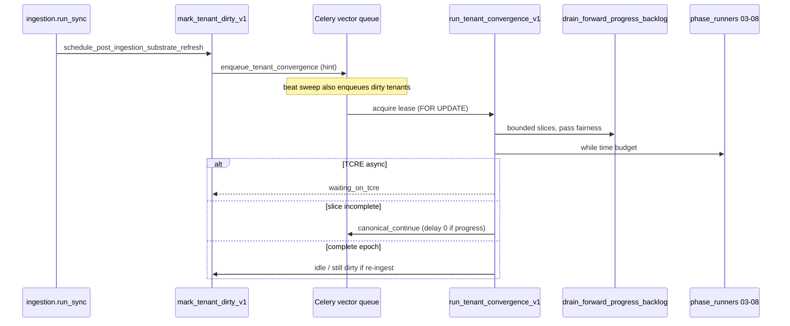

# Runtime simplification audit

**Status:** Phase A artifact (2026-05-20)  
**Scope:** One deterministic convergence runtime — no new orchestration layers  
**Default production posture:** `CORTEX_CONVERGENCE_SWEEPER_ENABLED=true` (M3: Celery beat = ingestion tick + convergence sweep only; legacy watchdog/progression beats removed)

---

## Executive summary

The substrate **production path** is now:

**ingest → dirty convergence lease → sweeper/worker slices → phase 02–08 inside `run_tenant_convergence_v1`**.

**M4:** `schedule_substrate_pipeline_v1` and the legacy post-ingestion Celery task redirect to convergence (dirty lease + worker). Legacy coordinator remains **admin/break-glass only** (deprecated log). Beat-driven progression/watchdog beats removed (M3).

**One owner per concern (target state):**

| Concern | Authoritative owner |
|--------|---------------------|
| Post-ingest scheduling | `mark_tenant_dirty_v1` + `enqueue_tenant_convergence_v1` |
| Periodic scheduling | `run_convergence_sweep_v1` (beat, ~120s) |
| Slice execution | `run_tenant_convergence_v1` + Postgres lease |
| Canonical backlog drain | `drain_forward_progress_backlog` (phase 02 only) |
| Topology deferral (row-level) | `cortex_canonical_materialization_deferrals` |
| Pass fairness (pass-level) | Lease `detail_json`: `pass_cooldown_until`, `pass_topology_stall_counts` |
| Phase 03–08 execution | Same convergence worker loop (not separate progression beat) |
| Async gaps (TCRE) | `mark_tenant_waiting_v1` → `resume_convergence_from_waiting_v1` |
| Operator break-glass | Admin `materialize-backlog*` (canonical only, no full pipeline) |

---

## 1. Active execution path (production)

### 1.1 End-to-end flow

### 1.2 Queues and tasks (authoritative)

| Step | Celery task | Queue | Trigger |
|------|-------------|-------|---------|
| Incremental ingest | `vector.cortex.ingestion.run_sync` | `cortex_live` | Scheduler / manual |
| Post-ingest | *(no dedicated task)* | — | `schedule_post_ingestion_substrate_refresh` |
| Convergence worker | `vector.cortex.convergence.run_tenant` | `vector` | Dirty mark, sweep, self-requeue |
| Convergence sweep | `vector.cortex.convergence.sweep` | `vector` | Beat `cortex-convergence-sweep` (~120s) |
| Ingestion tick | `vector.cortex.ingestion.scheduler_tick` | `vector` | Beat ~1800s |

**Not on beat when convergence authoritative:** continuity watchdog, operational progression tick.

### 1.3 Code path (canonical materialization)

1. **`post_ingestion_refresh_dispatch.schedule_post_ingestion_substrate_refresh`**  
   - If `cortex_convergence_runtime_enabled`: `mark_tenant_dirty_v1` + `enqueue_tenant_convergence_v1`  
   - Else: legacy `schedule_substrate_pipeline_v1`

2. **`run_tenant_convergence_v1`** (`convergence/run_convergence.py`)  
   - `try_acquire_convergence_lease_v1` (row lock, TTL heartbeat)  
   - `start_substrate_pipeline_run_v1` if needed  
   - Loop `SUBSTRATE_PIPELINE_PHASE_ORDER` within `cortex_convergence_time_budget_seconds` (~540s)

3. **Phase 02** — `run_phase_02_canonical_v1` → **`drain_forward_progress_backlog`**  
   - Pass-fair rotation: `all_canonical_passes_fair_rotation()`  
   - Pass-local cooldown on topology-only batches  
   - Success-first outcomes: partial progress does not global-stall  
   - Persists `pass_cooldown_until` / stall counts on lease `detail_json`

4. **Phases 03–08** — inline in convergence worker (identity, graph, traversal, TCRE enqueue, retrieval, synthesis)

5. **Requeue semantics**  
   - `canonical_continue`: immediate if `progress_made`  
   - `topology_wait` + zero success: `next_attempt_at` += `cortex_canonical_topology_wait_cooldown_seconds` (~90s)  
   - Time budget: `schedule_convergence_retry_v1` + `epoch_behind` dirty if ingest during slice

### 1.4 Lease ownership semantics

| Field | Meaning |
|-------|---------|
| `obligation_epoch` | Bumped on each ingest dirty mark |
| `target_epoch` | Epoch this worker slice committed to finish |
| `status` | `idle` / `dirty` / `running` / `waiting` / `stalled` |
| `phase_cursor` | Resume point (e.g. `phase_02_canonical` after partial canonical) |
| `next_attempt_at` | Sweeper defers pickup until this time |
| `lease_expires_at` | Running TTL; expired → recoverable dirty |
| `detail_json` | `canonical_pass_index`, `pass_cooldown_until`, `convergence_health`, etc. |

**Retry ownership:** Lease coordinates **when** a tenant runs again. Row-level **deferral** coordinates **which raw rows** are eligible in a batch. Pass **cooldown** coordinates **which resource-type pass** is tried next. These are complementary, not duplicates — but operators must understand three layers (see §3).

### 1.5 Event-driven continuation (not beat)

When convergence is authoritative, **`continue_substrate_operational_progression_v1`** is still invoked from:

- Phase 07 completion hooks (`phase_runners.py`)
- Traversal scheduling task completion (`cortex_substrate_traversal_scheduling.py`)
- TCRE completion / watchdog recovery paths

This is **in-slice / post-phase continuation**, not a global second scheduler. It does **not** replace phase 02 canonical drain.

---

## 2. Dead / legacy paths

### 2.1 Disabled by default (keep code, do not rely on in prod)

| Path | Entry | Why legacy | Recommendation |
|------|--------|------------|----------------|
| Debounced pipeline coordinator | `schedule_substrate_pipeline_v1` → `run_cortex_substrate_pipeline_coordinator_task` | Pre-lease revoke+countdown model | **Remove later** when `CORTEX_CONVERGENCE_RUNTIME_ENABLED` mandatory in all envs |
| Redis schedule anchor | `cortex_substrate_pipeline_schedule_anchor:*` | Debounce coalesce only for coordinator | **Remove later** with coordinator |
| Beat: continuity watchdog | `vector.cortex.substrate_pipeline.continuity_watchdog` | TCRE stall recovery; skipped when convergence authoritative | **Keep break-glass** — enable beat only if convergence disabled |
| Beat: progression tick | `vector.cortex.operational_runtime.substrate_progression_tick` | Phase 03–08 sweep; skipped when convergence authoritative | **Remove later** — redundant with convergence loop |
| Post-ingest stable `task_id` + revoke | `substrate_pipeline_celery_task_id` | Coordinator debounce | **Diagnostics only** (`post_ingestion_refresh_celery_task_id` alias) |

### 2.2 Admin / break-glass only

| Path | Entry | Use |
|------|--------|-----|
| Async canonical drain | `drain_stub_materialize_backlog_task` | Operator “Reprocess untreated” — **canonical only**, bypasses lease phases 03–08 |
| Sync backlog POST | `materialize_stub_backlog` (admin HTTP) | Scoped batch test |
| Full pipeline rerun | `cortex_full_pipeline_rerun` | Dangerous replay / flush |
| Forward-progress snapshot | `build_canonical_forward_progress_snapshot` | Operator truth |

**Recommendation:** Keep admin drains; document that they **do not** advance identity/graph/TCRE unless convergence also runs.

### 2.3 Registered but not beat-scheduled (Phase 08.5 sidecars)

Tasks imported in `celery_app` but **not** in default `beat_schedule`:

- `cortex_graph_density_promotion`
- `cortex_orphan_continuity_stitch`
- `cortex_substrate_traversal_scheduling` / `traversal_retry` / `stalled_traversal_recovery`
- `cortex_substrate_tcre_saturation_scheduling`
- `cortex_substrate_synthesis_activation_scheduling`

These run from **admin triggers**, **phase hooks**, or **one-off enqueue** — not continuous convergence.

**Recommendation:** **Keep** as phase-local sidecars; do not add beat entries without explicit product need.

### 2.4 CESP / certification static gates

`cesp_certification_pack.py`, `cesp_*_gate.py` — **doctrine verification**, not runtime execution.

**Recommendation:** **Keep** for release gates; not part of hot path.

---

## 3. Duplicated responsibilities (and how to simplify)

### 3.1 Scheduling ownership

| Layer | Behavior | Simplify toward |
|-------|----------|-----------------|
| Convergence sweep | Only authoritative periodic scheduler | Single beat concern |
| `enqueue_tenant_convergence` | Hint only; lease is truth | Accept duplicate Celery tasks; sweeper dedupes by lease |
| Legacy coordinator | Debounce + revoke | **Delete path** after env flag removal |

**Action:** Document in runbooks: never enable coordinator path when convergence enabled.

### 3.2 Retry / wait ownership

| Mechanism | Granularity | When |
|-----------|-------------|------|
| `next_attempt_at` on lease | Tenant | Full slice topology stall, stalled error |
| `retry_ready_at` on deferral | Raw row | Topology plan skip |
| `pass_cooldown_until` | Resource-type pass | Pass-local topology-only batch |
| `permanent_orphan` in deferral detail | Raw row | Stop churn (~5 quarantine cycles) |

**Not duplication** — three time scales. **Simplify:** expose all three in one operator panel (partially done via `operator_guidance`).

### 3.3 Topology retry

| Component | Role |
|-----------|------|
| `build_materialization_stage_plan` | In-batch parent-before-child |
| Deferral upsert | Cross-batch memory |
| Pass cooldown | Fairness — don’t spin on same pass |
| `release_deferrals_with_materialized_parents` | Self-heal when parent materializes |

**Action:** No second topology engine. Optional Phase C: index `detail_json->>'permanent_orphan'` if JSONB filters get hot.

### 3.4 Continuation semantics

| Path | Runs phases |
|------|-------------|
| Convergence worker | 02→08 authoritative |
| `continue_substrate_operational_progression_v1` | Stuck TCRE/traversal/retrieval closure |
| Legacy coordinator + `enqueue_next_pipeline_phase_v1` | Per-phase Celery chain |

**Simplify later:** When coordinator removed, ensure TCRE/traversal waits only use lease `waiting` + `resume_convergence_from_waiting_v1` (already true for TCRE in convergence path).

---

## 4. Remove now / remove later / keep

### Remove now

**None recommended without a feature flag sunset period.** Production default already skips legacy beats.

### Remove later (single PR series)

1. Delete `schedule_substrate_pipeline_v1` branch from `schedule_post_ingestion_substrate_refresh` when convergence mandatory.
2. Remove Redis `substrate_pipeline_schedule_anchor` module.
3. Remove beat entries for watchdog + progression tick (code paths already no-op).
4. Deprecate `run_cortex_substrate_pipeline_coordinator_task` and per-phase Celery chain if unused in tests/admin.

### Keep as break-glass

- Admin `materialize-backlog` / `materialize-backlog-async`
- `CORTEX_CONVERGENCE_RUNTIME_ENABLED=false` fallback to coordinator (disaster only)
- `continue_substrate_operational_progression_v1` for async phase gaps

---

## 5. Complexity budget (what we keep)

The following are **intentional** and should not be replaced by new frameworks:

- `drain_forward_progress_backlog` — single canonical drain brain
- `pass_fairness` + fair connector rotation — bounded fairness
- Deferral table — durable topology memory
- Convergence lease — tenant slice ownership
- Phase runners — thin wrappers only

**Goal:** Each new iteration should **delete** or **no-op** a legacy path, not add a parallel one.

---

## 6. Suggested next code changes (minimal)

1. **Topology gap report** — aggregate `missing_parent_ref` from deferrals (Phase D1).
2. **Deferral index** — `(tenant_id, bundle_id)` partial index on `(detail_json->>'permanent_orphan')` where true (Phase C2, only if EXPLAIN shows seq scans).
3. **Metric export** — log `convergence_health`, `progress_density_rows_per_batch` from phase 02 summary to structured logs for validation (Phase B).

No new schedulers required for any of the above.
