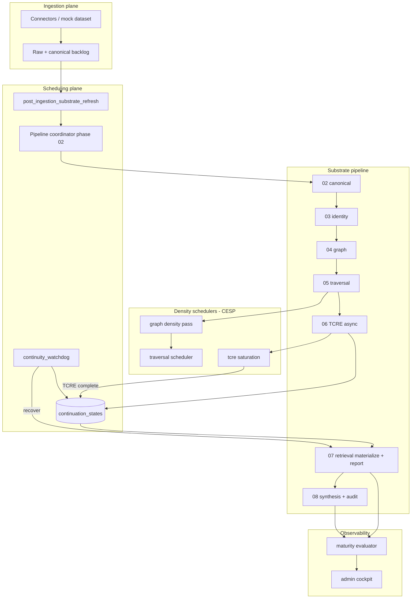

# Phase 08.5 — Runtime architecture (operational flow)

**Status:** normative.

---

## End-to-end operational flow



---

## Package layout (target)

```
vector/domains/cortex/operational_runtime/     # maturity, certification
vector/domains/cortex/substrate_pipeline/      # continuation, recovery (exists)
vector/domains/cortex/retrieval/                 # diagnostics, skip registry (partial)
vector/domains/cortex/synthesis/                 # eligibility, activation audit (partial)
vector/domains/cortex/completeness/              # fake-green fixes
app/tasks/cortex_substrate_continuity_watchdog.py
```

---

## Data flows

| Event | Durable writes |
| ----- | -------------- |
| Phase 06 enqueue | `continuation_states` WAITING |
| TCRE complete | resume receipt, phase 07 task |
| Phase 07 | `retrieval_materialization_reports`, index epoch |
| Phase 08 | `synthesis_activation_audits`, jobs, artifacts |
| Watchdog | continuation STALLED/RECOVERING, recovery receipts |

---

## Async boundaries

| Gap | Mechanism |
| --- | --------- |
| 06→07 | TCRE callback + continuation resume |
| 07→08 | `on_retrieval_publish_completed_for_pipeline_v1` |
| Stalled | watchdog `recover_stalled_pipeline_v1` |

---

## Truth surfaces

| Question | API |
| -------- | --- |
| Why retrieval 0? | materialization report + RET-SKIP |
| Why synthesis 0? | `explain_synthesis_eligibility_v1` |
| Is tenant alive? | `evaluate_tenant_runtime_maturity_v1` → upgraded |
| Pipeline stuck? | stalled catalog + continuation |
