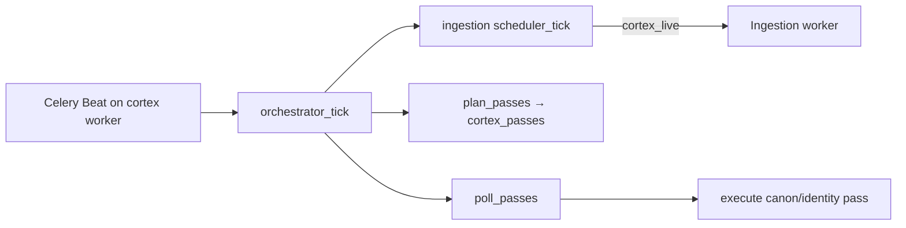

# Cortex scheduler: beat, tick, and lane workers

Single mental model for ingestion, canon, and identity background work.

## Topology

- **One Beat process** per cluster (`vector-substrate-worker-service` only; ingestion worker has no Beat).
- **One orchestrator tick** (`vector.cortex.runtime.orchestrator_tick`, default 120s) replaces per-lane Beat entries.
- **Passes** are rows in `cortex_passes`; poll claims and runs them on the `vector` queue.

| Lane | Plan cadence (default) | Execution | Queue |
|------|------------------------|-------------|-------|
| Ingestion | every orchestrator tick | `vector.cortex.ingestion.run_sync` | `cortex_live` / `cortex_replay` |
| Canon | 300s when raw backlog | canon materialization pass | `vector` |
| Identity | 300s when due | identity reconciliation pass | `vector` |

Prod ECS (2 workers): `vector-worker-service` (ingestion queues only), `vector-substrate-worker-service` (Beat + `vector` queue). Legacy `vector-canon-worker-service` and `vector-identity-worker-service` are deleted on deploy.

Config: `backend/src/app/celery_app.py`, `backend/src/vector/settings.py`, prod roles in `worker_queue_roles_v1.py`.

## Identity pass semantics

Each **pass** = one `IdentityPassRun` row + dirty-queue processing.

1. **Top-up** (every pass iteration): `enqueue_periodic_identity_candidates` adds up to `CORTEX_IDENTITY_PERIODIC_RESCAN_LIMIT` (default 200) rows for unresolved actors, `resolver_bump` (identity `resolver_version` behind code), and `seed_rematch`.
2. **Batch**: process up to `CORTEX_IDENTITY_BATCH_ACTOR_LIMIT` (default 500) unprocessed dirty-queue rows.
3. **Drain** (manual admin only): repeat top-up + batch until the queue is empty (cap 100 iterations). Scheduled passes run **one** batch per tick.

Incremental actors enqueue via `enqueue_identity_actor` on canon materialization; periodic top-up ensures resolver bumps are not blocked when the queue already has pending incremental rows.

## Scheduler dedup (canon + identity)

Planning runs inside `plan_cortex_passes_v1` on each orchestrator tick. Per-tenant skips use `should_skip_scheduled_*` (recent completed pass within lane interval). Canon only plans tenants with raw backlog (`_tenant_canon_has_backlog`).

Admin **STALE** badges use `scheduler.lane_stale` from readiness APIs: stale only when the tenant needs work, there is no active `cortex_passes` row, no recent completed pass, and the global orchestrator has not ticked successfully within ~2.5× `CORTEX_ORCHESTRATOR_INTERVAL_SECONDS`.

## Observability

- Global: `GET /admin/cortex/operations` (`orchestrator_runs`, pass counts, lane pause flags).
- Per-tenant readiness: `scheduler.last_orchestrator_run`, `scheduler.last_tick`, `scheduler.tenant_needs_work`.
- CloudWatch: `vector-substrate-worker`, `vector-worker` (not canon/identity worker log groups).
