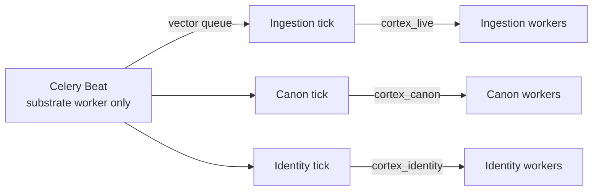

# Cortex scheduler: beat, tick, and lane workers

Single mental model for ingestion, canon, and identity background work.

## Topology

- **One Beat process** per cluster (substrate ECS service / local `celery-beat` beside substrate worker).
- **Ticks** are cheap Celery tasks on the `vector` queue; they only decide what to enqueue.
- **Passes** run on dedicated queues so lanes do not starve each other.

| Lane | Beat interval (default) | Tick task | Work task | Queue |
|------|-------------------------|-----------|-----------|-------|
| Ingestion | 120s | `vector.cortex.ingestion.scheduler_tick` | `vector.cortex.ingestion.run_sync` | `cortex_live` |
| Canon | 300s | `vector.cortex.canon.scheduler_tick` | `vector.cortex.canon.run_pass` | `cortex_canon` |
| Identity | 300s | `vector.cortex.identity.scheduler_tick` | `vector.cortex.identity.run_pass` | `cortex_identity` |

Config: `backend/src/app/celery_app.py`, `backend/src/vector/settings.py`, prod roles in `worker_queue_roles_v1.py`.

## Identity pass semantics

Each **pass** = one `IdentityPassRun` row + dirty-queue processing.

1. **Top-up** (every pass iteration): `enqueue_periodic_identity_candidates` adds up to `CORTEX_IDENTITY_PERIODIC_RESCAN_LIMIT` (default 200) rows for unresolved actors, `resolver_bump` (identity `resolver_version` behind code), and `seed_rematch`.
2. **Batch**: process up to `CORTEX_IDENTITY_BATCH_ACTOR_LIMIT` (default 500) unprocessed dirty-queue rows.
3. **Drain** (manual admin only): repeat top-up + batch until the queue is empty (cap 100 iterations). Scheduled passes run **one** batch per tick.

Incremental actors enqueue via `enqueue_identity_actor` on canon materialization; periodic top-up ensures resolver bumps are not blocked when the queue already has pending incremental rows.

## Scheduler dedup (canon + identity)

Before enqueueing a **scheduled** pass per tenant (both lanes):

- Abandon `RUNNING` passes older than `max(600s, 2× beat interval)` (`canon/pass_run_ops`, `identity/pass_run_ops`).
- Skip if a recent `RUNNING` pass exists (in-flight window).
- Skip if a `scheduled` pass started within ~85% of the beat interval (duplicate Beat / slow worker guard).

Post-ingestion passes use `source_trigger=ingestion_complete` and are not subject to the scheduled min-gap.

## Beat tick audit (all lanes)

| Lane | Table |
|------|--------|
| Ingestion | `ingestion_scheduler_ticks` |
| Canon | `canon_scheduler_ticks` |
| Identity | `identity_scheduler_ticks` |

Admin readiness exposes `scheduler.last_tick` and `scheduler.lane_stale` for canon and identity.

## Ingestion extras

- Persists `IngestionSchedulerTick` rows for observability.
- Honors Redis operator pause flag.
- Per-connector min-gap between syncs.

## Operational checks

| Symptom | Likely cause |
|---------|----------------|
| Ingestion fresh, canon/identity STALE | Substrate beat OK; `cortex_canon` or `cortex_identity` worker down / not consuming |
| All lanes STALE | Beat not running (substrate) or Redis broker issue |
| Manual identity pass, one row at v6, rest v4 | Pre-fix: pass processed only pending incremental queue (~36 rows), never top-up’d `resolver_bump`. Re-run manual pass after deploy or use **Rebuild identities**. |
| Identity pass stats `already_linked` high | Often includes `rematched` outcomes; check `rematched` stat after deploy. |
| `RUNNING` forever on Runs tab | Stuck pass; readiness API and scheduler tick abandon stale rows |
| Ingestion OK but canon/identity lag after sync | Post-ingestion should enqueue `ingestion_complete` passes; check `CORTEX_POST_INGESTION_SUBSTRATE_REFRESH_ENABLED` |
| `scheduler.lane_stale=true` | No completed pass within ~2.5× beat interval; check lane worker and Beat tick tables |

## Logs

- Identity tick: `identity scheduler tick enqueued …` (`cortex_identity_scheduler.py`).
- Pass completion: `IdentityPassRun.stats` JSON on admin **Runs** tab.
- Prod: CloudWatch log groups for `vector-substrate-worker`, `vector-identity-worker`, `vector-canon-worker`.
