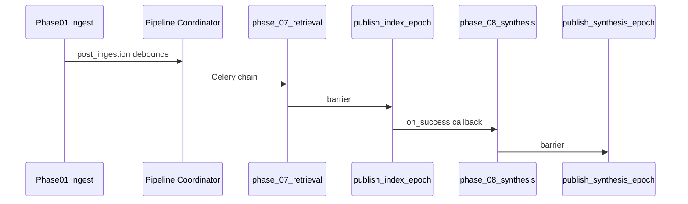

# Phase 08 — Pipeline orchestration & ingestion integration

**Status:** normative.  
**Extends:** `vector.domains.cortex.substrate_pipeline` (today ends at `phase_07_retrieval`).

---

## 1) Target pipeline order

```text
phase_02_canonical
  → phase_03_identity
  → phase_04_graph
  → phase_05_traversal
  → phase_06_tcre          # async completion chains phase 07
  → phase_07_retrieval     # publish index epoch
  → phase_08_synthesis     # NEW — publish synthesis epoch
```

Phase **01** ingestion triggers coordinator separately (unchanged); coordinator starts at **phase_02**.

---

## 2) Constants (implementation delta)

Add to `substrate_pipeline/constants.py`:

```python
PHASE_08_SYNTHESIS: Final[str] = "phase_08_synthesis"

SUBSTRATE_PIPELINE_PHASE_ORDER: Final[tuple[str, ...]] = (
    ...
    PHASE_07_RETRIEVAL,
    PHASE_08_SYNTHESIS,
)
```

---

## 3) Trigger graph



**Rule PIPE-08-01:** Phase **08** MUST NOT start until phase **07** `phase_run.status=completed` AND `published_index_epoch` advanced for tenant.

**Rule PIPE-08-02:** TCRE async path: existing `on_tcre_job_completed_for_pipeline_v1` completes **07** then enqueues **08** (same `substrate_pipeline_run_id`).

---

## 4) Celery tasks (new)

| Task | Responsibility |
| ---- | -------------- |
| `run_cortex_substrate_pipeline_phase_08_task` | Execute synthesis for pipeline scope |
| `on_retrieval_publish_completed_for_pipeline_v1` | Chains 08 after 07 publish |

Task kwargs: `tenant_id`, `substrate_pipeline_run_id`, `published_index_epoch`, `bundle_id`, `default_workloads[]`.

Coordinator idempotency: extend `compute_pipeline_idempotency_key_v1` — version bump when phase order changes.

---

## 5) Phase runner contract

`run_substrate_phase_08_synthesis_v1(session, *, tenant_id, pipeline_run, phase_run)`:

1. Load phase **07** receipt from `cortex_substrate_phase_runs.output_receipt_json`
2. Verify `published_index_epoch`
3. For each `pipeline_default` scope in policy pack (bounded batch):
   - Build `SynthesisJobEnvelopeV1` with `substrate_pipeline_run_id`
   - `enqueue_synthesis_job_v1` (async) OR inline if `SYNTHESIS_PIPELINE_INLINE_MAX_SCOPES=1` for dev
4. Wait for job completion (poll or chord callback) — **no** unbounded wait in coordinator thread; use Celery chord
5. Write phase receipt: `{jobs_completed, artifacts_published, synthesis_publication_epoch, sd_rollup}`

**Scale law PIPE-08-03:** Max scopes per pipeline run = `synthesis_pipeline_max_scopes_per_run` (default 32); overflow schedules child pipeline run with cursor.

---

## 6) Publish barrier (§Publish)

`publish_synthesis_epoch_v1(session, tenant_id)`:

- Preconditions: ≥1 artifact published in run OR explicit `SD-SCOPE-EMPTY` documented on receipt
- Monotonic epoch string: `syn-epoch-{iso}-{counter}` or inherit index epoch suffix policy
- Writes `cortex_synthesis_publication_epochs`
- Updates substrate overview completeness projection

---

## 7) Receipt linkage

`pipeline_receipts.py` gains:

```json
{
  "phase": "phase_08_synthesis",
  "synthesis_publication_epoch": "…",
  "artifact_digests": ["sha256:…"],
  "synthesis_job_ids": ["…"],
  "retrieval_epoch_pinned": "…"
}
```

Admin: `GET /admin/tenants/{id}/cortex/substrate-pipeline/runs/{run_id}` includes phase **08** block (surface_kind: `runtime_backed` once implemented).

---

## 8) Manual intervention

| Action | API |
| ------ | --- |
| Re-run synthesis only | `POST .../cortex/synthesis/jobs/run` |
| Re-run full pipeline | existing flush/rerun |
| Skip synthesis (dangerous) | `POST .../cortex/synthesis/publish/skip` with audit |

Skip never deletes phase **07** artifacts.

---

## 9) Failure handling

| phase_run status | Pipeline status |
| ---------------- | --------------- |
| `failed` with SD-PIPELINE-GAP | `partial` — operator retry |
| `failed` with SD-LLM-* | `partial` — degraded publish optional per policy |
| `completed` | `completed` or `partial` if earlier phase partial |

Finalize: `finalize_pipeline_run_v1` considers phase **08** mandatory for “full stack green” on overview.

---

## 10) Configuration flags

| Env | Default | Meaning |
| --- | ------- | ------- |
| `CORTEX_SUBSTRATE_PIPELINE_PHASE_08_ENABLED` | `false` → `true` at rollout | Kill switch |
| `CORTEX_SYNTHESIS_PIPELINE_MAX_SCOPES` | `32` | Batch cap |
| `CORTEX_SYNTHESIS_INLINE` | `false` | Dev only synchronous |
